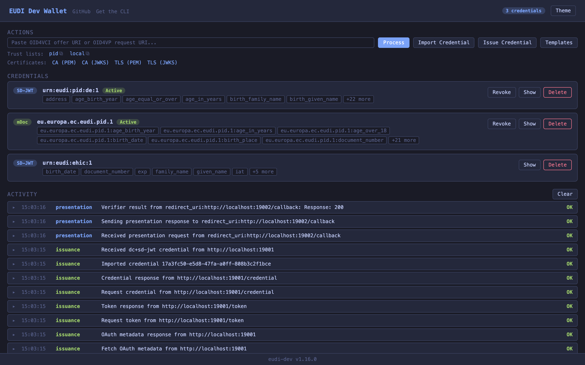
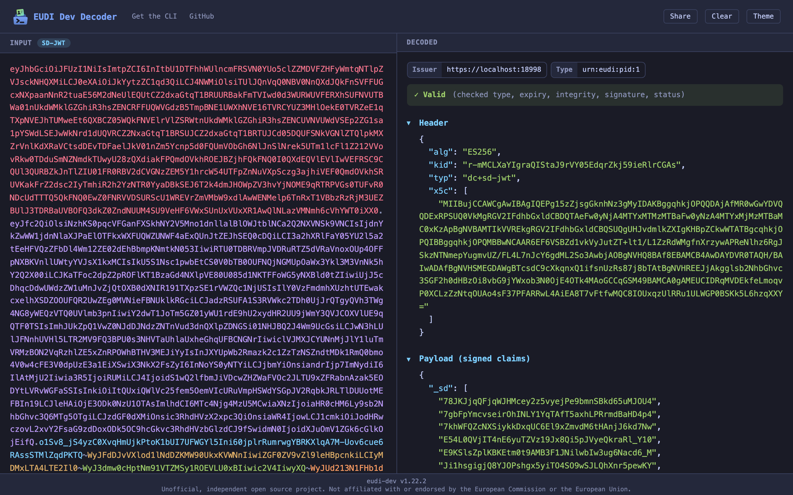

<p align="center">
  
</p>

# eudi-dev

[](https://github.com/dominikschlosser/eudi-dev/actions/workflows/ci.yml)
[](https://codecov.io/gh/dominikschlosser/eudi-dev)
[](https://github.com/dominikschlosser/eudi-dev/releases/latest)

An unofficial developer toolkit for the EUDI and OpenID4VC ecosystem. Decode, issue, and present verifiable credentials, run a testing wallet, or proxy live wallet traffic for debugging. The CLI command is `eudi`.

> **Try it online:** a shared public demo of the wallet and decoder runs at **<https://eudi-test.dev>**, no install needed. Issue, present, and decode test credentials right in the browser (state is shared between all visitors and resets daily, so do not enter personal data).

## Highlights

- **Testing Wallet** — stateful CLI wallet with file persistence, OID4VP/VCI flows, QR scanning, and OS URL scheme registration ([wallet](#wallet))
- **Reverse Proxy** — intercept, classify, and decode OID4VP/VCI wallet traffic in real time ([proxy](#proxy))
- **Web UI** — paste, decode, and validate credentials in a split-pane browser interface ([serve](#serve))
- **Unified Decode** — a single `decode` command handles SD-JWT, JWT VC, JWT, mDOC, OID4VCI offers, OID4VP requests, and ETSI trust lists
- **QR Screen Capture** — scan a QR code straight from your screen to decode credentials or OpenID requests ([decode --screen](#decode))
- **Offline Decode & Validate** — SD-JWT, JWT VC, mDOC, JWT with signature verification and trust list support
- **DCQL Generation** — generate Digital Credentials Query Language queries from existing credentials

## Install

### Homebrew (macOS and Linux)

```bash
brew install dominikschlosser/tap/eudi-dev
```

Installs the `eudi` command with shell completion (plus `oid4vc-dev` as a legacy alias).

### From GitHub Releases

Download the latest binary for your platform from [Releases](https://github.com/dominikschlosser/eudi-dev/releases).

### From source

```bash
go install github.com/dominikschlosser/eudi-dev@latest
```

This installs the binary as `eudi-dev` (Go names it after the module). The documentation calls the command `eudi`, so link it if you want the shorter name: `ln -s "$(go env GOPATH)/bin/eudi-dev" "$(go env GOPATH)/bin/eudi"`.

The module path is `github.com/dominikschlosser/eudi-dev`. Installing through the old `oid4vc-dev` path fails with a version constraints conflict: the repository redirects, but a module declares exactly one path and this one declares the new name.

### Build locally

```bash
git clone https://github.com/dominikschlosser/eudi-dev.git
cd eudi-dev
go build -o eudi .
```

### Docker

```bash
docker pull ghcr.io/dominikschlosser/eudi-dev:latest
docker run -p 8085:8085 -p 8086:8086 ghcr.io/dominikschlosser/eudi-dev
```

The default CMD starts the wallet server with pre-loaded PID credentials in headless mode — ready for automated verifier testing out of the box.

→ [Full Docker & verifier testing guide](docs/docker.md)
→ [OIDF conformance status](docs/conformance.md), [runbook](docs/conformance-run.md), and [results](docs/conformance-results.md)
→ [Examples](docs/examples.md)

## Usage

```
eudi [--json] [--no-color] [-v] <command> [flags] [input]
```

Input can be a **file path**, **URL**, **raw credential string**, or piped via **stdin**.

Shell completion covers all subcommands, flags, and known values (template names, credential IDs, running wallet instances). Install it into your shell init with one command (bash, zsh, and fish, detected from `$SHELL` when no argument is given):

```bash
eudi completion install
```

### Commands

| Command    | Purpose                                                    |
|------------|------------------------------------------------------------|
| `wallet`   | Stateful testing wallet with CLI-driven OID4VP/VCI flows   |
| `issue`    | Generate test SD-JWT, JWT, or mDOC credentials for development |
| `proxy`    | Debugging reverse proxy for OID4VP/VCI wallet traffic      |
| `serve`    | Web UI for decoding and validating credentials in the browser |
| `decode`   | Auto-detect & inspect credentials, OpenID4VCI/VP, and trust lists; may auto-verify issuer metadata when resolvable |
| `validate` | Verify signatures, check expiry, and check revocation status |
| `dcql`     | Generate a DCQL query from a credential's claims            |
| `completion` | Generate or install shell completion (`completion install`) |
| `version`  | Print version                                               |

---

### Wallet

A stateful testing wallet with file persistence, CLI-driven OID4VP/VCI flows, QR scanning, and OS URL scheme registration.

```bash
eudi issue sdjwt --wallet --template german-pid-sdjwt   # Issue a PID into the wallet
eudi wallet serve                 # Start web UI + OID4VP endpoints
eudi wallet ca-cert --out wallet-ca-cert.pem
eudi wallet tls-cert --out wallet-tls-cert.pem
eudi wallet accept 'openid4vp://authorize?...'
eudi wallet scan --screen         # QR scan → auto-dispatch
eudi wallet logs -f               # Follow persisted wallet interactions
```

> **Security:** By default the wallet server has **no authentication**: anyone who can reach its port controls the wallet and its credentials. Run it on localhost or an isolated test network, and never put real credentials in it. Internet-facing hosting has its own profile, `--demo`, which disables the process and filesystem endpoints and blocks fetches into private networks — that is what runs on [eudi-test.dev](https://eudi-test.dev). See [public demo hosting](docs/public-demo.md).

`wallet serve` starts the local wallet UI plus HTTP and HTTPS wallet endpoints for presentation, issuer metadata, trust lists, status lists, and test registrar responses. `issue ... --wallet --template german-pid-sdjwt` gives you a ready-to-use PID wallet and adds new credentials into the same wallet context (`wallet generate-pid` still works but is deprecated), and `wallet ca-cert` / `wallet tls-cert` export the trust root or exact HTTPS leaf certificate when a verifier needs them. All of these wallet operations are also available on the server's unauthenticated [HTTP API](docs/wallet.md#http-api). This lets automated tests manage and drive a hosted or containerized wallet entirely over HTTP.

For day-to-day use, the main commands are:
- `wallet serve` to run the wallet
- `issue ... --wallet` (with `--template` or `--pid`) to preload credentials
- `wallet instances` to find running wallet servers, `wallet instances use <url>` to manage one remotely over its REST API, and `wallet instances kill` to stop one (when a server already runs for the same wallet directory, CLI commands route through it automatically). Discovery only sees instances running directly on this system plus the active remote target, so a wallet inside a Docker container shows up after `wallet instances use <url>` and clicked credential-offer or presentation links route to it.
- `wallet trust-list` to get the verifier trust-list URL or JWT
- `wallet logs` to inspect wallet-side OID4VP/OID4VCI interactions
- `wallet ca-cert` and `wallet tls-cert` to export certificate material
- `wallet --mode debug|strict` and `--preferred-format ...` to control runtime behavior

When a wallet exposes multiple trust-list profiles, `/api/trustlists` gives you the available IDs and routes. Use the entry's relative `path` when you access the wallet through Docker port mappings or similar local indirection. The web UI lists the same trust-list URLs with copy buttons above the certificate downloads.



→ [Full documentation](docs/wallet.md) — subcommands, flags, endpoints, logs, trust lists, storage, URL scheme registration
→ [Public demo hosting](docs/public-demo.md) — run a shared internet-facing demo with `--demo` (hardened endpoints, periodic reset, imprint page)
→ [Flow diagrams](docs/diagrams/README.md) — GitHub-rendered OID4VP / OID4VCI interaction diagrams and parameter checklists

---

### Issue

Generate test SD-JWT, JWT, or mDOC credentials for development and testing.

```bash
eudi issue sdjwt --pid
eudi issue sdjwt --template employee-card --claims '{"employee_id": "E-42"}'
eudi issue sdjwt --pid --always-disclosed issuing_country,address.country
eudi issue jwt --claims '{"name":"Test","age":30}'
eudi issue mdoc --claims '{"name":"Test"}' --doc-type com.example.test
eudi issue sdjwt | eudi decode
```

Reusable claim sets live in credential templates (`templates list|show|save|import|delete`). Templates carry the credential type, default claims, and the claims to issue without selective disclosure. They work in the CLI, the HTTP API, and the wallet UI.

→ [Full documentation](docs/issue.md) — all flags, round-trip examples
→ [Credential templates](docs/templates.md) — template files, management commands, always disclosed claims

---

### Proxy

Intercept and debug OID4VP/VCI traffic between a wallet and a verifier/issuer with a live web dashboard.

```bash
eudi proxy --target http://localhost:8080
```

```
Wallet  <-->  Proxy (:9090)  <-->  Verifier/Issuer (:8080)
                  |
            Live dashboard (:9091)
```

→ [Full documentation](docs/proxy.md) — traffic classification, features, flags

---

### Serve

Start a local web UI for decoding and validating credentials in the browser.

```bash
eudi serve
eudi serve --port 3000
eudi serve credential.txt
```

Opens a split-pane interface at `http://localhost:8080` (default) with auto-decode on paste, format detection, collapsible sections, signature verification, and dark/light theme. Pass a credential as an argument to pre-fill the input on load. Use `--imprint-file` to serve a legal notice at `/imprint` when hosting it publicly.



> **Warning:** Credentials are sent to the server for decoding. Run it locally, or see [public demo hosting](docs/public-demo.md) for an internet-facing setup.

---

### Decode

Auto-detect and decode credentials (SD-JWT, JWT VC, mDOC), OpenID4VCI/VP requests, and ETSI trust lists.

```bash
eudi decode credential.txt
eudi decode 'openid4vp://authorize?...'
eudi decode --screen                    # QR scan from screen
```

→ [Full documentation](docs/decode.md) — auto-detection order, format override, QR scanning, flags

---

### Validate

Verify signatures, check expiry, and check revocation status.

```bash
eudi validate --key issuer-key.pem credential.txt
eudi validate --trust-list trust-list.jwt credential.txt
eudi validate credential.txt
```

→ [Full documentation](docs/validate.md) — flags, trust list explanation

---

### DCQL

Generate a DCQL (Digital Credentials Query Language) query from a credential's claims. Always outputs JSON.

```bash
eudi dcql credential.txt
```

The wallet evaluates `credential_sets` constraints when processing DCQL queries, selecting the best matching option from each set.

**Example output (SD-JWT):**

```json
{
  "credentials": [
    {
      "id": "urn_eudi_pid_1",
      "format": "dc+sd-jwt",
      "meta": { "vct_values": ["urn:eudi:pid:de:1"] },
      "claims": [
        { "path": ["birth_date"] },
        { "path": ["family_name"] },
        { "path": ["given_name"] }
      ]
    }
  ]
}
```

---

## Supported Formats

| Format | Description |
|--------|-------------|
| **SD-JWT** (`dc+sd-jwt`) | Header/payload, disclosures, `_sd` resolution, key binding JWT. Signature: ES256/384/512, RS256/384/512, PS256 |
| **JWT VC** (`jwt_vc_json`) | Plain JWT Verifiable Credentials (W3C JWT VC format). Presented as-is without selective disclosure |
| **mDOC** (`mso_mdoc`) | CBOR IssuerSigned & DeviceResponse (hex/base64url), COSE_Sign1 issuerAuth, MSO |
| **OpenID4VCI / VP** | Credential offers, authorization requests, URI schemes (`openid-credential-offer://`, `haip-vci://`, `openid4vp://`, `haip-vp://`, `eudi-openid4vp://`) |
| **ETSI Trust Lists** | TS 119 602 trust list JWTs with entity names, identifiers, and service types |

## Spec Compliance

See [docs/spec-compliance.md](docs/spec-compliance.md) for detailed compliance status against OID4VP 1.0, OID4VCI 1.0, the currently implemented HAIP subset, SD-JWT, mDoc (ISO 18013-5), ETSI trust lists, and RFC 9596.
For a system-level view of the implemented issuer and verifier interactions, see [docs/diagrams/README.md](docs/diagrams/README.md).

## Global Flags

| Flag         | Description              |
|--------------|--------------------------|
| `--json`     | Output as JSON           |
| `--no-color` | Disable colored output   |
| `-v`         | Verbose output (x5c chain, device key, digest IDs) |

## Notices

**No EU affiliation:** This is an independent open source project. It is **not** an official repository of the European Commission or the European Union, has no affiliation with them, and is not endorsed by them. "EUDI" is used descriptively (a developer tool for the European Digital Identity ecosystem). For official EUDI Wallet resources see the [eu-digital-identity-wallet](https://github.com/eu-digital-identity-wallet) organization.

**Renamed from oid4vc-dev:** The old name keeps working for the time being. A binary named `oid4vc-dev` behaves identically (help and completion adapt to the invoked name), the legacy `~/.oid4vc-dev` state directory and `OID4VC_DEV_HOME` variable are still honored, and the `ghcr.io/dominikschlosser/oid4vc-dev` image keeps receiving releases.

## License

Apache-2.0
