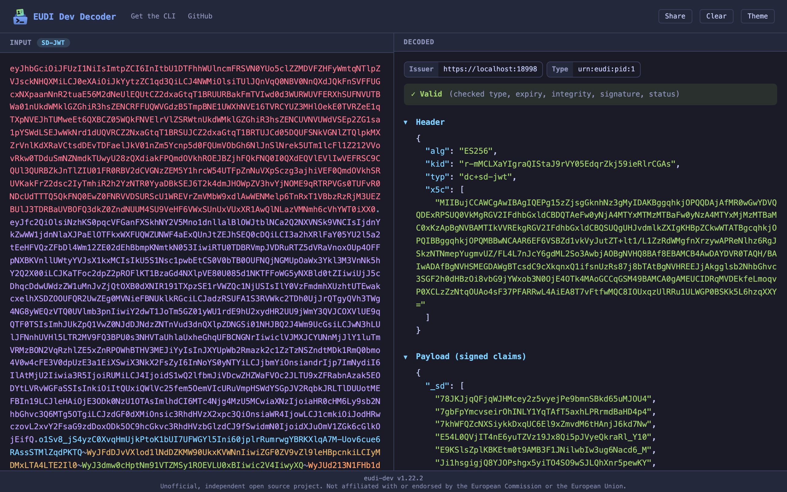

<p align="center">
  <picture>
    <source media="(prefers-color-scheme: dark)" srcset="docs/assets/logo-readme-dark.png">
    
  </picture>
</p>

[](https://github.com/dominikschlosser/eudi-dev/actions/workflows/ci.yml)
[](https://codecov.io/gh/dominikschlosser/eudi-dev)
[](https://github.com/dominikschlosser/eudi-dev/releases/latest)
[](#openid-certification)

[](docs/spec-compliance.md#oid4vp-10-openid-for-verifiable-presentations)
[](docs/spec-compliance.md#oid4vci-10-openid-for-verifiable-credential-issuance)
[](docs/spec-compliance.md#haip-10-high-assurance-interoperability-profile)
[](docs/spec-compliance.md#sd-jwt-selective-disclosure-jwt)
[](docs/spec-compliance.md#sd-jwt-selective-disclosure-jwt)
[](docs/spec-compliance.md#mdoc--iso-18013-5)
[](docs/spec-compliance.md#token-status-list-draft-ietf-oauth-status-list)
[](docs/spec-compliance.md#etsi-ts-119-602-trusted-entity-lists)

# Test Wallet and Dev Tools for the EUDI Ecosystem

A web and CLI wallet for testing EUDI issuers and verifiers.
It also decodes credentials, proxies wallet traffic for debugging and generates DCQL queries from credentials.

> **Try it online:** a shared public demo of the wallet and decoder runs at **<https://eudi-test.dev>**.

## Highlights

- **Wallet**: test issuance and presentation from the CLI or browser. Store state in files, memory or Postgres ([wallet](#wallet)).
- **Proxy**: inspect live OID4VP and OID4VCI traffic ([proxy](#proxy)).
- **Decoder**: inspect credentials, requests, offers and trust lists in the CLI or browser ([decode](#decode), [serve](#serve)).
- **Validation**: check signatures, expiry and status, with optional trust lists ([validate](#validate)).
- **QR scanning**: read credentials and requests from an image or your screen ([decode](#decode)).
- **DCQL**: generate a query from a credential ([dcql](#dcql)).

## Compared to other EUDI tooling

eudi-dev is a wallet for testing your issuer or verifier. The table compares it with other EUDI tools.

| Tool | What it tests | Runs locally | Scriptable |
|---|---|---|---|
| **eudi-dev** | your issuer or verifier | yes | CLI and HTTP API |
| [Animo OpenID4VC Playground](https://playground.animo.id/) | your wallet | self-hostable | no, web UI |
| [EUDIPLO Playground](https://playground.eudi-wallet.org/) | your wallet | self-hostable | no, web UI |
| [EUDI reference issuer and verifier](https://docs.eudi.dev/latest/test/issuer/) | your wallet | issuer only | no, web UI |
| [EUDI Web Wallet Tester](https://github.com/eu-digital-identity-wallet/eudi-app-web-wallet-tester-py) | your issuer, OID4VCI only | yes | no, web UI |
| [EUDI reference wallet](https://github.com/eu-digital-identity-wallet/eudi-app-android-wallet-ui) (Android, iOS) | your issuer or verifier | on a device | no |
| [Procivis One](https://github.com/procivis/one-wallet) trial apps | your issuer or wallet | on a device | no |
| [Multipaz](https://github.com/openwallet-foundation/multipaz) | your wallet or issuer, and proximity | SDK, apps, [hosted issuer and verifier](https://verifier.multipaz.org) | no |
| [polaris-oid4vp](https://pypi.org/project/polaris-oid4vp/) | your wallet: OpenID4VP 1.0 + HAIP, SD-JWT VC, `direct_post.jwt` | yes, `pip install` | CLI, a verdict line per presentation |
| [Paradym debuggers](https://paradym.id/articles/developer-tool-sdjwtvc-debugger) | one credential, decoded | no | no |
| SDKs: [walt.id](https://docs.walt.id/), [Sphereon](https://github.com/Sphereon-Opensource/OID4VC), [Credo](https://github.com/openwallet-foundation/credo-ts), [Procivis One](https://github.com/procivis/one-core) | whatever you build | yes | as you write it |

When to use something else:

- To certify your own implementation, use the [OpenID Foundation certification program](https://openid.net/certification/).
- To test a wallet, point it at one of the hosted issuer or verifier services above.
- To ship a product, use an SDK. The Go packages in this repository are internal (`internal/`).
- For proximity flows (BLE, NFC), use Multipaz. eudi-dev implements OID4VP over HTTP.
- To read a single credential, use a hosted decoder.

Never use real credentials (see [SECURITY.md](SECURITY.md)).

## Install

### Homebrew (macOS and Linux)

```bash
brew install dominikschlosser/tap/eudi-dev
```

Installs the `eudi` command with shell completion.

### From GitHub Releases

Download the latest binary for your platform from [Releases](https://github.com/dominikschlosser/eudi-dev/releases).

### From source

```bash
go install github.com/dominikschlosser/eudi-dev/v3@latest
```

This installs the binary as `eudi-dev` (Go uses the module name). The documentation uses `eudi`. Link it for the shorter name: `ln -s "$(go env GOPATH)/bin/eudi-dev" "$(go env GOPATH)/bin/eudi"`.

The module path is `github.com/dominikschlosser/eudi-dev/v3`. Each major version has its own suffix, so v2 releases install from `github.com/dominikschlosser/eudi-dev/v2`. Earlier v2 tags (up to v2.4.2) have an incorrect module path. Install them from release binaries or build them from source.

### Build locally

```bash
git clone https://github.com/dominikschlosser/eudi-dev.git
cd eudi-dev
go build -o eudi .
```

### Docker

```bash
docker pull ghcr.io/dominikschlosser/eudi-dev:latest
docker run -p 8085:8085 -p 8086:8086 ghcr.io/dominikschlosser/eudi-dev
```

The default CMD starts a headless wallet server with preloaded PID credentials. State is kept in memory, so the container needs no volume.

→ [Full Docker & verifier testing guide](docs/docker.md)
→ [OIDF conformance status](docs/conformance.md), [runbook](docs/conformance-run.md), and [results](docs/conformance-results.md)
→ [Examples](docs/examples.md)

### Kubernetes (Helm)

```bash
helm install my-release oci://ghcr.io/dominikschlosser/charts/eudi-dev
```

The [eudi-dev Helm chart](https://github.com/dominikschlosser/eudi-dev-helm) deploys the wallet with memory, file or PostgreSQL storage. It can create an Ingress or a Gateway API HTTPRoute and serve the wallet under a path prefix.

### Java integration tests

[testcontainers-eudi](https://github.com/dominikschlosser/testcontainers-eudi) starts the wallet in Docker for Java integration tests. Its Java client issues credentials, accepts credential offers and submits presentations.

## Usage

```
eudi [--json] [--no-color] [-v] <command> [flags] [input]
```

Input is a **file path**, **URL**, **raw credential string**, or **stdin**.

Shell completion covers all subcommands, flags, and known values (template names, credential IDs, running wallet instances). Install it for bash, zsh, or fish (detected from `$SHELL`):

```bash
eudi completion install
```

### Commands

| Command    | Purpose                                                    |
|------------|------------------------------------------------------------|
| `wallet`   | Stateful testing wallet with CLI-driven OID4VP/VCI flows   |
| `issue`    | Generate test SD-JWT, JWT, or mdoc credentials for development |
| `proxy`    | Debugging reverse proxy for OID4VP/VCI wallet traffic      |
| `serve`    | Web UI for decoding and validating credentials in the browser |
| `decode`   | Detect and inspect credentials, OpenID4VCI/VP requests, and trust lists. Verifies issuer metadata when resolvable |
| `validate` | Verify signatures, check expiry, and check revocation status |
| `templates` | Manage credential templates (`list`, `show`, `save`, `import`, `delete`) |
| `dcql`     | Generate a DCQL query from a credential's claims            |
| `completion` | Generate or install shell completion (`completion install`) |
| `version`  | Print version                                               |

---

### Wallet

A stateful testing wallet with CLI-driven OID4VP/VCI flows, QR scanning, and OS URL scheme registration. State is stored in files by default. `--storage` selects memory or Postgres.

```bash
eudi issue sdjwt --wallet --template pid-sdjwt         # Issue a PID into the wallet
eudi wallet serve                 # Start web UI + OID4VP endpoints
eudi wallet ca-cert --out wallet-ca-cert.pem
eudi wallet tls-cert --out wallet-tls-cert.pem
eudi wallet accept 'openid4vp://authorize?...'
eudi wallet scan --screen         # QR scan → auto-dispatch
eudi wallet logs -f               # Follow persisted wallet interactions
```

> **Security:** Anyone with network access to the wallet port controls its credentials and registered relying parties. Use localhost or an isolated test network and store test data only. The API rejects cross-origin requests. The exception is `/api/dc-api`, which verifier pages call from their own origin. It relies on the reported caller origin and the consent dialog. For public hosting, use the `--demo` profile (see [public demo hosting](docs/public-demo.md)).

`wallet serve` hosts the UI and protocol endpoints, including issuer metadata, trust lists and status lists. Use `issue ... --wallet --template pid-sdjwt` to add a PID. `wallet ca-cert` and `wallet tls-cert` export certificates for verifier trust stores. Automated tests can do the same through the [HTTP API](docs/wallet/http-api.md).

The main commands:

- `wallet serve` to run the wallet
- `issue ... --wallet` (with `--template` or `--pid`) to preload credentials
- `wallet ps` to find running wallet servers
- `wallet use <url>` to select a remote or containerized wallet
- `wallet kill` to stop a wallet server
- `wallet trust-list` to get the verifier trust list URL or JWT
- `wallet logs` to inspect wallet OID4VP/OID4VCI interactions
- `wallet ca-cert` and `wallet tls-cert` to export certificate material
- `wallet --mode debug|strict` and `--preferred-format ...` to control runtime behavior
- `wallet --tls-verify=true|false` to set HTTPS certificate verification and `--tls-ca dev-ca.pem` to trust a development CA
- `wallet --https-proxy http://proxy:3128` (or `HTTPS_PROXY`) to send requests to issuers and verifiers through a forward proxy
- `wallet serve --haip` to check verifiers and issuers against HAIP 1.0
- `wallet serve --arf` to check verifiers' access and registration certificates against the ARF
- `wallet registrar` to register relying parties and issue their certificates

`--haip` adds HAIP 1.0 checks and `--arf` adds the ARF relying party checks. `--mode strict` stops the flow on findings, including HAIP and ARF findings. `--mode debug` reports them and continues. See [HAIP enforcement](docs/wallet/presenting.md#haip-10-enforcement) and [ARF checks](docs/wallet/presenting.md#arf-checks).

When a wallet server is running for the selected wallet directory, CLI commands use its API. After `wallet use <url>`, commands and clicked offer or presentation links go to that target. `wallet ps` lists local instances and the active remote target.

`/api/trustlists` lists the trust list profiles. Each entry has a relative `path`, so it works with Docker port mappings. The web UI shows these URLs above the certificate downloads.


→ [Full documentation](docs/wallet.md): subcommands, flags, endpoints, logs, trust lists, storage, URL scheme registration
→ [Registrar](docs/wallet/registrar.md): register relying parties and issue their access and registration certificates
→ [Public demo hosting](docs/public-demo.md): run a shared internet-facing demo with `--demo` (hardened endpoints, periodic reset, imprint page)
→ [Flow diagrams](docs/diagrams/README.md): OID4VP / OID4VCI interaction diagrams and parameter checklists

---

### Issue

Generate test SD-JWT, JWT, or mdoc credentials for development and testing.

```bash
eudi issue sdjwt --pid
eudi issue sdjwt --template employee-card --claims '{"employee_id": "E-42"}'
eudi issue sdjwt --pid --always-disclosed issuing_country,address.country
eudi issue jwt --claims '{"name":"Test","age":30}'
eudi issue mdoc --claims '{"name":"Test"}' --doc-type com.example.test
eudi issue sdjwt | eudi decode
```

Credential templates hold reusable claim sets (`templates list|show|save|import|delete`). A template defines the credential type, default claims, and the always disclosed claims. Templates work in the CLI, the HTTP API, and the wallet UI.

→ [Full documentation](docs/issue.md): all flags, round-trip examples
→ [Credential templates](docs/templates.md): template files, management commands, always disclosed claims

---

### Proxy

Intercept and debug OID4VP/VCI traffic between a wallet and a verifier/issuer with a live web dashboard.

```bash
eudi proxy --target http://localhost:8080
```

```
Wallet  <-->  Proxy (:9090)  <-->  Verifier/Issuer (:8080)
                  |
            Live dashboard (:9091)
```

→ [Full documentation](docs/proxy.md): traffic classification, features, flags

---

### Serve

Start a local web UI for decoding and validating credentials in the browser.

```bash
eudi serve
eudi serve --port 3000
eudi serve credential.txt
```

The UI runs at `http://localhost:8080` by default. Paste a credential to decode it, expand its sections and check its signature. A credential passed on the command line fills the input. `--imprint-file` adds a legal notice at `/imprint`.



> **Warning:** The browser sends credentials to the server for decoding. Run it locally, or see [public demo hosting](docs/public-demo.md) for an internet-facing setup.

---

### Decode

Auto-detect and decode credentials (SD-JWT, JWT VC, mdoc), OpenID4VCI/VP requests, and ETSI trust lists.

```bash
eudi decode credential.txt
eudi decode 'openid4vp://authorize?...'
eudi decode --screen                    # QR scan from screen
```

→ [Full documentation](docs/decode.md): auto-detection order, format override, QR scanning, flags

---

### Validate

Verify signatures, check expiry, and check revocation status.

```bash
eudi validate --key issuer-key.pem credential.txt
eudi validate --trust-list trust-list.jwt credential.txt
eudi validate credential.txt
```

→ [Full documentation](docs/validate.md): flags, trust list explanation

---

### DCQL

Generate a DCQL (Digital Credentials Query Language) query from a credential's claims. Output is always JSON.

```bash
eudi dcql credential.txt
```

**Example output (SD-JWT):**

```json
{
  "credentials": [
    {
      "id": "urn_eudi_pid_1",
      "format": "dc+sd-jwt",
      "meta": { "vct_values": ["urn:eudi:pid:1"] },
      "claims": [
        { "path": ["birth_date"] },
        { "path": ["family_name"] },
        { "path": ["given_name"] }
      ]
    }
  ]
}
```

---

## Supported Formats

| Format | Description |
|--------|-------------|
| **SD-JWT** (`dc+sd-jwt`) | Header/payload, disclosures, `_sd` resolution, key binding JWT. Signature: ES256/384/512, RS256/384/512, PS256/384/512 |
| **JWT VC** (`jwt_vc_json`) | Plain JWT Verifiable Credentials (W3C JWT VC format), presented without changes |
| **mdoc** (`mso_mdoc`) | CBOR IssuerSigned & DeviceResponse (hex/base64url), COSE_Sign1 issuerAuth, MSO |
| **OpenID4VCI / VP** | Credential offers, authorization requests, URI schemes (`openid-credential-offer://`, `haip-vci://`, `eu-eaa-offer://`, `openid4vp://`, `haip-vp://`, `eudi-openid4vp://`) |
| **ETSI Trust Lists** | TS 119 602 trust list JWTs with entity names, identifiers, and service types |

## Spec Compliance

[docs/spec-compliance.md](docs/spec-compliance.md) lists the compliance status for OID4VP 1.0, OID4VCI 1.0, HAIP 1.0, SD-JWT (RFC 9901) and SD-JWT VC, mdoc (ISO 18013-5), ETSI trust lists, and Token Status List.
[docs/diagrams/README.md](docs/diagrams/README.md) shows the issuer and verifier interactions as diagrams.

## OpenID certification

<a href="https://openid.net/certification/mark/">
  
</a>

**eudi-dev v2.3.7 is OpenID Certified™** for the OpenID4VP 1.0 and OpenID4VCI 1.0 wallet profiles with HAIP 1.0, for both SD-JWT VC and mdoc credentials.

| Certification | Certified flows | Date |
|---|---|---|
| [OpenID4VP 1.0 + HAIP 1.0](https://openid.net/certification/certified-oid4vp-haip-final/) | Presentation using `direct_post.jwt` | 18 September 2026 |
| [OpenID4VCI 1.0 + HAIP 1.0](https://openid.net/certification/certified-oid4vci-haip-final/) | Wallet-initiated issuance and issuer-initiated issuance with offers by value or reference | 3 September 2026 |

The official listings link to the certification submissions and test results. This repository has its own [conformance results](docs/conformance-results.md) and a [runbook](docs/conformance-run.md). The OpenID Certified mark is a trademark of the OpenID Foundation and is used under its [mark usage terms](https://openid.net/certification/mark/).

## Global Flags

| Flag         | Description              |
|--------------|--------------------------|
| `--json`     | Print one JSON document on stdout for scripts. Messages go to stderr ([ADR 0020](docs/adr/0020-cli-output-can-be-automated.md)) |
| `--no-color` | Disable colored output   |
| `-v`         | Verbose output (x5c chain, device key, digest IDs) |

## Notices

**No EU affiliation:** This is an independent open source project. The European Commission and the European Union do not endorse it and it has no affiliation with them. "EUDI" describes the ecosystem the tool targets (European Digital Identity). For official EUDI Wallet resources see the [eu-digital-identity-wallet](https://github.com/eu-digital-identity-wallet) organization.

## License

Apache-2.0
