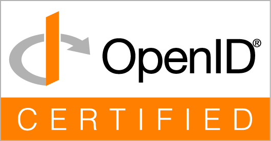

<p align="center">
  <picture>
    <source media="(prefers-color-scheme: dark)" srcset="docs/assets/logo-readme-dark.png">
    
  </picture>
</p>

[](https://github.com/dominikschlosser/eudi-dev/actions/workflows/ci.yml)
[](https://codecov.io/gh/dominikschlosser/eudi-dev)
[](https://github.com/dominikschlosser/eudi-dev/releases/latest)
[](#openid-certification)

[](docs/spec-compliance.md#oid4vp-10-openid-for-verifiable-presentations)
[](docs/spec-compliance.md#oid4vci-10-openid-for-verifiable-credential-issuance)
[](docs/spec-compliance.md#haip-10-high-assurance-interoperability-profile)
[](docs/spec-compliance.md#sd-jwt-selective-disclosure-jwt)
[](docs/spec-compliance.md#sd-jwt-selective-disclosure-jwt)
[](docs/spec-compliance.md#mdoc--iso-18013-5)
[](docs/spec-compliance.md#token-status-list-draft-ietf-oauth-status-list)
[](docs/spec-compliance.md#etsi-ts-119-602-trusted-entity-lists)

# Test Wallet and Dev Tools for the EUDI Ecosystem

A wallet for testing EUDI issuers and verifiers, in the browser, on the command line and over an HTTP API. It speaks OpenID4VP 1.0, OpenID4VCI 1.0 and HAIP 1.0 with SD-JWT VC and mdoc credentials, and it comes with the parts of the ecosystem around a wallet: a registrar, PID templates, a demo issuer and verifier, a decoder and a debug proxy.

> **Try it online:** a shared public demo runs at **<https://eudi-test.dev>**. The newest beta runs at <https://preview.eudi-test.dev>.


## Highlights

**A wallet for testing your issuer or verifier.** Accept credential offers and answer presentation requests from the web UI, the CLI or the HTTP API. Every exchange shows up in the activity log with its requests and responses. Debug mode reports what an issuer or verifier gets wrong and carries on. Strict mode refuses. → [Wallet](docs/wallet.md), [presenting](docs/wallet/presenting.md), [issuing](docs/wallet/issuing.md)

**HAIP and ARF checks.** `--haip` checks verifiers and issuers against HAIP 1.0. `--arf` checks how they authenticate under the ARF: access and registration certificates, revocation, and whether a verifier asks for more than it registered. → [HAIP](docs/wallet/presenting.md#haip-10-enforcement), [ARF checks for verifiers](docs/wallet/presenting.md#arf-checks) and [for issuers](docs/wallet/issuing.md#arf-checks)

**A registrar and a catalogue of attestations.** Register a verifier or an issuer and get its access certificate and registration certificate (ETSI TS 119 411-8, TS 119 475), ready for `verifier_info` or `issuer_info`. The catalogue lists attestation types (EC TS11). Each type links a schema for each format, a rulebook and optionally a trusted list. → [Registrar](docs/wallet/registrar.md)

**PIDs and credential templates.** The EUDI PID and the German, Italian and Dutch PIDs are built in as SD-JWT VC and mdoc, with sample identities. Templates define your own credentials, and `--credentials` loads them on every start. → [Templates](docs/templates.md), [startup credentials](docs/wallet/serve.md#startup-credentials)

**A demo issuer and verifier.** The wallet also serves an issuer and a verifier, so you can try a flow end to end or test another wallet. Both pass the OIDF conformance plans for issuers and verifiers. → [Serving the wallet](docs/wallet/serve.md), [demo conformance](docs/conformance-run-demorp.md)

**Developer tools.** Decode credentials, requests, offers and trusted lists, validate signatures and status, scan QR codes, generate DCQL queries, and watch live wallet traffic through a proxy. → [Decode](docs/decode.md), [validate](docs/validate.md), [issue](docs/issue.md), [proxy](docs/proxy.md)

**Runs where your tests run.** A single binary, a Docker image, a Helm chart and a Testcontainers module, with state in files, memory or Postgres. → [Docker](docs/docker.md), [storage](docs/wallet.md#storage-backends), [public demo hosting](docs/public-demo.md)

**OpenID Certified.** The wallet is certified for OpenID4VP 1.0 and OpenID4VCI 1.0 with HAIP 1.0. → [Certification](#openid-certification), [conformance results](docs/conformance-results.md), [spec compliance](docs/spec-compliance.md)

Never use real credentials (see [SECURITY.md](SECURITY.md)).

## Quick start

```bash
brew install dominikschlosser/tap/eudi-dev
eudi wallet serve --pid            # wallet UI at http://localhost:8085 with PIDs
eudi wallet accept 'openid4vp://authorize?...'
eudi wallet registrar verifiers add --name "Example Shop" --purpose "Age check" --dcql query.json
eudi decode credential.txt
```

Or with Docker:

```bash
docker run -p 8085:8085 -p 8086:8086 ghcr.io/dominikschlosser/eudi-dev
```

→ [Examples](docs/examples.md) for end-to-end recipes, and [all documentation](docs/README.md)

## Install

| Method | Command |
|---|---|
| Homebrew (macOS and Linux) | `brew install dominikschlosser/tap/eudi-dev` installs `eudi` with shell completion |
| Binaries | [GitHub Releases](https://github.com/dominikschlosser/eudi-dev/releases) |
| Go | `go install github.com/dominikschlosser/eudi-dev/v3@latest` installs `eudi-dev`. The docs use `eudi`, so link it: `ln -s "$(go env GOPATH)/bin/eudi-dev" "$(go env GOPATH)/bin/eudi"` |
| Docker | `docker pull ghcr.io/dominikschlosser/eudi-dev`. The default command starts a wallet with PIDs and keeps state in memory ([guide](docs/docker.md)) |
| Kubernetes | `helm install my-release oci://ghcr.io/dominikschlosser/charts/eudi-dev` ([chart](https://github.com/dominikschlosser/eudi-dev-helm)) |
| Java tests | [testcontainers-eudi](https://github.com/dominikschlosser/testcontainers-eudi) starts the wallet in Docker and drives it from Java |
| Source | `git clone https://github.com/dominikschlosser/eudi-dev.git && cd eudi-dev && go build -o eudi .` |

The Go module path is `github.com/dominikschlosser/eudi-dev/v3`. Each major version has its own suffix, so v2 releases install from `github.com/dominikschlosser/eudi-dev/v2`. Earlier v2 tags (up to v2.4.2) have an incorrect module path. Install them from release binaries or build them from source.

### Beta releases

A new major version comes out as betas first, for example `v3.0.0-beta.1`. A beta is a prerelease on GitHub. You only get it when you ask for it:

| Method | Command |
|---|---|
| Online | <https://preview.eudi-test.dev> runs the newest beta |
| Docker | `docker pull ghcr.io/dominikschlosser/eudi-dev:beta` gets the newest release, betas included. For repeatable runs, pin the exact tag, such as `:v3.0.0-beta.1` |
| Go | `go install github.com/dominikschlosser/eudi-dev/v3@v3.0.0-beta.1`. Go treats `/v3` as its own module, so until 3.0.0 is out, `/v3@latest` installs the newest beta too |
| Binaries | Download them from the prerelease on [GitHub Releases](https://github.com/dominikschlosser/eudi-dev/releases). The binaries aren't signed, so macOS blocks one you downloaded in the browser. Run `xattr -d com.apple.quarantine eudi` to unblock it |
| Java tests | [testcontainers-eudi](https://github.com/dominikschlosser/testcontainers-eudi) publishes a matching beta, such as `3.0.0-beta.1`. Maven only uses it when you set that version |

Homebrew and the `latest` Docker tag stay on the newest stable release. If you installed with Homebrew, try a beta with Docker or `go install`. Once the final release is out, `beta` points to it, so beta testers end up on the stable version.

## Commands

```
eudi [--json] [--no-color] [-v] <command> [flags] [input]
```

| Command | Purpose | Docs |
|---|---|---|
| `wallet` | The testing wallet: `serve`, `accept`, `scan`, `list`, `logs` and more | [wallet](docs/wallet.md) |
| `wallet registrar` | Register `verifiers` and `issuers`, then issue, `revoke` and `activate` their certificates | [registrar](docs/wallet/registrar.md) |
| `wallet catalog` | List, add and remove attestation types | [catalogue](docs/wallet/registrar.md#attestation-catalogue) |
| `issue` | Generate SD-JWT, JWT or mdoc test credentials | [issue](docs/issue.md) |
| `templates` | Manage credential templates | [templates](docs/templates.md) |
| `decode` | Inspect credentials, OpenID4VCI and OpenID4VP requests, and trusted lists | [decode](docs/decode.md) |
| `validate` | Verify signatures, expiry and revocation status | [validate](docs/validate.md) |
| `dcql` | Generate a DCQL query from a credential | |
| `proxy` | Debug proxy for wallet traffic with a live dashboard | [proxy](docs/proxy.md) |
| `serve` | Decoder web UI | |
| `completion` | Shell completion (`eudi completion install`) | |

Input is a file path, a URL, a raw credential string or stdin. `--json` prints one JSON document on stdout for scripts, and messages go to stderr ([ADR 0020](docs/adr/0020-cli-output-can-be-automated.md)). `-v` adds detail such as x5c chains, device keys and digest IDs.

> **Security:** Anyone with network access to the wallet port controls its credentials and registered relying parties. Use localhost or an isolated test network and store test data only. For public hosting, use the `--demo` profile (see [public demo hosting](docs/public-demo.md)).

## Supported formats

| Format | Description |
|--------|-------------|
| **SD-JWT VC** (`dc+sd-jwt`) | Disclosures, `_sd` resolution, key binding JWT. Signatures: ES256/384/512, RS256/384/512, PS256/384/512 |
| **mdoc** (`mso_mdoc`) | CBOR IssuerSigned and DeviceResponse, COSE_Sign1 issuerAuth, MSO |
| **JWT VC** (`jwt_vc_json`) | Plain W3C JWT Verifiable Credentials, presented unchanged |
| **OpenID4VCI and OpenID4VP** | Credential offers and authorization requests with the schemes `openid-credential-offer://`, `haip-vci://`, `eu-eaa-offer://`, `openid4vp://`, `haip-vp://` and `eudi-openid4vp://` |
| **ETSI trusted lists** | TS 119 602 lists of trusted entities |

[Spec compliance](docs/spec-compliance.md) lists what is implemented for each specification, and the [flow diagrams](docs/diagrams/README.md) show the issuer and verifier interactions.

## Compared to other EUDI tooling

eudi-dev is a wallet for testing your issuer or verifier. The table compares it with other EUDI tools.

| Tool | What it tests | Runs locally | Scriptable |
|---|---|---|---|
| **eudi-dev** | your issuer or verifier | yes | CLI and HTTP API |
| [Animo OpenID4VC Playground](https://playground.animo.id/) | your wallet | self-hostable | no, web UI |
| [EUDIPLO Playground](https://playground.eudi-wallet.org/) | your wallet | self-hostable | no, web UI |
| [EUDI reference issuer and verifier](https://docs.eudi.dev/latest/test/issuer/) | your wallet | issuer only | no, web UI |
| [EUDI Web Wallet Tester](https://github.com/eu-digital-identity-wallet/eudi-app-web-wallet-tester-py) | your issuer, OID4VCI only | yes | no, web UI |
| [EUDI reference wallet](https://github.com/eu-digital-identity-wallet/eudi-app-android-wallet-ui) (Android, iOS) | your issuer or verifier | on a device | no |
| [Procivis One](https://github.com/procivis/one-wallet) trial apps | your issuer or wallet | on a device | no |
| [Multipaz](https://github.com/openwallet-foundation/multipaz) | your wallet or issuer, and proximity | SDK, apps, [hosted issuer and verifier](https://verifier.multipaz.org) | no |
| [polaris-oid4vp](https://pypi.org/project/polaris-oid4vp/) | your wallet: OpenID4VP 1.0 + HAIP, SD-JWT VC, `direct_post.jwt` | yes, `pip install` | CLI, a verdict line per presentation |
| [Paradym debuggers](https://paradym.id/articles/developer-tool-sdjwtvc-debugger) | one credential, decoded | no | no |
| SDKs: [walt.id](https://docs.walt.id/), [Sphereon](https://github.com/Sphereon-Opensource/OID4VC), [Credo](https://github.com/openwallet-foundation/credo-ts), [Procivis One](https://github.com/procivis/one-core) | whatever you build | yes | as you write it |

When to use something else:

- To certify your own implementation, use the [OpenID Foundation certification program](https://openid.net/certification/).
- To test a wallet, point it at one of the hosted issuer or verifier services above.
- To ship a product, use an SDK. The Go packages in this repository are internal (`internal/`).
- For proximity flows (BLE, NFC), use Multipaz. eudi-dev implements OID4VP over HTTP.
- To read a single credential, use a hosted decoder.

## OpenID certification

<a href="https://openid.net/certification/mark/">
  
</a>

**eudi-dev v2.3.7 is OpenID Certified™** for the OpenID4VP 1.0 and OpenID4VCI 1.0 wallet profiles with HAIP 1.0, for both SD-JWT VC and mdoc credentials.

| Certification | Certified flows | Date |
|---|---|---|
| [OpenID4VP 1.0 + HAIP 1.0](https://openid.net/certification/certified-oid4vp-haip-final/) | Presentation using `direct_post.jwt` | 18 September 2026 |
| [OpenID4VCI 1.0 + HAIP 1.0](https://openid.net/certification/certified-oid4vci-haip-final/) | Wallet-initiated issuance and issuer-initiated issuance with offers by value or reference | 3 September 2026 |

The official listings link to the certification submissions and test results. This repository has its own [conformance results](docs/conformance-results.md) and a [runbook](docs/conformance-run.md). The OpenID Certified mark is a trademark of the OpenID Foundation and is used under its [mark usage terms](https://openid.net/certification/mark/).

## Notices

**No EU affiliation:** This is an independent open source project. The European Commission and the European Union do not endorse it and it has no affiliation with them. "EUDI" describes the ecosystem the tool targets (European Digital Identity). For official EUDI Wallet resources see the [eu-digital-identity-wallet](https://github.com/eu-digital-identity-wallet) organization.

## License

Apache-2.0
