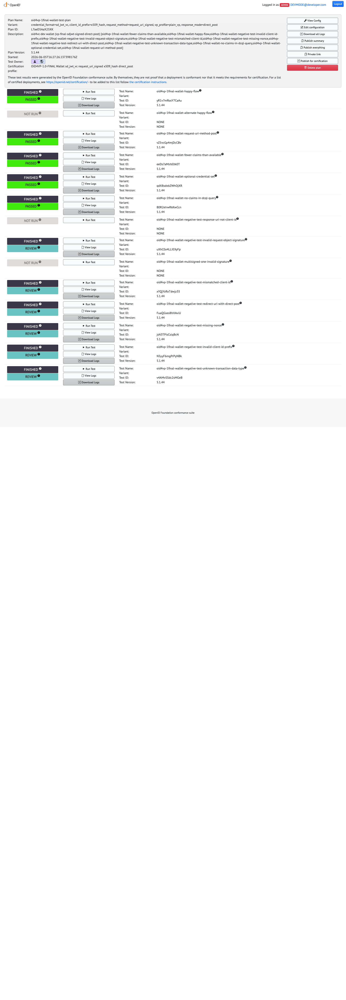
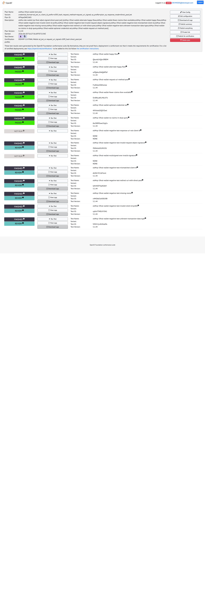
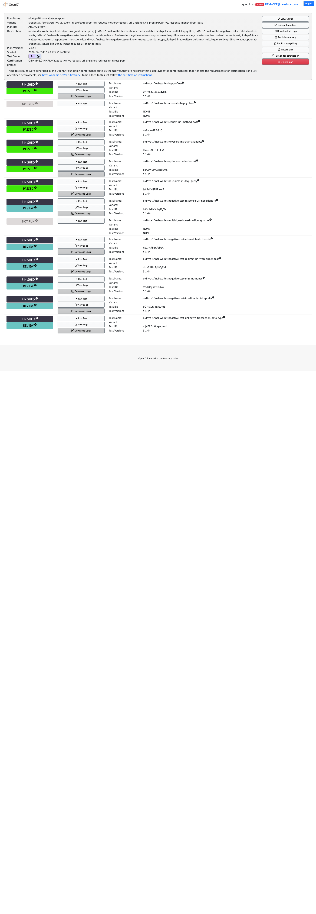
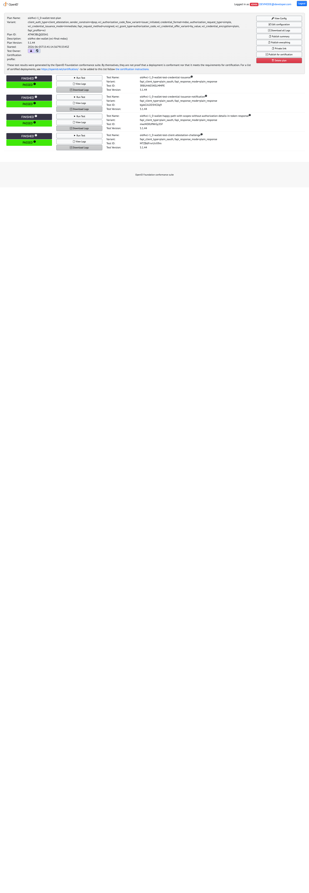
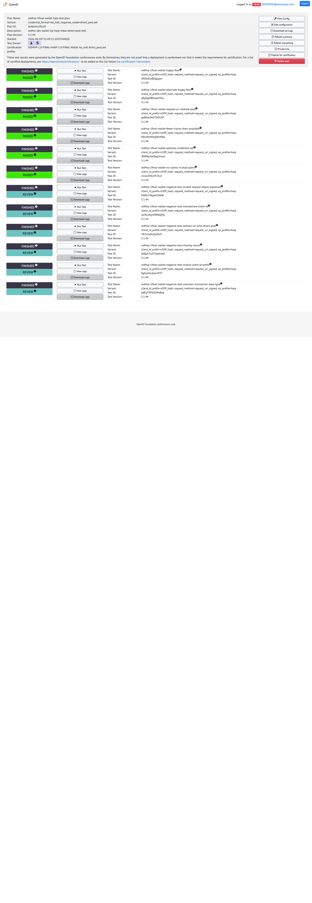
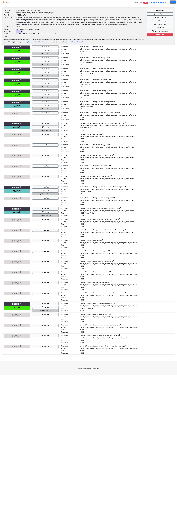
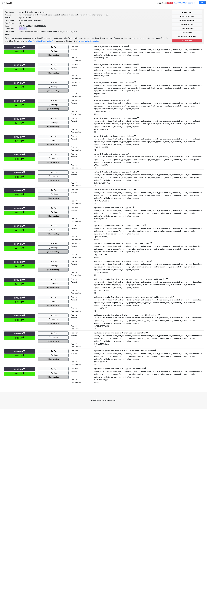

# Current OIDF Wallet Conformance Results

These are the current local wallet conformance results for `oid4vc-dev`. Use [Running OIDF Wallet Conformance](./conformance-run.md) to reproduce or update them.

## Baseline

- date: 2026-06-05
- wallet mode: strict
- suite server: local `https://localhost:8443/`
- suite baseline: `release-v5.1.44`, version `5.1.44`, revision `f326f6a`
- full run directory: `/tmp/oidf-wallet-conformance-20260605-rerun-all-buildvcsfalse`
- full runner log: `/tmp/oidf-wallet-conformance-20260605-rerun-all-buildvcsfalse/runner.log`
- full exported result archives: `/tmp/oidf-wallet-conformance-20260605-rerun-all-buildvcsfalse/results/`
- targeted VP fix run directory: `/tmp/oidf-wallet-conformance-20260605-fix-vp-targeted-brain`
- targeted VP fix runner log: `/tmp/oidf-wallet-conformance-20260605-fix-vp-targeted-brain/runner.log`
- targeted VP fix exported result archives: `/tmp/oidf-wallet-conformance-20260605-fix-vp-targeted-brain/results/`
- plan-detail screenshots: [`docs/conformance-results/2026-06-05/`](./conformance-results/2026-06-05/)

Command used:

```bash
GOFLAGS=-buildvcs=false \
OIDF_SUITE_DIR="$PWD/../conformance-suite" \
OIDF_SUITE_TAG=release-v5.1.44 \
OIDF_RUN_DIR=/tmp/oidf-wallet-conformance-20260605-rerun-all-buildvcsfalse \
  scripts/oidf-wallet-conformance.sh
```

The original full command exposed release-v5.1.44 suite-side VP module issues. The wrapper now passes explicit VP module lists for each generated variant so the local matrix runs the executable modules for that variant. The affected VP plans were rerun with:

```bash
GOFLAGS=-buildvcs=false \
OIDF_SUITE_DIR="$PWD/../conformance-suite" \
OIDF_SUITE_TAG=release-v5.1.44 \
OIDF_RUN_DIR=/tmp/oidf-wallet-conformance-20260605-fix-vp-targeted-brain \
  scripts/oidf-wallet-conformance.sh --rerun '1,2,3,4,9,10'
```

That targeted rerun completed successfully. VCI coverage remains green from the full run.

## Result Classification

- `PASSED` is green.
- `REVIEW` is pass-equivalent for this local harness when the runner summary shows `FINISHED`, `REVIEW`, and `0 FAILURE`. These modules are negative tests where the wallet rejects the request and the harness uploads the required screenshot placeholder.
- `INTERRUPTED` is not pass-equivalent. The current selected matrix has no `INTERRUPTED` modules.

## Matrix

| # | Plan | Variant | Current result | Screenshot |
|---|---|---|---|---|
| 1 | VP Final | SD-JWT, `direct_post`, signed `x509_hash` | 461 success / 0 failure. `REVIEW` negative modules are pass-equivalent. | [PNG](./conformance-results/2026-06-05/plan-01-vp-final-sdjwt-direct-post.png) |
| 2 | VP Final | SD-JWT, `direct_post.jwt`, signed `x509_hash` | 580 success / 0 failure. `REVIEW` negative modules are pass-equivalent. | [PNG](./conformance-results/2026-06-05/plan-02-vp-final-sdjwt-direct-post-jwt.png) |
| 3 | VP Final | SD-JWT, `direct_post`, unsigned `redirect_uri` | 461 success / 0 failure. `response-uri-not-client-id` finishes as pass-equivalent `REVIEW`. | [PNG](./conformance-results/2026-06-05/plan-03-vp-final-sdjwt-unsigned-direct-post.png) |
| 4 | VP Final | mDoc, `direct_post.jwt`, signed `x509_hash` | 488 success / 0 failure. `REVIEW` negative modules are pass-equivalent. | [PNG](./conformance-results/2026-06-05/plan-04-vp-final-mdoc-direct-post-jwt.png) |
| 5 | VCI Final | SD-JWT | 775 success / 0 failure. | [PNG](./conformance-results/2026-06-05/plan-05-vci-final-sdjwt.png) |
| 6 | VCI Final | mDoc | 803 success / 0 failure. | [PNG](./conformance-results/2026-06-05/plan-06-vci-final-mdoc.png) |
| 7 | VP HAIP | SD-JWT, `direct_post.jwt` | 616 success / 0 failure. `REVIEW` negative modules are pass-equivalent. | [PNG](./conformance-results/2026-06-05/plan-07-vp-haip-sdjwt-direct-post-jwt.png) |
| 8 | VP HAIP | mDoc, `direct_post.jwt` | 512 success / 0 failure. `REVIEW` negative modules are pass-equivalent. | [PNG](./conformance-results/2026-06-05/plan-08-vp-haip-mdoc-direct-post-jwt.png) |
| 9 | VP HAIP | SD-JWT, `dc_api.jwt` | 466 success / 0 failure. `REVIEW` negative modules are pass-equivalent. | [PNG](./conformance-results/2026-06-05/plan-09-vp-haip-sdjwt-dc-api-jwt.png) |
| 10 | VP HAIP | mDoc, `dc_api.jwt` | 328 success / 0 failure. `REVIEW` negative modules are pass-equivalent. | [PNG](./conformance-results/2026-06-05/plan-10-vp-haip-mdoc-dc-api-jwt.png) |
| 11 | VCI HAIP | SD-JWT | 3181 success / 0 failure. | [PNG](./conformance-results/2026-06-05/plan-11-vci-haip-sdjwt.png) |
| 12 | VCI HAIP | mDoc | 3262 success / 0 failure. | [PNG](./conformance-results/2026-06-05/plan-12-vci-haip-mdoc.png) |

## Passing VCI Coverage

- VCI Final SD-JWT and mDoc issuer-initiated authorization-code flows pass.
- VCI HAIP SD-JWT and mDoc pass for plain immediate issuance, deferred issuance, encrypted credential request variants, FAPI happy-path modules, and FAPI negative authorization-response modules.
- Strict mode rejects issuer mismatch in authorization server metadata, invalid authorization-response `iss`, removed authorization-response `iss`, invalid `state`, and missing `state`.

## VP Module Selection

The current wrapper passes explicit module lists for VP plans instead of relying on release-v5.1.44 `VariantNotApplicable` filtering. This keeps the local result pages focused on executable coverage for each generated variant.

Known release-v5.1.44 suite-side exclusions:

- VP Final `direct_post` omits `alternate-happy-flow` because that module unconditionally replaces encrypted-response setup that is absent for plain `direct_post`.
- VP Final x509 variants omit `response-uri-not-client-id`; the suite marks that module not applicable for `x509_hash`, and the applicable `redirect_uri` variant passes as `REVIEW`.
- VP Final non-multisigned variants omit `multisigned-one-invalid-signature`.
- VP HAIP `dc_api.jwt` omits `invalid-client-id-prefix`; the unsigned `web-origin` variant throws a suite `NullPointerException` before invoking the wallet. Invalid-prefix rejection remains covered by VP Final and VP HAIP `direct_post.jwt`.

Current `no-claims-in-dcql-query` status:

- VP Final SD-JWT `no-claims-in-dcql-query` passes for plans 1, 2, and 3.
- VP Final mDoc `no-claims-in-dcql-query` passes for plan 4.
- VP HAIP SD-JWT `no-claims-in-dcql-query` passes for plans 7 and 9.
- VP HAIP mDoc `no-claims-in-dcql-query` passes for plans 8 and 10.

## Visual Evidence

These screenshots are the local OIDF `plan-detail.html` pages from the current documented runs. They preserve the suite's green, review, and not-run status boxes.

<details>
<summary>Plan 1: VP Final SD-JWT direct_post</summary>



</details>

<details>
<summary>Plan 2: VP Final SD-JWT direct_post.jwt</summary>



</details>

<details>
<summary>Plan 3: VP Final SD-JWT unsigned direct_post</summary>



</details>

<details>
<summary>Plan 4: VP Final mDoc direct_post.jwt</summary>


</details>

<details>
<summary>Plan 5: VCI Final SD-JWT</summary>


</details>

<details>
<summary>Plan 6: VCI Final mDoc</summary>



</details>

<details>
<summary>Plan 7: VP HAIP SD-JWT direct_post.jwt</summary>


</details>

<details>
<summary>Plan 8: VP HAIP mDoc direct_post.jwt</summary>



</details>

<details>
<summary>Plan 9: VP HAIP SD-JWT dc_api.jwt</summary>



</details>

<details>
<summary>Plan 10: VP HAIP mDoc dc_api.jwt</summary>


</details>

<details>
<summary>Plan 11: VCI HAIP SD-JWT</summary>


</details>

<details>
<summary>Plan 12: VCI HAIP mDoc</summary>



</details>

## Result Inspection

Use this query to summarize important runner lines from a run:

```bash
rg -n \
  "Results for \\[[0-9]+\\]|Overall totals|\\*\\* SOME TEST|\\*\\* Exiting|INTERRUPTED|result .*FAILED|result .*REVIEW|no-claims-in-dcql-query|invalid-client-id-prefix" \
  "$OIDF_RUN_DIR/runner.log"
```

Use the printed `plan-detail.html?plan=...` URLs from `runner.log` to inspect module details in the local suite UI.

## Update Rules

When the wallet or suite baseline changes:

- rerun the full matrix unless the change is clearly limited to a documented targeted rerun
- preserve all previously passing conformance coverage
- update the baseline tag, suite revision, run directory, runner log, and exported artifact location
- update the matrix, suite-side exclusions, and screenshots in this file
- keep suite-side exclusions visible until the upstream suite behavior changes
