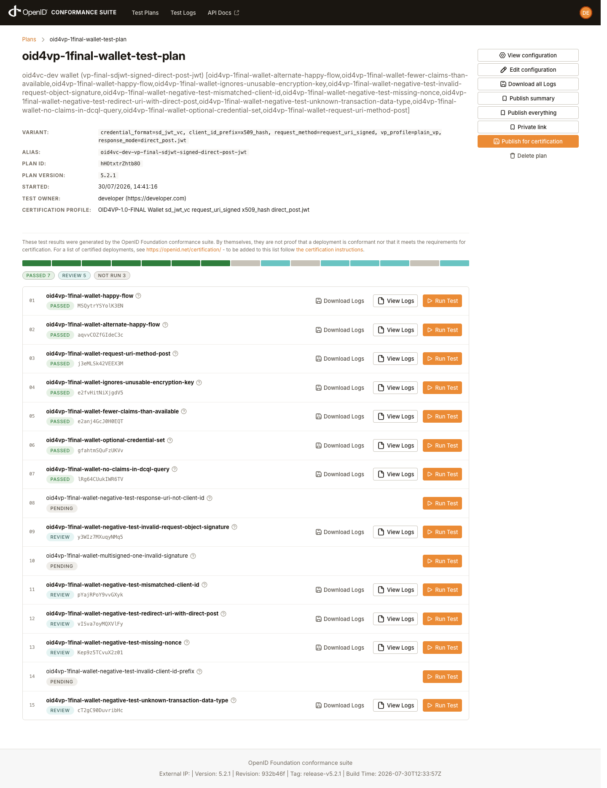
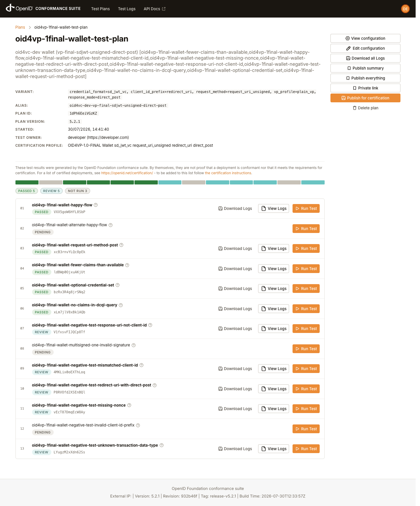
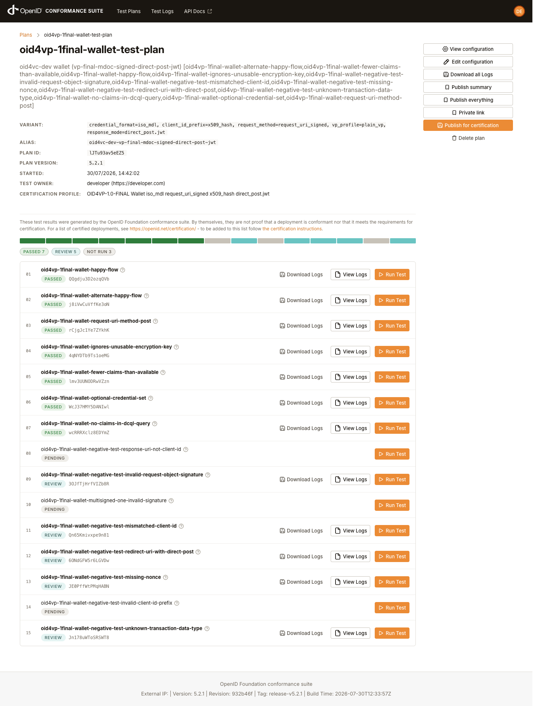
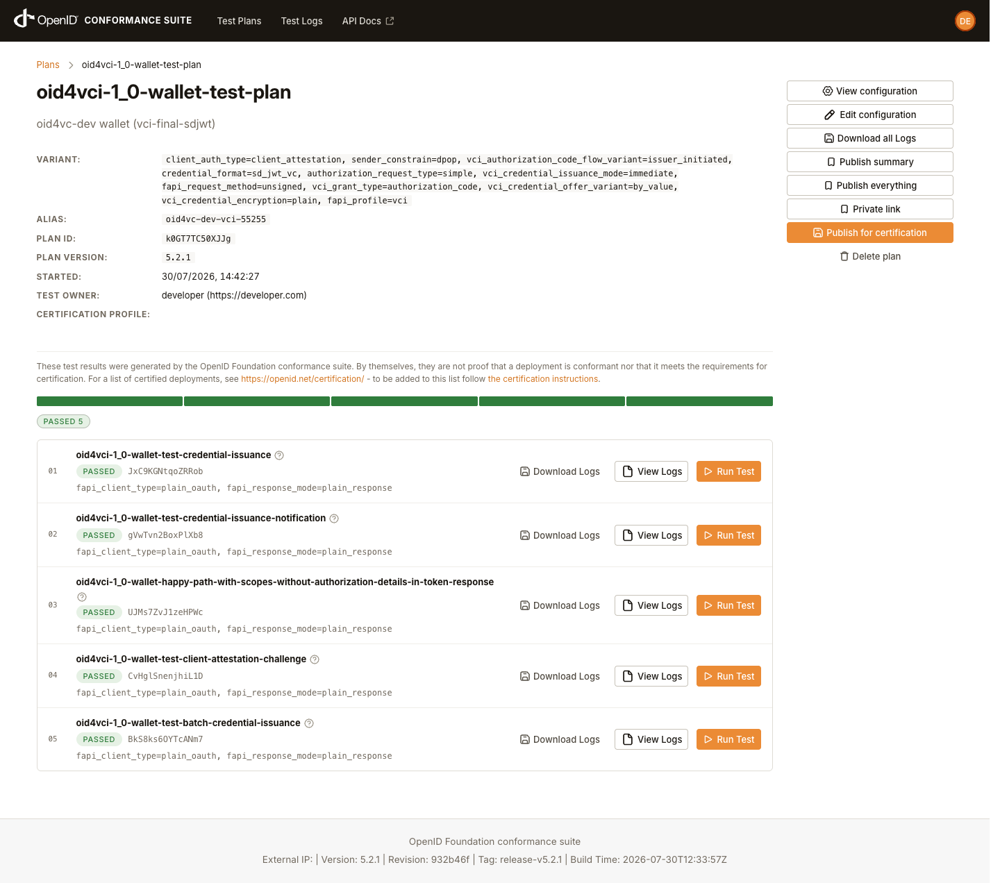
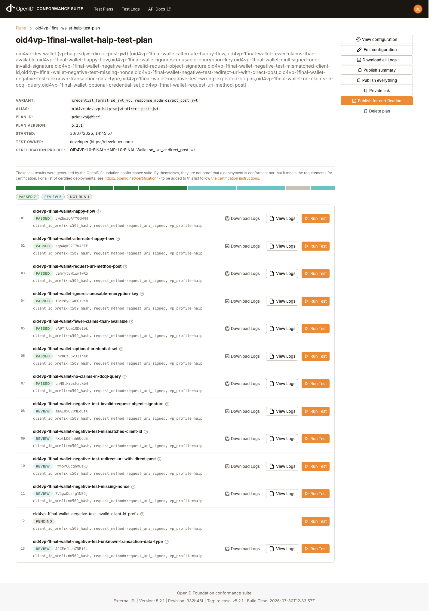
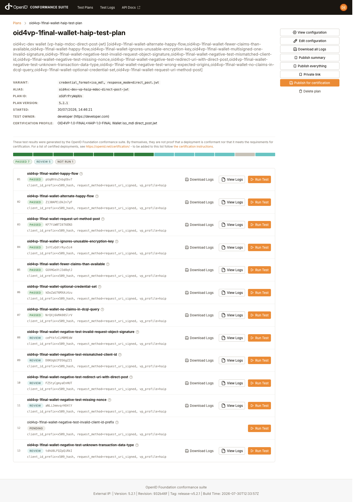
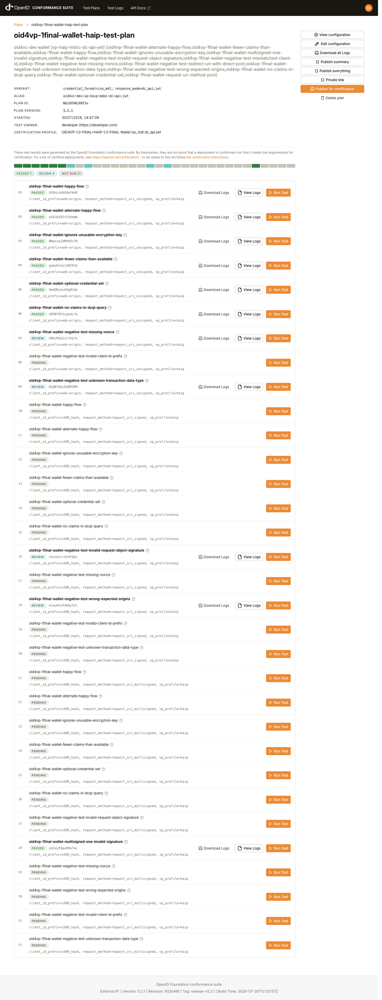
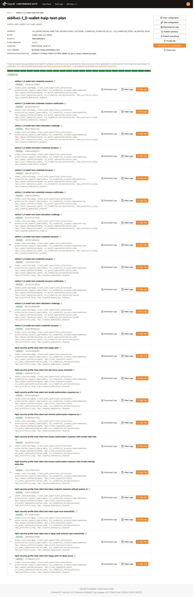

# Current OIDF Wallet Conformance Results

These are the current local wallet conformance results for `eudi-dev`. Use [Running OIDF Wallet Conformance](./conformance-run.md) to reproduce or update them.

## Baseline

- date: 2026-08-07 (previous: 2026-08-05 and 2026-08-04, same totals across 12 plans. And 2026-07-30, which did not exercise credential status. See below)
- wallet mode: strict
- suite server: local `https://localhost:8443/`
- suite baseline: `release-v5.2.1`, version `5.2.1`, revision `932b46f`
- full run directory: `/tmp/oidf-wallet-conformance-local-strict`
- full runner log: `/tmp/oidf-wallet-conformance-local-strict/runner.log`
- full exported result archives: `/tmp/oidf-wallet-conformance-local-strict/results/`
- plan-detail screenshots: [`docs/conformance-results/2026-07-30/`](./conformance-results/2026-07-30/)

Command used:

```bash
OIDF_SUITE_DIR="$PWD/../conformance-suite" \
OIDF_SUITE_TAG=release-v5.2.1 \
OIDF_RUN_DIR=/tmp/oidf-wallet-conformance-local-strict \
  scripts/oidf-wallet-conformance.sh
```

The full matrix passes in a single run: all 14 plans finish with 0 condition failures and 0 warnings (114 modules `PASSED`, 38 negative modules `REVIEW`, 2 `SKIPPED`, 15,228 condition successes). The 2026-07-30 run reported comparable totals, but its credentials carried no status list, so the status-list conditions were skipped rather than passed.

## Run of 2026-08-04

Re-run against the same suite baseline (`release-v5.2.1`), with the server running on the host per [the runbook](./conformance-run.md):

**106 modules PASSED, 38 negative modules REVIEW, 0 FAILED**, across all 12 plans, with zero condition failures.

This run exercises credential status for the first time. Until now the tested configuration produced no status list at all: default PID generation was gated on `w.BaseURL != ""`, and the wrapper starts the wallet with only `--port`, so the credentials carried no `status` claim and the suite skipped `FetchStatusListToken` and everything after it. Once the gate became `StatusListURL() != ""` (which falls back to the always-derived issuer URL), those conditions started running and surfaced two defects that had never been exercised:

- the status list token carried the self-signed trust anchor inside its `x5c` chain, which HAIP 6.1 rejects ("Trust anchor certificate must not be included in x5c chain"). 14 modules
- the token offered no key-resolution route the Final (non-HAIP) plans accept: that branch verifies with a `jwk` embedded in the header or with `server_jwks`, and `server_jwks` is unreachable in these plans. 17 modules

Both are fixed. The token now strips the trust anchor from `x5c` and additionally embeds the signing key as a `jwk` header, derived from the signing key so it cannot disagree with the `x5c` leaf. `x5c` remains the anchored route that HAIP validates. `jwk` is the convenience route, permitted because Token Status List §5.1 requires only `typ` and `jwk` is a registered JOSE header (RFC 7515 §4.1.3).

## Run of 2026-08-05

Re-run for the 1.19.2 release against the same suite baseline, after the browser hardening and the authorization code flow changes: **106 modules PASSED, 38 negative modules REVIEW, 0 FAILED**, 13,951 condition successes with 0 failures and 0 warnings across all 12 plans. Same totals as 2026-08-04, so neither the stricter `redirect_uri` scheme check nor the reworked authorization code flow moved conformance. The suite drives the authorization endpoint through redirects, so it never takes the interactive-login branch the demo issuer uses.

## Run of 2026-08-07

Re-run for the 1.19.19 release against the same suite baseline, after the conformance work of 1.19.18 and 1.19.19: **114 modules PASSED, 38 negative modules REVIEW, 2 SKIPPED, 0 FAILED**, 15,228 condition successes with 0 failures and 0 warnings across 14 plans.

The matrix is 14 plans rather than 12: the pre-authorized code flow is now covered for both credential formats (plans 7 and 8).

Two batches of modules moved from `SKIPPED` to `PASSED` in this run, both because the wallet had been declining to do something the suite was waiting for:

- the 5 mdoc `batch-credential-issuance` modules. A credential configuration requiring key attestations collapsed the credential request to a single proof, and the suite skips the module when the wallet sends only one ("batch behavior cannot be evaluated"). The mdoc plans request `eu.europa.ec.eudi.pid.mdoc.1.jwt.keyattest` while the SD-JWT plans request a configuration with no such requirement, which is why the split fell along format lines and not because of anything mdoc-specific. OpenID4VCI 1.0 Appendix F.1 has one proof per key, each carrying an attestation whose `attested_keys` covers every key in the request
- 2 of the 4 `credential-issuance-notification` modules, the pre-authorized code ones. The Notification Endpoint was called only on the authorization code path

The 2 remaining `SKIPPED` modules are `credential-issuance-notification` in the `vci_credential_issuance_mode=deferred` variant of the two VCI HAIP plans, measured before the deferred acknowledgement was added. The suite exits non-zero on an unexpected skip even with no failures, so a run reporting these two ends with status 1.

### Flaky module to expect

`RequestUriFetchedMoreThanOnce` can fail spuriously. `submit_wallet_request` retries a submission up to five times after a transient HTTP 502, and each submission makes the wallet fetch the `request_uri` once, so a retry produces a second fetch that the suite flags. It appeared once in an earlier run of this same code on a loaded machine and did not reproduce on a quiet one. Re-run before treating it as a defect.

## New release-v5.2.1 Coverage

Release-v5.2.1 added two wallet test modules. Both are implemented by the wallet and pass:

- `oid4vci-1_0-wallet-test-batch-credential-issuance`: the emulated issuer advertises `batch_credential_issuance` with `batch_size: 10` and returns the issued credentials in reverse proof order. The wallet sends 2 proofs with distinct, freshly generated keys, each carrying a key attestation whose `attested_keys` covers both, and identifies the holder-key-bound credential from the credential itself (`cnf.jwk` for SD-JWT, MSO `deviceKey` for mdoc). Passes in VCI Final SD-JWT and mDoc, and in VCI HAIP immediate, deferred, and encrypted variants for both formats, as of 2026-08-07. Before that the 5 mdoc variants were skipped rather than passed, because a credential configuration requiring key attestations suppressed the batch. An earlier revision of this document claimed they passed.
- `oid4vp-1final-wallet-ignores-unusable-encryption-key`: the verifier's `client_metadata.jwks` advertises two unusable keys (a post-quantum-shaped `kty: AKP` key and a made-up `kty`) alongside the usable key. The wallet ignores keys it cannot use per RFC 7517 §5 and encrypts to the usable key. Passes in all encrypted response mode variants (plans 2, 4, 7, 8, 9, 10).

Release-v5.2.1 also enforces RFC 8414 §3.1 on the wallet's OAuth authorization server metadata request: the wallet now strips the issuer's terminating `/` before inserting `/.well-known/oauth-authorization-server`, while continuing to preserve the Credential Issuer Identifier path verbatim for `/.well-known/openid-credential-issuer` per OID4VCI 1.0 §12.2.2.

## Result Classification

- `PASSED` is green.
- `REVIEW` is pass-equivalent for this local harness when the runner summary shows `FINISHED`, `REVIEW`, and `0 FAILURE`. These modules are negative tests where the wallet rejects the request and the harness uploads the required screenshot placeholder.
- `INTERRUPTED` is not pass-equivalent. The current selected matrix has no `INTERRUPTED` modules.

## Matrix

Condition counts are from the 2026-08-07 run. The screenshots are the plan-detail pages of the 2026-07-30 12-plan run, so they are linked against the plan they depict rather than the row number, and the two pre-authorized code plans have none.

| # | Plan | Variant | Current result | Screenshot |
|---|---|---|---|---|
| 1 | VP Final | SD-JWT, `direct_post`, signed `x509_hash` | 460 success / 0 failure. `REVIEW` negative modules are pass-equivalent. | [PNG](./conformance-results/2026-07-30/plan-01-vp-final-sdjwt-direct-post.png) |
| 2 | VP Final | SD-JWT, `direct_post.jwt`, signed `x509_hash` | 655 success / 0 failure. Includes `ignores-unusable-encryption-key`. | [PNG](./conformance-results/2026-07-30/plan-02-vp-final-sdjwt-direct-post-jwt.png) |
| 3 | VP Final | SD-JWT, `direct_post`, unsigned `redirect_uri` | 460 success / 0 failure. `response-uri-not-client-id` finishes as pass-equivalent `REVIEW`. | [PNG](./conformance-results/2026-07-30/plan-03-vp-final-sdjwt-unsigned-direct-post.png) |
| 4 | VP Final | mDoc, `direct_post.jwt`, signed `x509_hash` | 520 success / 0 failure. Includes `ignores-unusable-encryption-key`. | [PNG](./conformance-results/2026-07-30/plan-04-vp-final-mdoc-direct-post-jwt.png) |
| 5 | VCI Final | SD-JWT | 976 success / 0 failure. Includes batch credential issuance. | [PNG](./conformance-results/2026-07-30/plan-05-vci-final-sdjwt.png) |
| 6 | VCI Final | mDoc | 1011 success / 0 failure. Includes batch credential issuance. | [PNG](./conformance-results/2026-07-30/plan-06-vci-final-mdoc.png) |
| 7 | VCI Final | SD-JWT, pre-authorized code | 637 success / 0 failure. | (added after the screenshot run) |
| 8 | VCI Final | mDoc, pre-authorized code | 644 success / 0 failure. | (added after the screenshot run) |
| 9 | VP HAIP | SD-JWT, `direct_post.jwt` | 693 success / 0 failure. Includes `ignores-unusable-encryption-key`. | [PNG](./conformance-results/2026-07-30/plan-07-vp-haip-sdjwt-direct-post-jwt.png) |
| 10 | VP HAIP | mDoc, `direct_post.jwt` | 551 success / 0 failure. Includes `ignores-unusable-encryption-key`. | [PNG](./conformance-results/2026-07-30/plan-08-vp-haip-mdoc-direct-post-jwt.png) |
| 11 | VP HAIP | SD-JWT, `dc_api.jwt` | 561 success / 0 failure. Includes `ignores-unusable-encryption-key`. | [PNG](./conformance-results/2026-07-30/plan-09-vp-haip-sdjwt-dc-api-jwt.png) |
| 12 | VP HAIP | mDoc, `dc_api.jwt` | 374 success / 0 failure. Includes `ignores-unusable-encryption-key`. | [PNG](./conformance-results/2026-07-30/plan-10-vp-haip-mdoc-dc-api-jwt.png) |
| 13 | VCI HAIP | SD-JWT | 3789 success / 0 failure. Batch issuance passes in immediate, deferred, and encrypted variants. | [PNG](./conformance-results/2026-07-30/plan-11-vci-haip-sdjwt.png) |
| 14 | VCI HAIP | mDoc | 3897 success / 0 failure. Batch issuance passes in immediate, deferred, and encrypted variants. | [PNG](./conformance-results/2026-07-30/plan-12-vci-haip-mdoc.png) |

## Passing VCI Coverage

- VCI Final SD-JWT and mDoc issuer-initiated authorization-code flows pass, including the batch credential issuance module.
- VCI Final SD-JWT and mDoc pre-authorized code flows pass, including batch issuance and the notification endpoint.
- VCI HAIP SD-JWT and mDoc pass for plain immediate issuance, deferred issuance, encrypted credential request variants, batch issuance, FAPI happy-path modules, and FAPI negative authorization-response modules.
- Strict mode rejects issuer mismatch in authorization server metadata, invalid authorization-response `iss`, removed authorization-response `iss`, invalid `state`, and missing `state`.

## Debug Mode Reference Run

The documented matrix above runs the wallet in `strict` mode. A full reference run with `OIDF_WALLET_MODE=debug` (2026-07-31, same suite baseline, run directory `/tmp/oidf-wallet-conformance-local-debug`) shows exactly which coverage depends on strict-mode enforcement:

- 38 negative modules fail in debug mode because the wallet logs the violation and continues instead of rejecting:
  - every VP plan: `invalid-request-object-signature` (signed variants), `missing-nonce`, `unknown-transaction-data-type`, plus `redirect-uri-with-direct-post` (redirect variants) and `response-uri-not-client-id` (plan 3)
  - both VCI HAIP plans: FAPI `discovery-issuer-mismatch`, `invalid-authorization-response-iss`, `remove-authorization-response-iss`, and `missing-state`
- Everything else still passes: all positive modules, both VCI Final plans in full, and the negative checks that are not mode-gated (`mismatched-client-id`, `wrong-expected-origins`, FAPI `invalid-state`).

Debug mode is for troubleshooting verifier and issuer integrations. Only strict-mode runs count as conformance results.

## VP Module Selection

The current wrapper passes explicit module lists for VP plans instead of relying on release-v5.2.1 `VariantNotApplicable` filtering. This keeps the local result pages focused on executable coverage for each generated variant.

Known release-v5.2.1 suite-side exclusions:

- All VP variants omit `invalid-client-id-prefix`. Release-v5.2.1's `VP1FinalWalletInvalidClientIdPrefix.performRedirect()` calls `createPlaceholder()` after the base class has already set the module status to `WAITING`. Conditions cannot run while `WAITING`, so the suite kills the module with "This is a bug in the test module" before the wallet is ever invoked, and the interrupted module's alias steal also breaks the next module in the plan. This is an upstream regression from commit `7e78b5988` ("expose failure-photo upload up front"). Invalid-prefix rejection was covered at the release-v5.1.44 baseline. Re-enable the module when the upstream fix lands.
- VP Final `direct_post` omits `alternate-happy-flow` because that module unconditionally replaces encrypted-response setup that is absent for plain `direct_post` (unchanged from release-v5.1.44).
- VP Final x509 variants omit `response-uri-not-client-id`. The suite marks that module not applicable for `x509_hash`, and the applicable `redirect_uri` variant passes as `REVIEW`.
- VP Final non-multisigned variants omit `multisigned-one-invalid-signature`.
- VP unencrypted variants (`direct_post`, `dc_api`) omit `ignores-unusable-encryption-key` per the module's `@VariantNotApplicable`. The unencrypted modes never advertise an encryption key.

Current `no-claims-in-dcql-query` status:

- VP Final SD-JWT `no-claims-in-dcql-query` passes for plans 1, 2, and 3.
- VP Final mDoc `no-claims-in-dcql-query` passes for plan 4.
- VP HAIP SD-JWT `no-claims-in-dcql-query` passes for plans 7 and 9.
- VP HAIP mDoc `no-claims-in-dcql-query` passes for plans 8 and 10.

## Visual Evidence

These screenshots are the local OIDF `plan-detail.html` pages from the current documented runs. They preserve the suite's green, review, and not-run status boxes.

<details>
<summary>Plan 1: VP Final SD-JWT direct_post</summary>


</details>

<details>
<summary>Plan 2: VP Final SD-JWT direct_post.jwt</summary>



</details>

<details>
<summary>Plan 3: VP Final SD-JWT unsigned direct_post</summary>



</details>

<details>
<summary>Plan 4: VP Final mDoc direct_post.jwt</summary>



</details>

<details>
<summary>Plan 5: VCI Final SD-JWT</summary>



</details>

<details>
<summary>Plan 6: VCI Final mDoc</summary>


</details>

<details>
<summary>Plan 7: VP HAIP SD-JWT direct_post.jwt</summary>



</details>

<details>
<summary>Plan 8: VP HAIP mDoc direct_post.jwt</summary>



</details>

<details>
<summary>Plan 9: VP HAIP SD-JWT dc_api.jwt</summary>


</details>

<details>
<summary>Plan 10: VP HAIP mDoc dc_api.jwt</summary>



</details>

<details>
<summary>Plan 11: VCI HAIP SD-JWT</summary>



</details>

<details>
<summary>Plan 12: VCI HAIP mDoc</summary>


</details>

## Result Inspection

Use this query to summarize important runner lines from a run:

```bash
rg -n \
  "Results for \\[[0-9]+\\]|Overall totals|\\*\\* SOME TEST|\\*\\* Exiting|INTERRUPTED|result .*FAILED|result .*REVIEW|no-claims-in-dcql-query|batch-credential-issuance|ignores-unusable-encryption-key" \
  "$OIDF_RUN_DIR/runner.log"
```

Use the printed `plan-detail.html?plan=...` URLs from `runner.log` to inspect module details in the local suite UI.

## Update Rules

When the wallet or suite baseline changes:

- rerun the full matrix unless the change is clearly limited to a documented targeted rerun
- preserve all previously passing conformance coverage
- update the baseline tag, suite revision, run directory, runner log, and exported artifact location
- update the matrix, suite-side exclusions, and screenshots in this file
- keep suite-side exclusions visible until the upstream suite behavior changes
