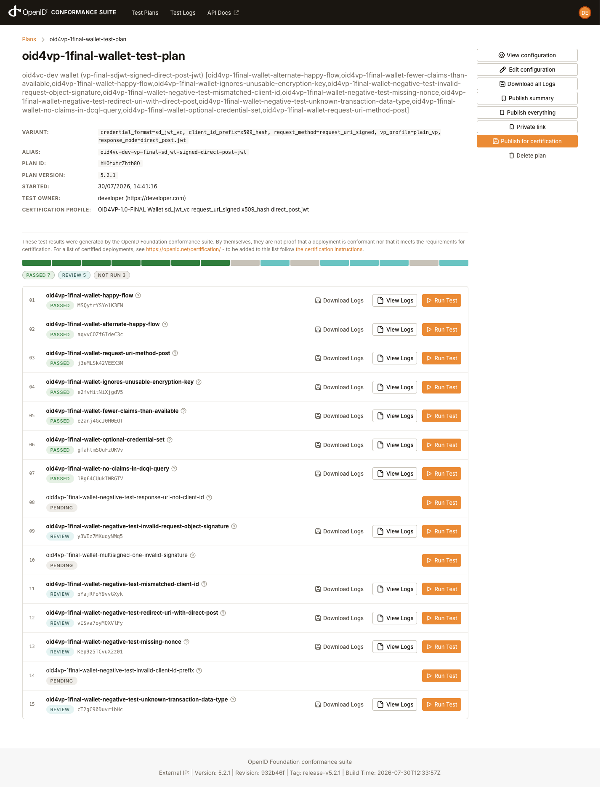
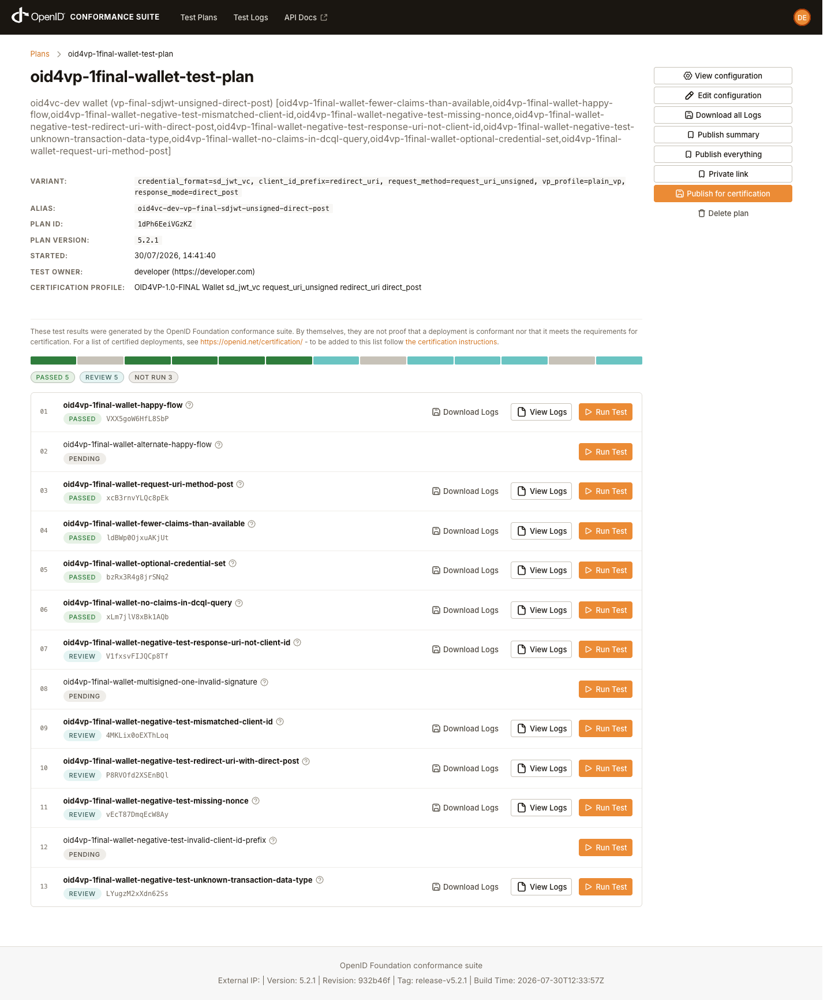
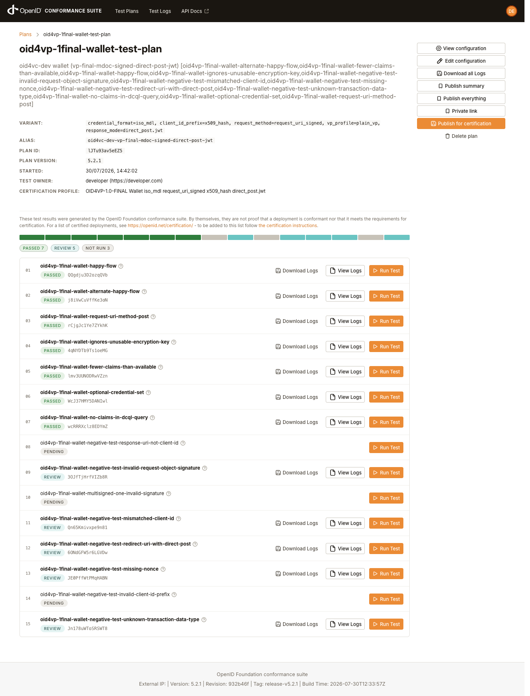
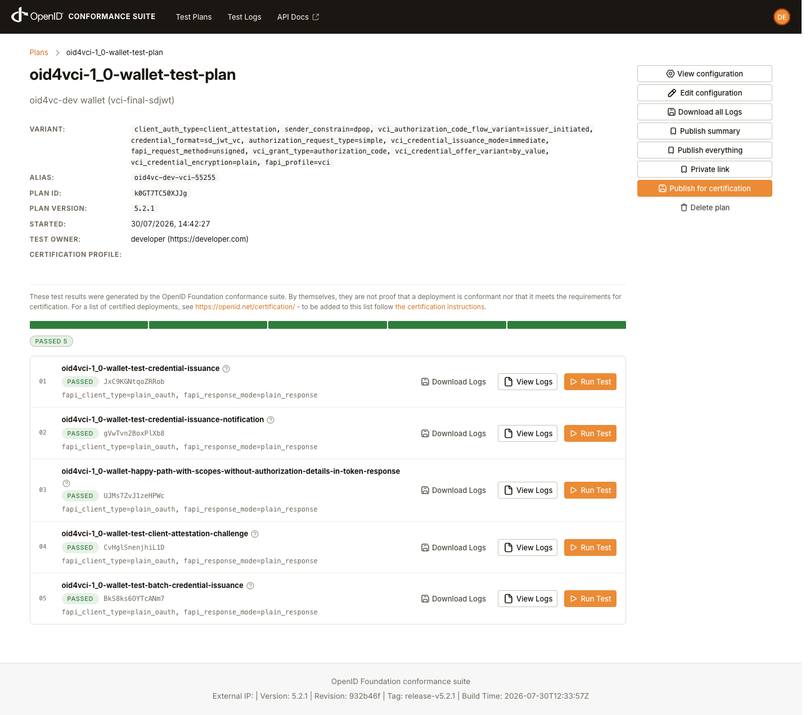
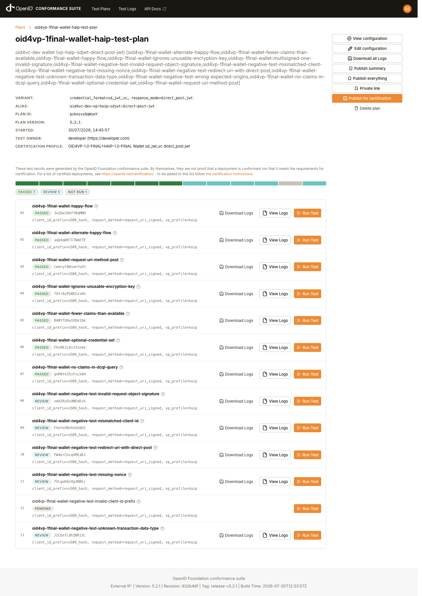
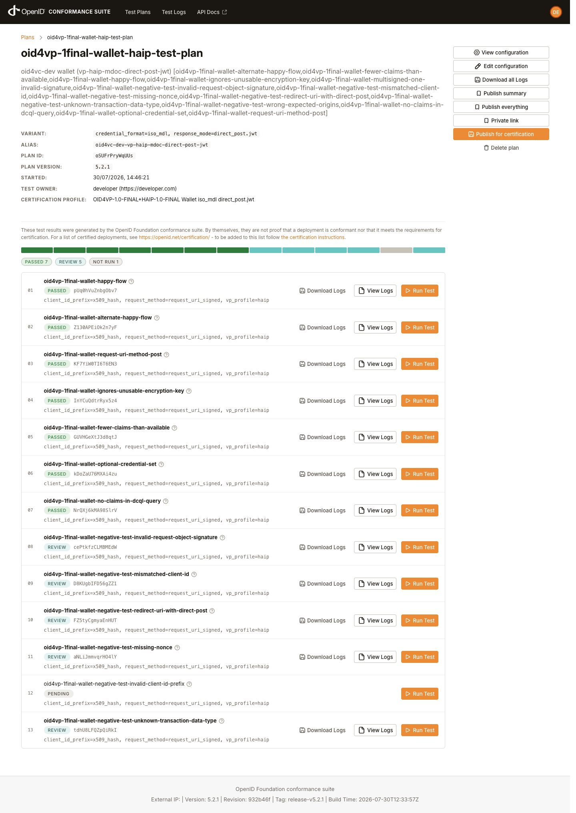
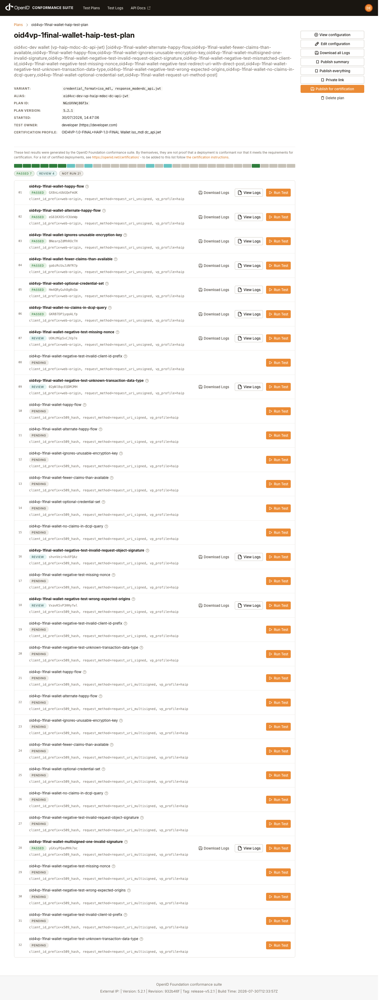
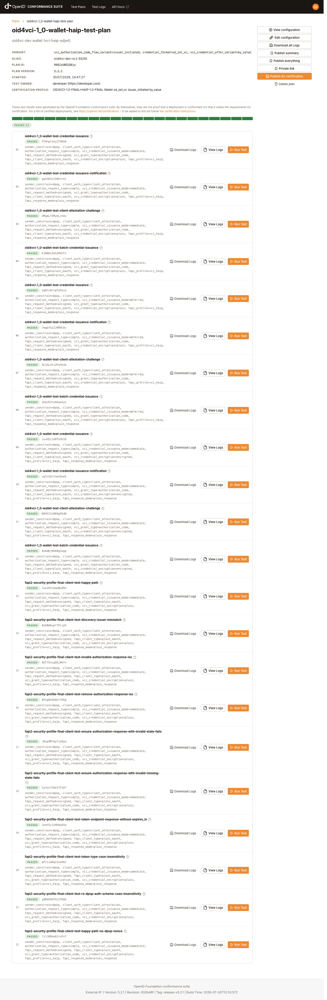

# Current OIDF Wallet Conformance Results

Reproduce these runs with [Running OIDF Wallet Conformance](./conformance-run.md).

## Run of 2026-10-10 (3.0.0-beta.3)

The beta was checked against suite `release-v5.3.1` (revision `440eec8`) in strict mode. The full wallet matrix ran with file storage. The demo issuer and verifier ran all nine plans.

| Target | Configurations | Modules | `PASSED` | `REVIEW` | `WARNING` | `FAILED` |
|---|---:|---:|---:|---:|---:|---:|
| Wallet, file | 78 | 744 | 530 | 188 | 26 | 0 |
| Demo issuer and verifier | 9 | 111 | 67 | 36 | 8 | 0 |

No module failed, and the counts match the beta.1 run. The 26 wallet warnings are the IACA path length advisory described for 2.5.0. The 8 demo warnings are the metadata warnings described for the run of 2026-10-08.

The first demo run interrupted `oid4vci-1_0-issuer-happy-flow-multiple-clients`. Its two clients start their flows with the `issuer_state` of the same offer, and the demo issuer accepted it only once. OpenID4VCI 1.0 §4.1.1 defines `issuer_state` as a link to the issuer's context, not as a grant. The demo issuer now accepts it until the offer expires, and the run above used that build.

The suite answered three wait requests with HTTP 504. The runner retried each one and the modules completed.

The full Go suite and all 235 browser tests passed. Vet and lint also passed.

## Run of 2026-10-09 (3.0.0-beta.1)

The beta was checked against suite `release-v5.3.1` (revision `440eec8`) in strict mode. The full wallet matrix ran with file storage. The demo issuer and verifier ran all nine plans.

| Target | Configurations | Modules | `PASSED` | `REVIEW` | `WARNING` | `FAILED` |
|---|---:|---:|---:|---:|---:|---:|
| Wallet, file | 78 | 744 | 530 | 188 | 26 | 0 |
| Demo issuer and verifier | 9 | 111 | 67 | 36 | 8 | 0 |

No module failed. The 26 wallet warnings are the IACA path length advisory described for 2.5.0. The 8 demo warnings are the metadata warnings described for the run of 2026-10-08.

The demo verifier signs its request objects with an access certificate from the relying party access CA. The harness gives the suite that CA as its trust anchor. The wallet signs each credential category with its own key, so the harness picks the key of the PID provider for the suite.

The suite answered one metadata request with HTTP 504. The wallet retried, and the harness sent the same offer again. The pending deferred requests of the first attempt then interrupted three modules, and the suite stopped the run. The remaining 16 plans ran again on their own. The numbers above contain only completed modules.

The full Go race suite and all 226 browser tests passed on each of file, memory and Postgres storage. Vet and lint also passed.

## Run of 2026-10-08 (3.0.0 development build)

The release was checked against suite `release-v5.3.1` (revision `440eec8`) in strict mode. The full wallet matrix ran with file storage. Memory and Postgres each ran the 10 HAIP plans. The demo issuer and verifier ran all nine plans.

| Target | Configurations | Modules | `PASSED` | `REVIEW` | `WARNING` | `FAILED` |
|---|---:|---:|---:|---:|---:|---:|
| Wallet, file | 78 | 744 | 530 | 188 | 26 | 0 |
| Wallet, memory, HAIP | 10 | 228 | 166 | 36 | 26 | 0 |
| Wallet, Postgres, HAIP | 10 | 228 | 166 | 36 | 26 | 0 |
| Demo issuer and verifier | 9 | 111 | 67 | 36 | 8 | 0 |

No wallet module failed. Release-v5.3.1 builds the multisigned DC API presentation correctly, so the two suite failures of 2.6.0 do not occur. The `invalid-client-id-prefix` module also runs in the multisigned DC API plans, which adds 8 modules. The 26 wallet warnings are the IACA path length advisory described for 2.5.0.

The demo verifier sends its registration certificate in `verifier_info` by default. All 36 of its outcomes matched expectations. The 8 demo warnings come from the metadata modules of the four issuer plans, which run on both the unsigned and the signed issuer metadata. The suite's schemas do not know `issuer_info` (ETSI TS 119 472-3) and `client_attestation_pop_methods_supported` (the client attestation draft). Neither warning was suppressed.

The suite server stopped answering twice during these runs. The plans it cut off were run again on their own. The numbers above contain only completed modules.

The full Go race suite and all 221 browser tests passed on each of file, memory and Postgres storage. Vet, lint and the benchmark smoke check also passed.

Two load tests ran against two wallet servers built from the release tree and sharing one Postgres database:

| Run | Issuances | Presentations and callbacks | Duration | Issuance p95 | Presentation p95 |
|---|---:|---:|---:|---:|---:|
| Default | 160 | 240 | 1.330 s | 105 ms | 92 ms |
| Stress | 640 | 960 | 12.606 s | 459 ms | 378 ms |

Both runs passed every correctness check. Each credential appeared once, status indices were unique, every presentation callback arrived and both servers reported the same count.

## Run of 2026-10-04 (2.6.0)

The release was checked against suite `release-v5.2.4` (revision `ab35a8d`) in strict mode. The full wallet matrix ran with file storage. Memory and Postgres each ran the 10 HAIP plans. The demo issuer and verifier ran all nine plans.

| Target | Configurations | Modules | `PASSED` | `REVIEW` | `WARNING` | `FAILED` |
|---|---:|---:|---:|---:|---:|---:|
| Wallet, file | 78 | 736 | 530 | 178 | 26 | 2 |
| Wallet, memory, HAIP | 10 | 228 | 166 | 34 | 26 | 2 |
| Wallet, Postgres, HAIP | 10 | 228 | 166 | 34 | 26 | 2 |
| Demo issuer and verifier | 9 | 101 | 61 | 36 | 4 | 0 |

The two failures in each wallet run come from the suite. It fails to construct the multisigned presentation (see [the baseline](#baseline)). The 26 warnings are the IACA path length advisory described for 2.5.0. All 36 demo verifier outcomes matched expectations.

Earlier runs had 32 mdoc pre-authorized issuance failures. The suite caused them. In a pre-authorized flow the suite decides which credential the token covers. Its `simple` variant always picks the scope `eudi.pid.1`, so an mdoc offer got a token for an SD-JWT. The harness now runs the mdoc pre-authorized plans with the `rar` variant. In that variant the suite uses the offered configuration. All 8 plans passed with 40 modules. The wallet now also requests the identifier of the offered configuration. It warns when a token covers only a different one.

The suite stopped the first file run after three of those failures in a row. The remaining plans ran one at a time. Two modules stopped on suite alias conflicts. Both passed when their plans were rerun.

The full Go race suite and all 187 browser tests passed on each of file, memory and Postgres storage. Vet, lint, the installation check, all 31 Python tests and the benchmark smoke check also passed.

Two load tests ran against two wallet servers built from the release tree and sharing one Postgres database:

| Run | Issuances | Presentations and callbacks | Duration | Issuance p95 | Presentation p95 |
|---|---:|---:|---:|---:|---:|
| Default | 160 | 240 | 4.694 s | 402 ms | 332 ms |
| Stress | 640 | 960 | 31.588 s | 1.168 s | 973 ms |

Both runs passed every correctness check.

## Check of 2026-10-02 (2.5.1 activity display and deferred exchanges)

The full Go race suite, all 159 browser tests and all 31 Python tests passed. Lint reported no issues. Integration tests checked deferred requests and responses, pending replies, errors, encrypted wire values and plaintext. Immediate and deferred batch import entries were checked against the credentials actually stored. Browser tests opened every returned and imported credential in a batch through its decoder button. CLI tests confirmed unchanged text, verbose and JSON output.

The deferred endpoint capture was checked against suite `release-v5.2.4` (revision `ab35a8d`) in strict mode with file storage. Four Final configurations covered SD-JWT and mdoc, each with plain and encrypted exchanges. All 20 modules passed with zero failing conditions. Two encrypted batch modules also passed after the activity export fix and again on the final build. The final exports contain the encrypted deferred response, its plaintext and all eight imported copies. Every imported token matches a returned token, and all eight stored IDs are distinct. These were targeted checks of deferred issuance and batch activity.

Two load tests used two wallet servers sharing Postgres:

| Run | Issuances | Presentations and callbacks | Duration |
|---|---:|---:|---:|
| Default | 160 | 240 | 1.917 s |
| Stress | 640 | 960 | 18.198 s |

Both passed every correctness check. Each credential appeared once, status indices were unique, every callback arrived and both servers reported the same credential count. Timings are diagnostic and depend on local machine load.

Local evidence is in `/tmp/eudi-dev-ui-review-2026-10-02`. `deferred-verification.json` records the checks. Conformance logs and exports are in `deferred-conformance`, `deferred-batch-export` and `final-batch-copies`. Final load logs are `final-load-default.log` and `final-load-stress.log`.

## Check of 2026-10-02 (offer links and documentation)

The EUDI offer scheme now routes to issuance in the web UI, including when offer parameters are missing. All 141 browser tests and the full Go race suite passed on file, memory and Postgres storage. The offer parser, format detection and CLI dispatch checks passed. All 30 Python tests, vet, lint and the Docker build passed.

Documentation checks covered 58 Markdown files, 270 local links, 53 heading links and 145 CLI flags. The full OIDF and load test results below cover the certificate and protocol changes. Those runs were not repeated for this UI, help and documentation follow-up.

Local evidence is in `/tmp/eudi-offer-docs-2026-10-02`.

## Run of 2026-10-01 (2.5.0 EUDI certificate profiles)

The certificate and metadata changes were checked against suite `release-v5.2.4` (revision `ab35a8d`). The full wallet matrix ran with file storage. Memory and Postgres each ran 16 selected modules covering both credential formats, encrypted exchanges and all HAIP happy flows. The demo issuer and verifier ran all nine plans.

| Target | Configurations | Modules | `PASSED` | `REVIEW` | `WARNING` | `FAILED` |
|---|---:|---:|---:|---:|---:|---:|
| Wallet, file | 78 | 736 | 498 | 178 | 26 | 34 |
| Wallet, memory, selected modules | 16 | 16 | 14 | 0 | 2 | 0 |
| Wallet, Postgres, selected modules | 16 | 16 | 14 | 0 | 2 | 0 |
| Demo issuer and verifier | 9 | 101 | 61 | 36 | 4 | 0 |

Every wallet module has an export. Individual failing conditions were compared with the TLS baseline below. All 34 existing wallet failures match that baseline. The suite still has its 32 mdoc pre-authorized issuance failures and two multisigned presentation construction failures. No new protocol failure was found. Focused reruns completed modules that had stalled or hit local suite timeouts. All 36 final demo verifier outcomes matched expectations.

The wallet warnings come from `ValidateMdocTrustAnchorIacaCertificateProfile`. ISO/IEC 18013-5:2021 Annex B requires an IACA root with a path length of zero. The generated EUDI certificate hierarchy uses provider intermediates for the retrieval path required by ETSI TS 119 412-6 V1.1.1 clause 4.4.3, so its root permits one intermediate. The suite reports that difference as an advisory warning. The [certificate guide](test-certificates.md) explains the applicable versions and the chain used for each root configuration.

The four demo metadata modules now finish with `WARNING`, replacing the four previous failures caused by string mdoc algorithm identifiers. The warnings identify `issuer_info` and `client_attestation_pop_methods_supported`, which the suite's metadata schemas do not recognize. The first is EUDI registration metadata. The second is defined by the client attestation draft. Neither warning was suppressed.

The full Go race suite and all 140 browser tests passed on each of file, memory and Postgres storage. Build, installation, vet, lint, all 30 Python tests and the benchmark smoke check also passed. Independent checks validated the generated lists against ETSI's pinned JSON binding and verified their signatures, certificate retrieval, metadata, registration identities and PID certificate references.

Two load tests ran against the final Docker image, with two wallet servers sharing Postgres:

| Run | Issuances | Presentations and callbacks | Duration | Issuance p95 | Presentation p95 |
|---|---:|---:|---:|---:|---:|
| Default | 160 | 240 | 8.658 s | 517 ms | 457 ms |
| Stress | 640 | 960 | 117.132 s | 4.687 s | 3.801 s |

Both runs passed every correctness check. Each credential appeared once, status indices were unique, every presentation callback arrived and both servers reported the same count. These runs shared the machine with the conformance suite, so the timings are diagnostic rather than a capacity estimate.

Local evidence is in `/tmp/eudi-eudi-profile-fixes-2026-10-01`. `final-verification.json` records the completed checks and `regression-verification.json` records the module comparison. Run directories contain `runner.log` and exported ZIP archives in `results/`:

- Full wallet matrix: `wallet-final-presentations`, `wallet-final-vci-sdjwt` and `wallet-final-vci-mdoc`, with the last five HAIP plans in `wallet-final-haip-74` through `wallet-final-haip-78` and focused reruns in `wallet-final-rerun*` directories.
- Selected backends: `wallet-memory-final` and `wallet-postgres-final`.
- Demo: `demo-final-profile` and `demo-verifier-verified`, with an earlier focused rerun in `demo-final-nonce-rerun`.

## Run of 2026-10-01 (2.5.0 outbound TLS)

The TLS changes were checked against suite `release-v5.2.4` (revision `ab35a8d`). The full wallet matrix ran with file storage. Memory and Postgres each ran 16 selected modules covering plain and encrypted presentations, SD-JWT and mdoc issuance, and every HAIP happy flow. The demo issuer and verifier ran their full matrix of nine plans.

| Target | Configurations | Modules | `PASSED` | `REVIEW` | `FAILED` |
|---|---:|---:|---:|---:|---:|
| Wallet, file | 78 | 736 | 524 | 178 | 34 |
| Wallet, memory, selected modules | 16 | 16 | 16 | 0 | 0 |
| Wallet, Postgres, selected modules | 16 | 16 | 16 | 0 | 0 |
| Demo issuer and verifier | 9 | 101 | 61 | 36 | 4 |

These totals include reruns of two wallet modules and two interrupted demo modules. All four reruns reached their expected result with no failing conditions. Every module run with file storage has an export. The runner used `CONFORMANCE_MAX_CONSECUTIVE_FAILURES=100` to continue past the known mdoc failures.

The 34 wallet failures and four demo failures match the baseline below, including individual failing conditions. All 36 demo verifier outcomes matched expectations. No new conformance regression was found.

Wallets ran in strict mode with `--tls-verify=false` because the local suite certificate has no subject alternative names. Integration tests with real TLS servers checked mode defaults, overrides, CA trust, hostname and expiry checks, and redirects between local and remote hosts. They also checked runtime changes, presentation clones and storage reloads.

The full Go race suite and all 140 browser tests passed on each of file, memory and Postgres storage. Build, vet, lint, Python tests, installation checks and benchmark smoke checks also passed.

The comparison is recorded in `/tmp/eudi-tls-conformance-verification.json`. Run directories contain `runner.log` and exported ZIP archives in `results/`:

- File wallet: `/tmp/eudi-tls-wallet-file`, with continuations in `-remaining*` directories and reruns in `-rerun*` directories.
- Selected backend runs: `/tmp/eudi-tls-wallet-memory` and `/tmp/eudi-tls-wallet-postgres`.
- Demo: `/tmp/eudi-tls-demo` and its `-rerun*` directories.

## Run of 2026-10-01 (2.5.0 activity logs)

The activity-log changes were checked against suite `release-v5.2.4` (revision `ab35a8d`) in strict mode. The full wallet matrix ran on file, memory and Postgres storage: 78 configurations per backend, covering 36 Final presentation configurations, 32 Final issuance configurations and 10 HAIP configurations. The demo issuer and verifier also ran their full matrix of nine plans.

| Target | Configurations | Modules | `PASSED` | `REVIEW` | `FAILED` |
|---|---:|---:|---:|---:|---:|
| Wallet, file | 78 | 736 | 524 | 178 | 34 |
| Wallet, memory | 78 | 736 | 524 | 178 | 34 |
| Wallet, Postgres | 78 | 736 | 524 | 178 | 34 |
| Demo issuer and verifier | 9 | 101 | 61 | 36 | 4 |

These totals include focused reruns of seven modules with transient failures. One had a `PASSED` verdict despite a failing authorization code condition. All seven reruns passed or reached the expected `REVIEW` result with zero failing conditions. The request monitor timeout was raised from 20 to 60 seconds to reduce duplicate submissions during slow flows. No modules were skipped. The remaining failures are:

- **32 mdoc pre-authorized issuance failures per backend.** Four modules fail in each of eight Final configurations. All 32 were reproduced on unchanged commit `5098a0d`, with identical failing conditions. The token response identifies SD-JWT configuration `eu.europa.ec.eudi.pid.1`, while the offer selects an mdoc configuration requiring an attestation proof. The suite rejects that proof for the token's configuration and then throws a NullPointerException. The scope-based module passes in all eight configurations.
- **Two presentation suite failures per backend.** These are the previously documented `AddInvalidClientIdPrefixToRequestObject` NullPointerExceptions in multisigned `dc_api.jwt` plans. They occur before the suite contacts the wallet.
- **Four demo issuer metadata failures.** These were also reproduced on unchanged commit `5098a0d`, with identical failing conditions. The mdoc metadata advertises JOSE signing-algorithm strings where the suite expects COSE algorithm integers. All 36 demo verifier verdicts matched their expected outcome.

No new conformance regression was found. The baseline failures remain unresolved.

Local evidence is summarized in `/tmp/eudi-activity-conformance-verification.json`. Wallet exports are under `/tmp/eudi-activity-wallet-file-final`, `/tmp/eudi-activity-wallet-memory`, `/tmp/eudi-activity-wallet-postgres`, and their `-remaining*` continuation directories. Focused reruns are in `wallet-<backend>-rerun*` directories under the same `/tmp/eudi-activity-` prefix. Baseline comparisons are in `/tmp/eudi-activity-wallet-mdoc-baseline*` and `/tmp/eudi-activity-demo-baseline`. Demo exports combine `/tmp/eudi-activity-demo-file` and `/tmp/eudi-activity-demo-final-haip`. Each run directory contains `runner.log` and exported ZIP archives in `results/`.

## Demo Issuer and Verifier (2026-08-31)

The demo issuer and demo verifier are tested with the suite acting as the wallet. Use [the demo runbook](./conformance-run-demorp.md) to reproduce. Suite `release-v5.2.4` (revision `ab35a8d`), 9 plans (4 issuer, 5 verifier), 101 modules: **61 `PASSED`, 36 `REVIEW`, 4 `WARNING`, 0 `FAILED`, 0 `SKIPPED`**, 7645 condition successes against 0 condition failures.

All 36 verifier modules ended in `REVIEW`, as expected after screenshot upload. The harness separately checked the demo verifier's verdicts. All 36 matched: tampered presentations failed and valid presentations verified.

The four warnings report the same metadata field: `client_attestation_pop_methods_supported`. ABCA draft-10 defines it, but the suite's RFC 8414 schema does not recognize it.

Suite defect in `release-v5.2.4`: under the pre-authorized code grant the client attestation negative modules keep running after their expected token refusal and interrupt themselves ("This is a bug in the test module"). These six modules are excluded under that grant. The authorization code scenarios cover them.

## Run of 2026-09-06 (2.4.0 storage backends)

The ten HAIP plans ran once on each storage backend: files, memory and Postgres. All used suite `release-v5.2.4` (revision `ab35a8d`) with strict wallet validation.

Each run had the same result: 228 modules, 26962 condition successes and 4 condition failures. All four failures came from the suite's multisigned request NullPointerException described below. There were no wallet condition failures.

The wallets ran in 2.4.0 containers with random keys and a different `EUDI_DEV_STORAGE` value for each run. The harness connected through `OIDF_WALLET_URL`. Artifacts are in `/tmp/oidf-file-2.4.0`, `/tmp/oidf-memory-2.4.0` and `/tmp/oidf-postgres-2.4.0`.

## Runs of 2026-09-02 and 2026-09-04 (production certification and expanded matrix)

Both runs use suite `release-v5.2.4` (revision `ab35a8d`): the production certification run of 2026-09-04 on release 2.3.7, and the expanded local matrix of 2026-09-02 for release 2.3.0 (ISO 18013-5 certificate profile, RFC 3986 request URI parsing, `response_uri` derived from a `redirect_uri` client id per OID4VP 1.0 §5.9.3).

### Production certification run

The certifiable HAIP plans ran on 2026-09-04 on `https://www.certification.openid.net/` against the hosted strict wallet at `https://strict.eudi-test.dev` (release 2.3.7, strict mode for every module, see [the runbook](./conformance-run.md)). 10 plans (4 VP HAIP, and per format the VCI HAIP plan issuer-initiated `by_value`, issuer-initiated `by_reference` and wallet-initiated), 228 modules, complete and unfiltered: **192 `PASSED`, 34 `REVIEW`, 2 `FAILED`, no skips**, 29466 condition successes, 0 wallet condition failures, 0 warnings. Run directory `/tmp/oidf-strict-2.3.7`. Details:

- the 2 `FAILED` are `oid4vp-1final-wallet-negative-test-invalid-client-id-prefix` under `request_uri_multisigned`, one per `dc_api.jwt` plan, where the suite throws a NullPointerException in its own request construction before contacting the wallet (`AddInvalidClientIdPrefixToRequestObject` reads a `client_id` the multisigned sequence never puts into the shared payload). The same module passes in the signed entry. Reported upstream.
- the negative modules end `REVIEW` after an uploaded screenshot of the wallet's error, each stating the rule the module breaks (request object signature, mismatched `client_id`, `redirect_uri` with `direct_post`, missing nonce, invalid prefix, `transaction_data`, `expected_origins`, and for the FAPI2 tests the issuer, `iss` and `state` checks of the authorization response). `required-non-matching-credential` ends `PASSED`: the wallet answers `access_denied`.
- the mdoc plans run on the key attestation configuration with the `attestation` proof type, where the suite issues one credential per attested key, so `batch-credential-issuance` passes in every VCI plan.

| Plan | Modules | Conditions |
|---|---|---|
| VP HAIP SD-JWT `direct_post.jwt` | 14 | 821 successes |
| VP HAIP mdoc `direct_post.jwt` | 14 | 727 successes |
| VP HAIP SD-JWT `dc_api.jwt` | 34 | 1829 successes, 2 suite failures |
| VP HAIP mdoc `dc_api.jwt` | 34 | 1423 successes, 2 suite failures |
| VCI HAIP SD-JWT `by_value` | 22 | 3997 successes |
| VCI HAIP SD-JWT `by_reference` | 22 | 4283 successes |
| VCI HAIP mdoc `by_value` | 22 | 4063 successes |
| VCI HAIP mdoc `by_reference` | 22 | 4349 successes |
| VCI HAIP SD-JWT wallet-initiated | 22 | 3954 successes |
| VCI HAIP mdoc wallet-initiated | 22 | 4020 successes |

### Local full matrix

The expanded local matrix (76 plans: the full supported cross product of the alpha Final plans plus the HAIP plans) ran in one pass: 768 modules, 69411 condition successes against 4 condition failures and 26 warnings. Details:

- the 4 condition failures are the two occurrences of the multisigned suite NullPointerException above
- the 26 warnings are the IACA subject key identifier check on a wallet binary built before the SHA-1 fix (the deployed build and the production run above are clean)
- one VCI module ended `INTERRUPTED` after a machine-load stall (the harness cancelled it, and the same module passes in the neighbouring plans)
- 18 mdoc VCI plans contain the mdoc batch skips

Variants exercised for the first time in this matrix: `url_query`, `x509_san_dns`, `web-origin`, multisigned requests and the Browser API response modes in the Final plan, plus grant, offer delivery, issuance mode and encryption cross products in VCI. They revealed the two wallet gaps fixed in 2.3.0 (request URI parsing, derived `response_uri`).

## Baseline

- date: 2026-08-09 (earlier runs below)
- wallet mode: strict
- suite server: local `https://localhost:8443/`
- suite baseline: `release-v5.2.2`, version `5.2.2`, revision `321bc5bc5`
- full run directory: `/tmp/oidf-wallet-conformance-local-strict`
- full runner log: `/tmp/oidf-wallet-conformance-local-strict/runner.log`
- full exported result archives: `/tmp/oidf-wallet-conformance-local-strict/results/`
- plan-detail screenshots: [`docs/conformance-results/2026-07-30/`](./conformance-results/2026-07-30/)

Command used:

```bash
OIDF_SUITE_DIR="$PWD/../conformance-suite" \
OIDF_SUITE_TAG=release-v5.2.2 \
OIDF_RUN_DIR=/tmp/oidf-wallet-conformance-local-strict \
  scripts/oidf-wallet-conformance.sh
```

The full matrix runs in one pass: 14 plans, 160 modules, 111 `PASSED`, 44 negative modules `REVIEW`, 5 `SKIPPED`, 0 `FAILED`, 16,305 condition successes against 1 condition failure. The skips and the condition failure are explained below. The 2026-07-30 run reported comparable totals, but its credentials carried no status list, so the suite skipped the status list conditions.

## Run of 2026-08-27

First run on suite `release-v5.2.4` (version `5.2.4`, revision `ab35a8d`), strict mode, for the 2.1.0 release (strict array disclosure, demo custom request builder). The scenario set exported 12 plans and 116 modules: **49 `PASSED`, 43 negative modules `REVIEW`, 21 `WARNING`, 2 `SKIPPED`, 1 `FAILED`**. The SD-JWT VC flows (happy path, request_uri, request_uri_method=post, fewer claims, optional set, no claims) are clean. The warnings, the skips and the one failure are all mdoc.

The 21 `WARNING` modules all carry the same two conditions, new in 5.2.4, which validate the wallet's mdoc certificates against the ISO 18013-5 Annex B profile:

- `ValidateMdocDsCertificateProfile` on the document signer certificate (CN=EUDI Dev Wallet PID Provider): no countryName in the subject, no subject key identifier extension, no extended key usage extension (which must be present, critical, and name the document signing purpose), no CRL distribution points extension, no issuer alternative name extension.
- `ValidateMdocTrustAnchorIacaCertificateProfile` on the IACA trust anchor (CN=OID4VC Dev Wallet CA): no countryName in the subject, a subject key identifier that is not the SHA-1 of the subject public key, a basicConstraints pathLenConstraint of 1 where Table B.1 requires 0, no issuer alternative name extension.

These are profile gaps in that release's mdoc certificate generation. They are advisory, so no module fails on them.

The 1 `FAILED` module is `oid4vp-1final-wallet-negative-test-unknown-transaction-data-type` in the HAIP mdoc direct_post.jwt plan. Its own assertion passed: the wallet refused the unknown transaction_data type (the response carried `invalid_transaction_data`) and the module's `ExpectUnknownTransactionDataTypeErrorPage` resolved to `REVIEW`. The `FAILED` came from an unrelated second request_uri hitting the shared wallet, which the module counted as unexpected. Re-running that one plan returned the module to `REVIEW` with 0 condition failures. The 2 `SKIPPED` are the mdoc `batch-credential-issuance` skips described below.

Suite 5.2.4 does not validate `wallet_metadata.response_types_supported`: the `request_uri_method=post` module parses the posted wallet metadata for JSON validity and the wallet nonce (`ExtractWalletMetadataAndNonceFromRequestUriPost`) and never reads it again.

## Run of 2026-08-24

Full matrix on suite `release-v5.2.2` (version `5.2.2`, revision `321bc5b`), strict mode, for the 2.0.0 release (batch issuance, deferred issuance, credential display UI): **111 modules `PASSED`, 44 negative modules `REVIEW`, 5 `SKIPPED`, 0 `FAILED`**, 0 condition failures and 0 warnings across all 14 plans. The 5 skips are the mdoc `batch-credential-issuance` skips described below, so the run exits non-zero on the skip.

The batch behavior of this release (the wallet requests the advertised batch, up to a ceiling of 8 proofs) is conformant: every SD-JWT `batch-credential-issuance` module `PASSED` (plans 5, 7, 13), and the deferred-issuance modules pass. Run directory `/tmp/oidf-wallet-conformance-local-strict`.

## Run of 2026-08-04

Re-run against the same suite baseline (`release-v5.2.1`), with the server running on the host per [the runbook](./conformance-run.md):

**106 modules PASSED, 38 negative modules REVIEW, 0 FAILED**, across all 12 plans, with zero condition failures.

This run exercises credential status for the first time (earlier runs' credentials carried no `status` claim, so the suite skipped `FetchStatusListToken` and everything after it). The status list conditions surfaced two defects in the status list token, both fixed in this run's release:

- the token carried the self-signed trust anchor inside its `x5c` chain, which HAIP 6.1 rejects ("Trust anchor certificate must not be included in x5c chain"), affecting 14 modules
- the token offered no key resolution method that the Final (non-HAIP) plans accept. These plans verify with a `jwk` embedded in the header or with `server_jwks`, and `server_jwks` is unreachable there. This affected 17 modules

The token carries `x5c` without the trust anchor (the anchored path HAIP validates) and the signing key in a `jwk` header (Token Status List §5.1 requires only `typ`, and `jwk` is a registered JOSE header per RFC 7515 §4.1.3).

## Run of 2026-08-05

Re-run for the 1.19.2 release against the same suite baseline (browser hardening, authorization code flow): **106 modules PASSED, 38 negative modules REVIEW, 0 FAILED**, 13,951 condition successes with 0 failures and 0 warnings across all 12 plans. Same totals as 2026-08-04. The suite drives the authorization endpoint through redirects, so it never takes the interactive-login branch the demo issuer uses.

## Run of 2026-08-07

Re-run for the 1.19.19 release against the same suite baseline: **114 modules PASSED, 38 negative modules REVIEW, 2 SKIPPED, 0 FAILED**, 15,228 condition successes with 0 failures and 0 warnings across 14 plans.

The matrix is 14 plans: the pre-authorized code flow is covered for both credential formats (plans 7 and 8).

The 2 `SKIPPED` modules are `credential-issuance-notification` in the `vci_credential_issuance_mode=deferred` variant of the two VCI HAIP plans. The suite exits non-zero on an unexpected skip even with no failures, so a run reporting these ends with status 1.

The 114 `PASSED` include the 5 mdoc `batch-credential-issuance` modules (see the release-v5.2.1 coverage below for the key attestation configurations).

## Run of 2026-08-08

Full matrix for the 1.19.22 release, suite pinned to `release-v5.2.1` to match the running server: **110 modules PASSED, 38 negative modules REVIEW, 5 SKIPPED, 1 FAILED**, 15,404 condition successes across 14 plans, with no watchdog termination.

The wrapper's `EUDI_REMOTE_TIMEOUT=120s` kept the run going through 6 suite pauses (visible as `[monitor] failed to monitor module`). At the wallet's 15 second default such a pause times out the module's exchange.

The 5 `SKIPPED` are the mdoc `batch-credential-issuance` skips (see below).

The 1 `FAILED` is `oid4vci-1_0-wallet-test-credential-issuance-notification` on `VCIVerifyIssuerStateInAuthorizationRequest`, an artifact of two modules overlapping. The module logs the check twice: the first authorization request carries the `issuer_state` of the offer under test and passes, and a second one 18 seconds later carries the `issuer_state` of a later offer, which the module compares against the first. The wallet echoed the value each offer gave it (OID4VCI 1.0 §5.1.3). This artifact can appear in a different module in another run.

## Run of 2026-08-09

Full matrix on suite `release-v5.2.2`, the first run on that release: **111 modules PASSED, 44 negative modules REVIEW, 5 SKIPPED, 0 FAILED**, 16,305 condition successes across 14 plans and 160 modules, with no watchdog termination through 11 suite pauses.

The matrix is 160 modules (154 on release-v5.2.1) because `oid4vp-1final-wallet-negative-test-invalid-client-id-prefix` runs in 6 VP plans (REVIEW in all) since release-v5.2.2 fixed the module (upstream `4f790f161`). It stays out of the DC API plans per its own `@VariantNotApplicableWhen`: an unsigned DC API request carries no `client_id` to corrupt (OID4VP 1.0 Appendix A.2).

Release-v5.2.2 reworked `alternate-happy-flow` to put a decoy origin into an unsigned DC API request's `expected_origins` and check that the wallet ignores it. The monitor sends the POST in place of the browser. Like a real browser, it derives the `Origin` header from the submit URL where the suite serves the page.

The 1 condition failure occurs in a module that still finished `PASSED`: a suite pause made the monitor retry an offer submission, the wallet ran the flow twice, and `ValidateAuthorizationCode` compared the code of one flow against the other. This is the same retry artifact as the 2026-08-08 `issuer_state` failure.

## New release-v5.2.1 Coverage

Release-v5.2.1 added two wallet test modules. Both pass:

- `oid4vci-1_0-wallet-test-batch-credential-issuance`: the emulated issuer advertises `batch_credential_issuance` with `batch_size: 10` and returns the issued credentials in reverse proof order. The wallet requests the advertised batch (one key per copy, capped at its own ceiling of 8) with distinct, freshly generated keys and identifies the holder-key-bound credential from the credential itself (`cnf.jwk` for SD-JWT, MSO `deviceKey` for mdoc). It passes in the SD-JWT plans.

  The mdoc plans request `eu.europa.ec.eudi.pid.mdoc.1.attestation.keyattest`, a configuration requiring key attestations that offers the `attestation` proof type. There the key attestation naming every batch key is the proof (Appendix F.3, HAIP §4.5.1) and the suite issues one credential per attested key, so the module passes in the mdoc plans as well. Under the `jwt.keyattest` configuration the wallet sends one `jwt` proof whose attestation names every batch key (Appendix F.1). The suite reads `attested_keys` only for the `attestation` proof type and issues for the proof key of a `jwt` proof, so the wallet receives one credential there and the module skips as "batch behavior cannot be evaluated". Credo-based issuers apply F.1 as written and issue per attested key for both proof types (checked 2026-09-03: a batch of 8 for one `jwt` proof and for one `attestation` proof).
- `oid4vp-1final-wallet-ignores-unusable-encryption-key`: the verifier's `client_metadata.jwks` advertises two unusable keys (a post-quantum-shaped `kty: AKP` key and a made-up `kty`) alongside the usable key. The wallet ignores keys it cannot use per RFC 7517 §5 and encrypts to the usable key. Passes in all encrypted response mode variants (plans 2, 4, 9, 10, 11, 12).

Release-v5.2.1 also enforces RFC 8414 §3.1 on the wallet's OAuth authorization server metadata request: the wallet strips the issuer's terminating `/` before inserting `/.well-known/oauth-authorization-server`, and preserves the Credential Issuer Identifier path verbatim for `/.well-known/openid-credential-issuer` per OID4VCI 1.0 §12.2.2.

## Result Classification

- `PASSED` is a pass.
- The local harness accepts `REVIEW` when the runner summary shows `FINISHED`, `REVIEW`, and `0 FAILURE`. These modules are negative tests where the wallet rejects the request and the harness uploads the required screenshot placeholder.
- `INTERRUPTED` counts as a failure.

## Matrix

Condition counts are from the 2026-08-09 run on suite release-v5.2.2. The screenshots are the plan-detail pages of the 2026-07-30 12-plan run. Each links to the plan it depicts, and the two pre-authorized code plans have none.

| # | Plan | Variant | Current result | Screenshot |
|---|---|---|---|---|
| 1 | VP Final | SD-JWT, `direct_post`, signed `x509_hash` | 507 success / 0 failure. Negative modules ending in `REVIEW` are accepted. | [PNG](./conformance-results/2026-07-30/plan-01-vp-final-sdjwt-direct-post.png) |
| 2 | VP Final | SD-JWT, `direct_post.jwt`, signed `x509_hash` | 711 success / 0 failure. Includes `ignores-unusable-encryption-key`. | [PNG](./conformance-results/2026-07-30/plan-02-vp-final-sdjwt-direct-post-jwt.png) |
| 3 | VP Final | SD-JWT, `direct_post`, unsigned `redirect_uri` | 507 success / 0 failure. `response-uri-not-client-id` ends in an accepted `REVIEW` result. | [PNG](./conformance-results/2026-07-30/plan-03-vp-final-sdjwt-unsigned-direct-post.png) |
| 4 | VP Final | mdoc, `direct_post.jwt`, signed `x509_hash` | 592 success / 0 failure. Includes `ignores-unusable-encryption-key`. | [PNG](./conformance-results/2026-07-30/plan-04-vp-final-mdoc-direct-post-jwt.png) |
| 5 | VCI Final | SD-JWT | 1021 success / 0 failure. Includes batch credential issuance. | [PNG](./conformance-results/2026-07-30/plan-05-vci-final-sdjwt.png) |
| 6 | VCI Final | mdoc | 1055 success / 0 failure. Batch credential issuance `SKIPPED` in this run (the `jwt.keyattest` configuration, see below). | [PNG](./conformance-results/2026-07-30/plan-06-vci-final-mdoc.png) |
| 7 | VCI Final | SD-JWT, pre-authorized code | 665 success / 0 failure. | (added after the screenshot run) |
| 8 | VCI Final | mdoc, pre-authorized code | 671 success / 0 failure. Batch credential issuance `SKIPPED` in this run (the `jwt.keyattest` configuration, see below). | (added after the screenshot run) |
| 9 | VP HAIP | SD-JWT, `direct_post.jwt` | 751 success / 0 failure. Includes `ignores-unusable-encryption-key`. | [PNG](./conformance-results/2026-07-30/plan-07-vp-haip-sdjwt-direct-post-jwt.png) |
| 10 | VP HAIP | mdoc, `direct_post.jwt` | 625 success / 0 failure. Includes `ignores-unusable-encryption-key`. | [PNG](./conformance-results/2026-07-30/plan-08-vp-haip-mdoc-direct-post-jwt.png) |
| 11 | VP HAIP | SD-JWT, `dc_api.jwt` | 579 success / 0 failure. Includes `ignores-unusable-encryption-key`. | [PNG](./conformance-results/2026-07-30/plan-09-vp-haip-sdjwt-dc-api-jwt.png) |
| 12 | VP HAIP | mdoc, `dc_api.jwt` | 399 success / 0 failure. Includes `ignores-unusable-encryption-key`. | [PNG](./conformance-results/2026-07-30/plan-10-vp-haip-mdoc-dc-api-jwt.png) |
| 13 | VCI HAIP | SD-JWT | 3978 success / 0 failure. Batch issuance passes in immediate, deferred, and encrypted variants. | [PNG](./conformance-results/2026-07-30/plan-11-vci-haip-sdjwt.png) |
| 14 | VCI HAIP | mdoc | 4244 success / 1 failure. Batch issuance `SKIPPED` in all three variants in this run (the `jwt.keyattest` configuration, see below). The 1 failure is the retried-submission artifact described above. The module finished `PASSED`. | [PNG](./conformance-results/2026-07-30/plan-12-vci-haip-mdoc.png) |

## Passing VCI Coverage

- VCI Final SD-JWT and mdoc issuer-initiated authorization code flows pass, including the batch credential issuance module in both formats.
- VCI Final SD-JWT and mdoc pre-authorized code flows pass, including the notification endpoint and batch issuance.
- VCI HAIP SD-JWT and mdoc pass for plain immediate issuance, deferred issuance, encrypted credential request variants, FAPI happy-path modules, and FAPI negative authorization-response modules, plus batch issuance in both formats.
- Strict mode rejects issuer mismatch in authorization server metadata, invalid authorization-response `iss`, removed authorization-response `iss`, invalid `state`, and missing `state`.

## Debug Mode Reference Run

The documented matrix above runs the wallet in `strict` mode. A full reference run with `OIDF_WALLET_MODE=debug` (2026-07-31, same suite baseline, run directory `/tmp/oidf-wallet-conformance-local-debug`) shows which coverage depends on strict mode:

- 38 negative modules fail in debug mode because the wallet logs the violation and continues:
  - every VP plan: `invalid-request-object-signature` (signed variants), `missing-nonce`, `unknown-transaction-data-type`, plus `redirect-uri-with-direct-post` (redirect variants) and `response-uri-not-client-id` (plan 3)
  - both VCI HAIP plans: FAPI `discovery-issuer-mismatch`, `invalid-authorization-response-iss`, `remove-authorization-response-iss`, and `missing-state`
- Everything else still passes: all positive modules, both VCI Final plans in full, and the negative checks that apply in both modes (`mismatched-client-id`, `wrong-expected-origins`, FAPI `invalid-state`).

Debug mode is for troubleshooting verifier and issuer integrations. Only strict-mode runs count as conformance results.

## VP Module Selection

The wrapper passes explicit module lists for the alpha Final VP plans, so each result page shows only the modules that apply to its variant.

Suite exclusions:

- `invalid-client-id-prefix` runs everywhere except the DC API plans, whose unsigned requests carry no `client_id` to corrupt (the module's own `@VariantNotApplicableWhen`).
- VP Final `direct_post` omits `alternate-happy-flow` because that module rewrites the encrypted-response setup, which plain `direct_post` lacks.
- VP Final x509 variants omit `response-uri-not-client-id`. The suite marks that module not applicable for `x509_hash`, and the applicable `redirect_uri` variant passes as `REVIEW`.
- VP Final non-multisigned variants omit `multisigned-one-invalid-signature`.
- VP unencrypted variants (`direct_post`, `dc_api`) omit `ignores-unusable-encryption-key` per the module's `@VariantNotApplicable`. The unencrypted modes never advertise an encryption key.

Current `no-claims-in-dcql-query` status:

- VP Final SD-JWT `no-claims-in-dcql-query` passes for plans 1, 2, and 3.
- VP Final mdoc `no-claims-in-dcql-query` passes for plan 4.
- VP HAIP SD-JWT `no-claims-in-dcql-query` passes for plans 9 and 11.
- VP HAIP mdoc `no-claims-in-dcql-query` passes for plans 10 and 12.

## Visual Evidence

Local OIDF `plan-detail.html` pages from the documented runs.

<details>
<summary>Plan 1: VP Final SD-JWT direct_post</summary>


</details>

<details>
<summary>Plan 2: VP Final SD-JWT direct_post.jwt</summary>



</details>

<details>
<summary>Plan 3: VP Final SD-JWT unsigned direct_post</summary>



</details>

<details>
<summary>Plan 4: VP Final mdoc direct_post.jwt</summary>



</details>

<details>
<summary>Plan 5: VCI Final SD-JWT</summary>



</details>

<details>
<summary>Plan 6: VCI Final mdoc</summary>


</details>

<details>
<summary>Plan 7: VP HAIP SD-JWT direct_post.jwt</summary>



</details>

<details>
<summary>Plan 8: VP HAIP mdoc direct_post.jwt</summary>



</details>

<details>
<summary>Plan 9: VP HAIP SD-JWT dc_api.jwt</summary>


</details>

<details>
<summary>Plan 10: VP HAIP mdoc dc_api.jwt</summary>



</details>

<details>
<summary>Plan 11: VCI HAIP SD-JWT</summary>



</details>

<details>
<summary>Plan 12: VCI HAIP mdoc</summary>


</details>

## Result Inspection

Use this query to summarize important runner lines from a run:

```bash
rg -n \
  "Results for \\[[0-9]+\\]|Overall totals|\\*\\* SOME TEST|\\*\\* Exiting|INTERRUPTED|result .*FAILED|result .*REVIEW|no-claims-in-dcql-query|batch-credential-issuance|ignores-unusable-encryption-key" \
  "$OIDF_RUN_DIR/runner.log"
```

Use the printed `plan-detail.html?plan=...` URLs from `runner.log` to inspect module details in the local suite UI.

## Update Rules

When the wallet or suite baseline changes:

- rerun the full matrix unless the change is clearly limited to a documented targeted rerun
- keep every passing module passing
- update the baseline tag, suite revision, run directory, runner log, and exported artifact location
- update the matrix, suite exclusions, and screenshots in this file
- keep suite exclusions visible until the upstream suite behavior changes
