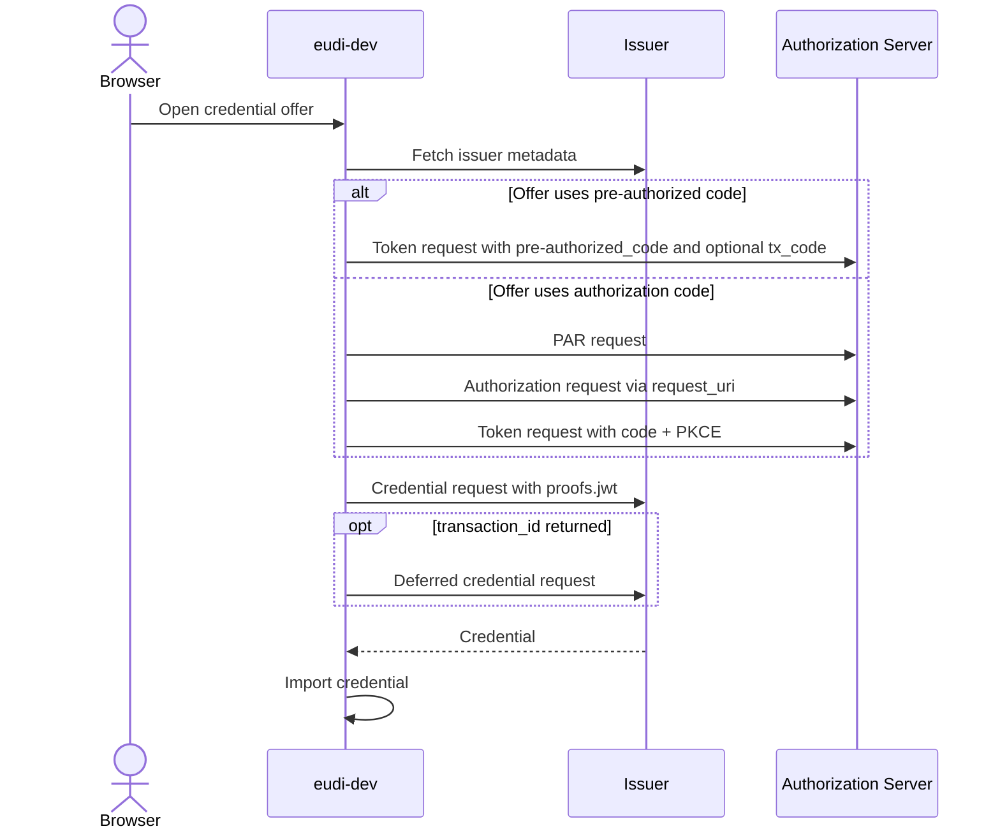
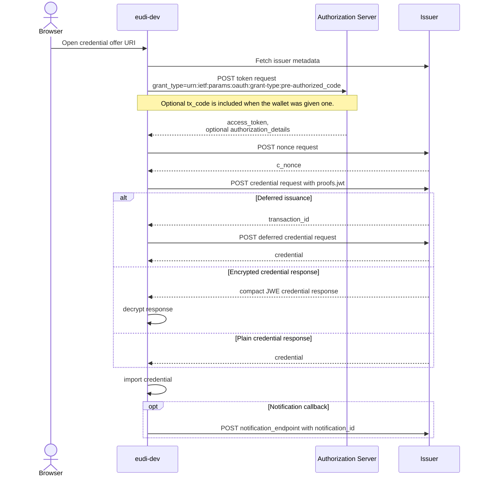
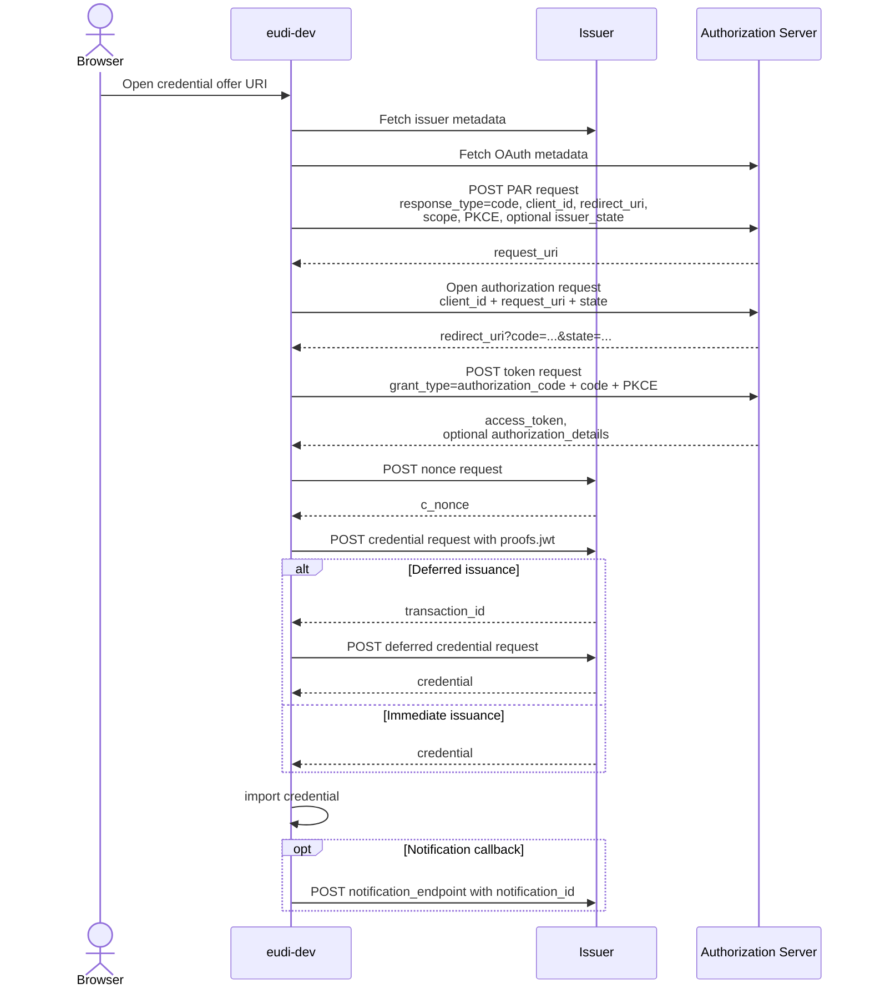
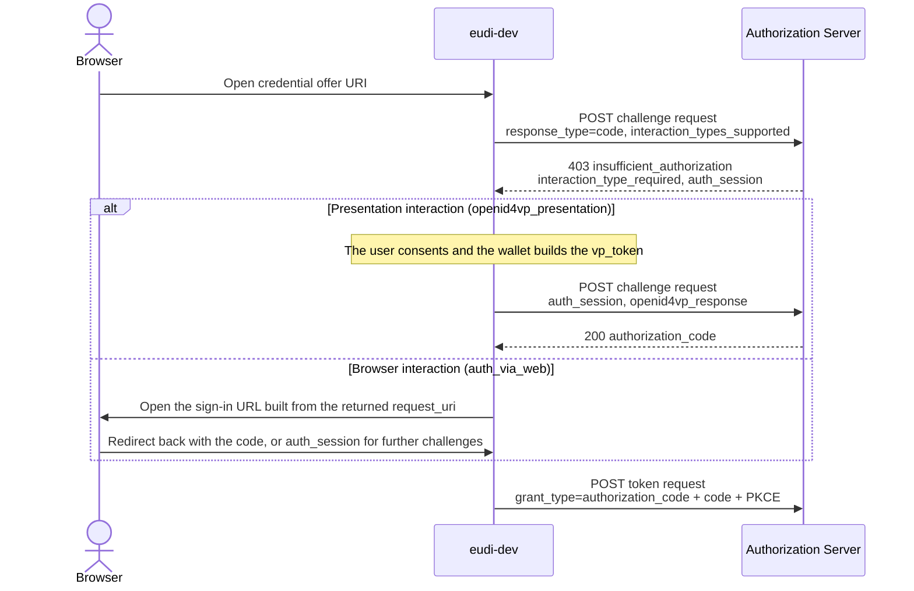

# OID4VCI Flows

The OID4VCI flows `eudi-dev` implements when it acts as a wallet receiving a credential offer.

## Flow Map

## Common Inputs

| Field / setting | Why it matters in `eudi-dev` |
|-----------------|--------------------------------|
| `credential_offer` or `credential_offer_uri` | One of these must exist for the wallet to start the issuance flow. |
| `credential_issuer` | Used to fetch `/.well-known/openid-credential-issuer` and resolve the token and credential endpoints. |
| `credential_configuration_ids` | The wallet uses the first configuration ID to resolve format and, in the authorization-code flow, the scope. |
| Issuer metadata `nonce_endpoint` | The source of the challenge the key proof is signed over. OpenID4VCI 1.0 §8.2 names the Nonce Endpoint of §7 as the only one, so the wallet asks it whenever the metadata advertises it. |
| `authorization_details[].credential_identifiers` | If present in the token response, `eudi-dev` uses `credential_identifier` at the credential endpoint instead of `credential_configuration_id`. |
| Issuer metadata `credential_response_encryption` support | When advertised, the wallet requests encrypted credential responses and decrypts compact JWE responses. |

## Pre-authorized Code Flow

### Relevant Parameters

| Field / setting | Used how |
|-----------------|----------|
| `grants.urn:ietf:params:oauth:grant-type:pre-authorized_code.pre-authorized_code` | Required to choose the pre-authorized code branch. |
| `grants...tx_code` | Optional. If present, the issuer expects an out-of-band transaction code. The wallet can send it via `wallet accept --tx-code ...`. |
| `access_token` | Used to authorize the credential endpoint call. |
| `c_nonce` | Taken from the Nonce Endpoint. A `c_nonce` in the token response is a pre-1.0 parameter: strict mode ignores it, debug mode uses it (naming the issuer as pre-1.0) when the issuer advertises no Nonce Endpoint. A challenge the issuer rejects with `invalid_nonce` is fetched again and the request is retried once with rebuilt proofs (§8.3.1.2). |
| `credential_identifier` vs `credential_configuration_id` | `credential_identifier` wins when the token response exposes it. Otherwise the wallet falls back to the first `credential_configuration_id` from the offer. |

## Authorization Code Flow

### Relevant Parameters

| Field / setting | Used how |
|-----------------|----------|
| `eudi wallet serve --vci-client-id ...` | Required. The wallet will reject the authorization-code flow without a configured client ID. |
| `eudi wallet serve --vci-redirect-uri ...` | Required for the redirect flow. Interactive authorization (below) runs without one, and the flow is rejected only when neither applies. |
| OAuth metadata `pushed_authorization_request_endpoint` | Used when published (RFC 9126 makes publishing it a SHOULD). Absent, the request goes straight to the authorization endpoint. `--haip` requires PAR unless the server publishes an `authorization_challenge_endpoint`. |
| OAuth metadata `authorization_endpoint` | Required for the browser redirect. |
| OAuth metadata DPoP support | Optional. The wallet binds its tokens with DPoP when the metadata advertises it and uses bearer tokens otherwise. Under `--haip`, advertising DPoP without `ES256` is a violation (silent metadata is not). |
| `credential_configuration_ids[0] -> scope` | The wallet resolves the scope from the selected credential configuration and uses it in PAR. |
| `grants.authorization_code.issuer_state` | If present, forwarded into the PAR request. |
| `token_endpoint_auth_methods_supported` | `eudi-dev` supports `private_key_jwt` and `attest_jwt_client_auth` here. Unsupported methods are rejected. |
| `transaction_id` + `deferred_credential_endpoint` | If the credential response is deferred, the wallet follows this branch automatically. |
| `notification_id` + `notification_endpoint` | If both are present, the wallet sends a notification after successful import. |

## Interactive Authorization (OpenID4VCI 1.1)

At feature level 1.1 (`--vci-version 1.1`), an authorization server that publishes `authorization_challenge_endpoint` gets this flow instead of the browser redirect above. The wallet either answers the challenge with an OpenID4VP presentation or hands the user to a browser sign-in (`auth_via_web`). Everything after the authorization code is the ordinary token and credential exchange. See [interactive authorization](../wallet/issuing.md#interactive-authorization) for the full behavior.

### Relevant Parameters

| Field / setting | Used how |
|-----------------|----------|
| `eudi wallet serve --vci-version 1.1` | Selects the feature level. At `1.0` the challenge endpoint is ignored and the redirect flow runs. |
| OAuth metadata `authorization_challenge_endpoint` | Publishing it is what switches an offer to this flow. |
| `interaction_types_supported` | The wallet always advertises `urn:openid:dcp:ia:openid4vp_presentation`, and `urn:openid:dcp:ia:auth_via_web` only when a redirect URI is configured and the metadata names an `authorization_endpoint`. |
| `openid4vp_request` | The OpenID4VP request the presentation interaction answers, with response mode `ia_post` or `ia_post.jwt`. |
| `auth_session` | Carries the authorization state across challenge requests and the browser redirect. |
