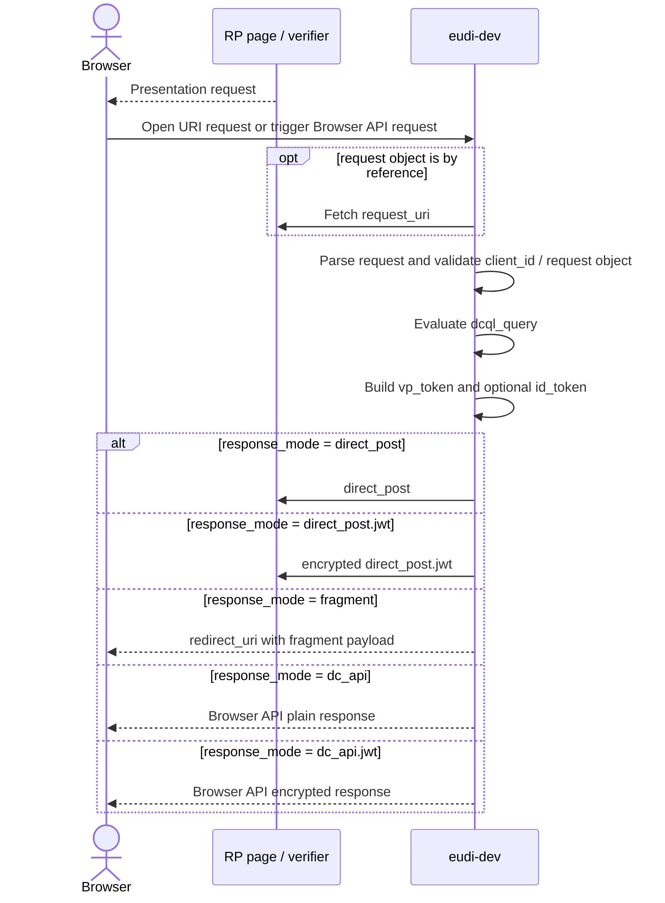
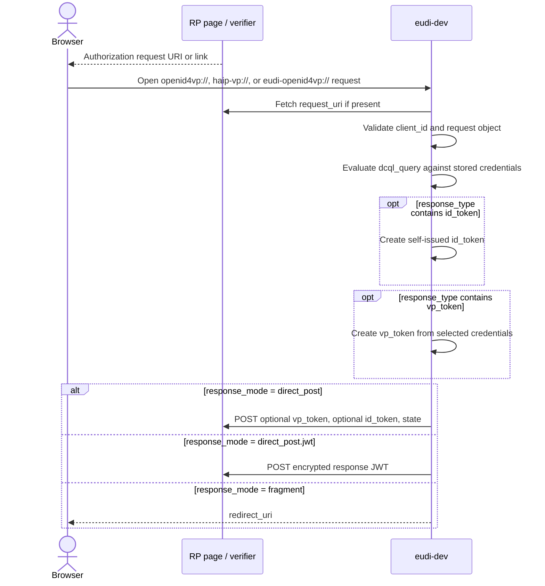
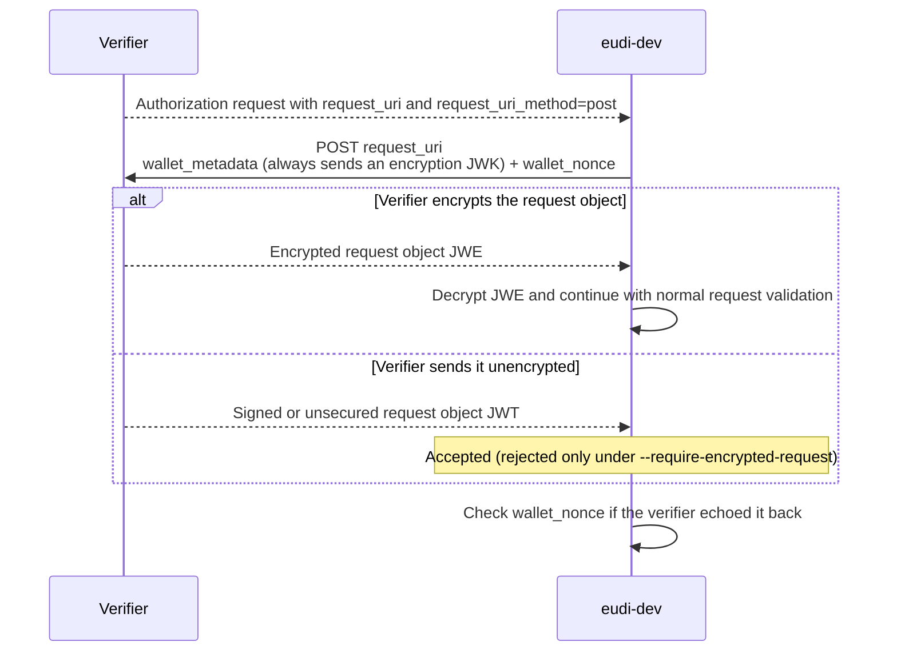
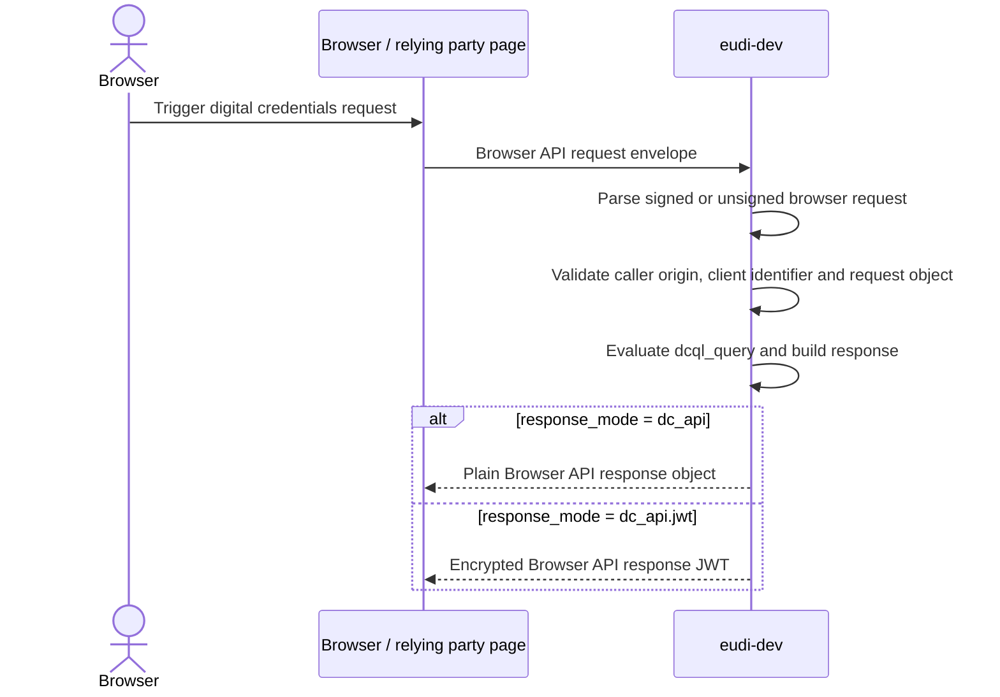

# OID4VP Flows

The OID4VP presentation flows `eudi-dev` implements when it acts as a wallet.

## Flow Map

## Common Request Fields

| Field / setting | Why it matters in `eudi-dev` |
|-----------------|--------------------------------|
| `client_id` | Required except in an unsigned Digital Credentials API request, which OpenID4VP Appendix A.2 says must carry none. `eudi-dev` validates the Client Identifier Prefix and refuses the ones it does not support. |
| `response_type` | Supports `vp_token`, `vp_token id_token`, and `id_token`. |
| `response_mode` | Drives the response branch: `direct_post`, `direct_post.jwt`, `fragment`, `dc_api`, or `dc_api.jwt`. |
| `nonce` | Bound into SD-JWT key binding JWTs and self-issued `id_token`s. |
| `state` | Reflected in the authorization response when present. |
| `response_uri` | Required for `direct_post` and `direct_post.jwt`. |
| `redirect_uri` | Used for `fragment`. When absent, the wallet falls back to `response_uri`. |
| `dcql_query` | Practically required for credential selection in `eudi-dev`. This is how the wallet matches stored credentials. |
| `request` or `request_uri` | Used when the verifier sends a request object directly or by reference. |
| `client_metadata` | Important for format negotiation and mandatory for encrypted response modes because `client_metadata.jwks` carries the verifier encryption key. |

## URI-Based Presentation Flow

### Relevant Parameters

| Field / setting | Used how |
|-----------------|----------|
| `response_type=vp_token` | Standard VP-only flow. |
| `response_type=vp_token id_token` | `eudi-dev` returns both artifacts. |
| `response_type=id_token` | SIOPv2-only branch without a VP token. |
| `response_mode=direct_post` | Wallet posts a form with plain `vp_token`, optional `id_token`, and `state`. |
| `response_mode=direct_post.jwt` | Wallet requires a verifier encryption key in `client_metadata.jwks` and posts an encrypted response JWT. |
| `response_mode=fragment` | Wallet builds a redirect URL using `redirect_uri`. |
| `--auto-accept` | Skips the consent UI and submits one credential per credential query automatically (the most recently issued one that answers it). |
| `--preferred-format ...` | Accepts `dc+sd-jwt`, `mso_mdoc`, or `jwt_vc_json` and biases selection when more than one stored credential satisfies the same query. |
| `--session-transcript ...` | Accepts `oid4vp` or `iso` and changes how mDoc session transcript data is constructed. |

## `request_uri_method=post` and Encrypted Request Objects

### Relevant Parameters

| Field / setting | Used how |
|-----------------|----------|
| `request_uri` | The wallet dereferences this URI instead of relying only on outer query parameters. |
| `request_uri_method=post` | Switches the request-object fetch from GET to POST. |
| `wallet_metadata` | Sent by `eudi-dev`. Includes supported formats, the Request Object signing algorithms (only when the client identifier prefix permits a signed Request Object), the Authorization Response encryption algorithms, and an encryption JWK the wallet always sends. |
| `wallet_nonce` | Sent by the wallet for replay protection and checked if returned inside the request object. |
| `--require-encrypted-request` | Makes the wallet reject a POSTed `request_uri` response that is not a compact JWE. The encryption JWK is sent either way. |
| Request object `Content-Type` | `eudi-dev` expects `application/oauth-authz-req+jwt` on the POST response. |

## Browser API Flow

### Relevant Parameters

| Field / setting | Used how |
|-----------------|----------|
| Browser API protocol `openid4vp-v1-unsigned` | Unsigned Browser API request branch. |
| Browser API protocol `openid4vp-v1-signed` | Signed Browser API request branch. Request data can be a compact JWT or an object containing `request` or `request_uri`. |
| `response_mode=dc_api` | Wallet returns plain JSON through the Browser API response envelope. |
| `response_mode=dc_api.jwt` | Wallet encrypts the response and returns a `response` JWT in the Browser API envelope. |
| Unsigned Browser API request | Carries no `client_id` (OpenID4VP Appendix A.2). The verifier is identified by the origin the platform reports, and any `client_id` or `expected_origins` in the request data is discarded. |

## Client Identifier Prefixes and Policy Switches

| Item | Behavior in `eudi-dev` |
|------|---------------------------|
| `x509_hash:` | Implemented and verified. |
| `x509_san_dns:` | Implemented and verified against the verifier certificate SAN. |
| `redirect_uri:` | Implemented. Requires unsigned request objects and must match `response_uri`. |
| `verifier_attestation:` | Validated structurally. |
| `decentralized_identifier:` | DID syntax and `kid` cross-check are validated. Full DID resolution is not implemented. |
| No prefix (no `:` in the value) | Treated as a pre-registered client, per OpenID4VP §5.9.2. |
| `origin:` | Refused. §5.9.3 reserves it and forbids a wallet to accept it in a request. |
| `openid_federation:` | Refused. The trust chain resolution it requires is not implemented. |
| `--haip` | Holds the counterparty to HAIP 1.0: `response_type=vp_token`, encrypted response modes, the `x509_hash` prefix with a verified request signature and certificate rules, JAR through `request_uri`, DCQL, the `mso_mdoc` and `dc+sd-jwt` formats, `A128GCM` plus `A256GCM` in the verifier's client metadata, and ES256. What a violation does follows the wallet mode: strict refuses the request, debug reports it and carries on. |
| Wallet mode `debug` vs `strict` | Both collect request findings. `debug` reports them, keeps partially matching DCQL credentials and continues. `strict` turns the same findings into hard failures. |
