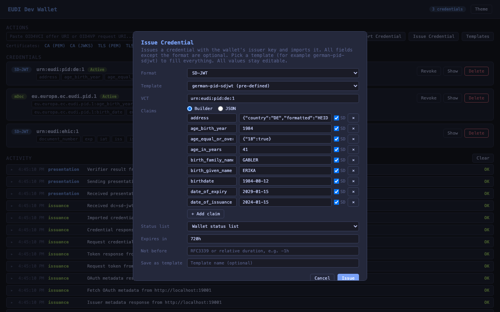

# Wallet

A stateful testing wallet with file persistence, CLI-driven OID4VP/VCI flows, QR scanning, and OS URL scheme registration. Credentials and keys are stored in `~/.eudi-dev/wallet/` (configurable via `--wallet-dir`) and persist across invocations.

The wallet has two validation modes. Both run the same checks and collect the same findings, and the mode decides what happens to them:
- `debug` (default) reports each finding and keeps processing the request, so the failure surfaces further along where its effect is visible. During DCQL evaluation it warns and keeps a credential match when some required claim paths are missing but other requested claims still match
- `strict` treats the same findings as errors and refuses the request

`--haip` is a separate switch and not a third mode. See [HAIP 1.0 enforcement](#haip-10-enforcement).

For OpenID Foundation conformance work, see [docs/conformance.md](./conformance.md).
For GitHub-rendered interaction diagrams of the implemented OID4VP and OID4VCI flows, see [docs/diagrams](./diagrams/README.md).

## Subcommands

| Subcommand     | Purpose                                                         |
|----------------|-----------------------------------------------------------------|
| `serve`        | Start wallet HTTP server with web UI, OID4VP endpoints, and optional URL scheme handling |
| `list`         | List stored credentials                                         |
| `show`         | Show a stored credential by ID (raw or decoded)                 |
| `import`       | Import a credential from file, stdin, or raw string (SD-JWT, JWT VC, mDoc) |
| `remove`       | Remove a credential by ID                                       |
| `generate-pid` | Deprecated. Generate default EUDI PID credentials (SD-JWT + mDoc) from the pre-defined PID templates. Use `issue ... --wallet --template german-pid-sdjwt|german-pid-mdoc` instead |
| `accept`       | Accept an OID4VP presentation request or OID4VCI credential offer (auto-detects) |
| `scan`         | Scan a QR code and auto-dispatch to accept/import               |
| `logs`         | Show persisted wallet-side OID4VP/OID4VCI interaction logs      |
| `trust-list`   | Print the trust list JWT (`--list` for the profiles, `--url` for the URL) |
| `ca-cert`      | Print or export the shared wallet CA certificate                |
| `tls-cert`     | Print or export the HTTPS wallet certificate used by HTTPS wallet endpoints |
| `instances`    | Manage running wallet instances: `list`, `use <url|local>`, `kill <pid|port|url>` |
| `info`         | Show the configuration of the managed wallet (local or remote)  |
| `register`     | Register OS URL scheme handlers on macOS. No-op elsewhere       |
| `unregister`   | Remove OS URL scheme handlers on macOS. No-op elsewhere         |

All wallet management operations (list, show, import, remove, issue, generate-pid, credential templates, cert export) are also available over HTTP on a running `wallet serve` instance. This lets you drive hosted or containerized wallets remotely. See [HTTP API](#http-api).

## Quick start

```bash
# Issue PID credentials from the pre-defined templates and list them
eudi issue sdjwt --wallet --template german-pid-sdjwt
eudi issue mdoc --wallet --template german-pid-mdoc
eudi wallet list

# Deprecated equivalent (issues both PIDs at once, will be removed later)
eudi wallet generate-pid

# Show a credential (raw)
eudi wallet show <id>

# Show a credential (human-readable decoded)
eudi wallet show --decoded <id>

# Start the wallet web UI with stored credentials
eudi wallet serve

# Start the wallet and register URL scheme handlers
eudi wallet serve --register

# Export the shared wallet CA for verifier trust stores
eudi wallet ca-cert --out wallet-ca-cert.pem

# Export the HTTPS wallet certificate for verifier trust stores
eudi wallet tls-cert --out wallet-tls-cert.pem

# Process an OID4VP request from the CLI
eudi wallet accept 'openid4vp://authorize?client_id=...'

# Accept a credential offer (auto-detected from URI)
eudi wallet accept 'openid-credential-offer://...'

# Scan a QR code from screen and auto-detect the flow
eudi wallet scan --screen

# Show wallet-side interactions
eudi wallet logs
eudi wallet logs -f

# Import a credential from a file
eudi wallet import credential.txt

# Register URL scheme handlers so openid4vp:// links open the wallet on macOS
eudi wallet register

# Keep URL handling silent/background-only on macOS
eudi wallet register --auto-accept
```

On Linux and Windows, `wallet register` and `wallet unregister` are accepted as no-ops so shared scripts stay portable. Use `eudi wallet accept '<uri>'` with copied `openid4vp://` or `openid-credential-offer://` links instead.

The macOS URL handler honors the active remote wallet. While a remote target is set with `wallet instances use <url>`, clicked links are submitted to that instance instead of the local listener (useful when the wallet runs in a Docker container). Because a remote instance cannot open a browser on this desktop, the handler also opens the remote consent UI after submitting the link. The handler never restarts or replaces a remote instance. `wallet instances use local` switches link handling back to the local wallet server.

## Storage

Everything the wallet holds is stored unencrypted, including private keys and,
where an issuer hands them over, access and refresh tokens. This is a
development and test wallet: the store is meant to be readable so you can see
what a flow produced, and it is not a place for credentials or tokens that
matter. Point it at test issuers, and treat the wallet directory as disposable.

All wallet state is stored in `~/.eudi-dev/wallet/` by default:

```
~/.eudi-dev/
├── wallet-ca-cert.pem  # Shared CA certificate used across wallet instances
├── wallet-ca-key.pem   # Shared CA private key
├── remote.json         # Active remote wallet target set by wallet instances use
├── instances/          # Registry of running wallet servers (one file per pid)
└── wallet/
    ├── wallet.json       # Credentials + metadata
    ├── holder.pem        # Holder EC private key (auto-generated on first use)
    ├── issuer.pem        # Issuer EC private key (for self-issued credentials)
    ├── wallet-log-cleaned-at # Timestamp marker written by wallet logs clean
    ├── wallet-tls-cert.pem # HTTPS certificate for wallet endpoints on port+1
    ├── wallet-tls-key.pem  # HTTPS private key for wallet endpoints on port+1
    └── templates/          # User credential templates (see docs/templates.md)
```

Wallet interaction logs are stored in `wallet.json` under the top-level `log` field. `wallet logs clean` clears those entries and writes `wallet-log-cleaned-at` so an already-running wallet server cannot later save old in-memory log entries back to disk. If you use `--wallet-dir`, both files live in that custom wallet directory instead.

Keys are P-256 EC keys, auto-generated on first use and reused across invocations. Wallets under the same wallet base directory share a persisted **CA key** and build certificate chains from it:

1. **CA certificate**: self-signed, used as trust anchor in the trust list (`/api/trustlist`)
2. **Leaf certificate**: signed by the CA, wraps the issuer key's public key

Generated credentials are signed with the **issuer key**. SD-JWT credentials include a deterministic `kid` header, expose the signing key through JWT VC issuer metadata, and include the leaf signing certificate in `x5c`. The shared trust-anchor CA stays in the wallet trust list so verifiers can validate the signing key through the exposed trust chain instead of trusting a bare public key.

The shared CA key is persisted and reused across wallet instances in the same base directory. Each wallet keeps its own issuer key, and its credential-signing leaf certificate and HTTPS wallet certificate are generated from that shared CA.

Generated credentials expire in **30 days** by default. Use `--exp` to override (e.g. `--exp 720h` for 30 days, `--exp 24h` for 1 day). Use `--nbf` to set a not-before time (RFC3339 or duration, e.g. `--nbf 2025-01-15T00:00:00Z` or `--nbf -1h`).


## `wallet show <id>`

Displays a stored credential by its ID (as shown in `wallet list`). By default, outputs the raw credential string and nothing else, so it can be piped. Use `--decoded` for human-readable decoded output (supports `--json` and `-v` global flags), which begins with a validity line (the decoded payload states the expiry as a Unix timestamp, which does not answer whether the credential is still good).

`wallet list` carries the same thing in its `VALID` column, as the time left (`29d`, `5h`, `expired`) or `-` for a credential that states no lifetime.

```bash
eudi wallet show <id>                  # Raw credential string
eudi wallet show --decoded <id>        # Human-readable output
eudi wallet show --decoded --json <id> # JSON output
```

| Flag        | Default | Description                                          |
|-------------|---------|------------------------------------------------------|
| `--decoded` | `false` | Show human-readable decoded output instead of raw    |

## `wallet logs`

Displays persisted wallet-side protocol interactions, including OID4VP request-object fetches, parsed presentation requests, wallet presentation responses, verifier responses, Browser API responses, OID4VCI credential offers, metadata fetches, token exchanges, credential requests, deferred/notification calls, and imported credentials.

By default, every entry is printed on one line so the output is easy to scan and pipe. Compact lines include protocol markers such as `event`, `direction`, source, endpoint, method, URL, client ID, issuer, response mode, nonce, status code, and payload-presence flags. Use the global `-v` / `--verbose` flag to expand structured details such as request objects, DCQL queries, wallet metadata, token and credential request payloads, sent VP tokens, actual presented credentials, selected claims, verifier response bodies, received credential responses, and imported credential material. Use `-f` / `--follow` to attach to the wallet log and print new entries as they are persisted, similar to `kubectl logs -f`.

```bash
eudi wallet logs              # One line per persisted wallet interaction
eudi wallet logs -v           # Expand request/response details
eudi wallet logs -f           # Print existing logs, then follow new entries
eudi wallet logs clean        # Remove old persisted wallet logs
eudi wallet logs --json       # JSON array of log entries
```

| Flag       | Default | Description                                      |
|------------|---------|--------------------------------------------------|
| `-f, --follow` | `false` | Keep running and print new entries as they appear |
| `-v, --verbose` | `false` | Global flag. Expand structured log details        |
| `--json`   | `false` | Global flag. Output the persisted log entries as JSON. Cannot be combined with `--follow` |

## `wallet serve`

Starts a persistent wallet HTTP server with a web UI for managing credentials and handling OID4VP/OID4VCI flows. Loads credentials from disk and saves state on credential changes. Includes request logging with timestamps and a browser-based consent UI for incoming requests.

The server exposes:
- Web UI for credential management and consent (list, show, import, remove, and issue credentials, with credential templates and CA and TLS certificate downloads)
- OID4VP authorization endpoint (`/authorize`)
- OID4VCI credential offer endpoint (`/credential-offer`). Accepts `credential_offer` / `credential_offer_uri` query parameters, so offer links can target the wallet URL instead of a custom scheme (see [Invoking the wallet by URL](#invoking-the-wallet-by-url))
- Legacy ETSI trust list endpoint (`/api/trustlist`). Use this URL as `--trust-list` when validating PID credentials issued by the wallet
- Trust-list index endpoint (`/api/trustlists`) with one JWT endpoint per coherent trust-list profile
- HTTPS wallet endpoints on the wallet's effective issuer URL, including `/.well-known/jwt-vc-issuer`, `/.well-known/openid-credential-issuer`, `/api/trustlist`, `/api/trustlists`, `/api/statuslist`, and `/api/registrar/wrp`
- A management API mirroring the wallet CLI (list, show, import, and remove credentials, issue credentials, generate PIDs, export certificates). It has no authentication (see [HTTP API](#http-api))

The consent dialog for a credential offer shows the issuer's name and origin, the flow the offer uses, whether a transaction code will be required, and for each offered credential its format, type, display name, description and declared claims. Everything beyond the offer itself is read from the issuer's metadata and is optional. An offer delivered as a `credential_offer_uri` is dereferenced for the dialog too, and fetched again when the offer is approved. If it cannot be retrieved, the dialog names the issuer it points at and approving retries.

Credentials can be issued interactively from the web UI. The Issue Credential dialog shows format specific fields and offers a claim builder next to a raw JSON editor. Selecting a credential template (for example the pre-defined `german-pid-sdjwt`) fills all fields so they can be reviewed and edited before issuing. A status list selector controls the embedded status reference (the wallet's own list when configured, none, or a custom URI and index).

Credential cards show the revocation status when a credential carries a status list reference. Credentials on the wallet's own status list show a live Active or Revoked badge plus a Revoke or Activate button. Credentials pointing at an external status list show a Check status action that fetches the list and resolves the current value.

The whole UI is built for browser automation. Every interactive control has a stable element id, and credential cards expose selection hooks as data attributes (`data-credential-id`, `data-format`, `data-vct`, `data-doctype`, `data-status`), so a test can select a card with `.credential-card[data-vct="urn:eudi:pid:1"]` and drive its buttons (`show-<id>`, `delete-<id>`, `revoke-<id>`, `status-check-<id>`). Template manager rows (`template-row-<name>`, `template-edit-<name>`, `template-delete-<name>`) and the consent dialog (`consent-approve`, `consent-deny`, `consent-credential-<id>`, claim checkboxes with `data-cred` and `data-claim`) follow the same pattern.



The UI header links to the project on GitHub and to CLI install instructions. Below the action buttons the UI lists the wallet's trust list URLs with copy buttons, each labelled with the provider profile it describes, plus direct downloads for the CA, signing and HTTPS keys. The **Trust & certificates** dialog covers both counterparties: a verifier trusting the wallet's self-issued credentials, and an issuer verifying the wallet attestation and key attestation the wallet sends during issuance. Both chain to the same CA.

By default, a fresh wallet uses a local issuer URL on `https://localhost:<port+1>`. An https `--base-url` is used as the issuer URL directly instead, so issuer metadata, trust lists, and status lists live on the public origin and an external TLS terminator serves them (see [public demo hosting](public-demo.md)). If the wallet already has a persisted issuer URL, `wallet serve` reuses it unless you explicitly replace it with `--base-url` or `--docker`.

The shared wallet CA can be exported with `wallet ca-cert` for verifier trust stores or CI fixtures. The per-wallet HTTPS leaf certificate can still be exported with `wallet tls-cert` when you need the exact server certificate instead. The wallet continues to serve the same endpoints and response formats on top of that shared trust root.
The trust list remains certificate- and service-centric. EUDI-style issuer authorization data such as provider entitlements and `providesAttestations` is published through signed OpenID Credential Issuer metadata and registrar-style responses instead of being added as custom trust-list fields.

The wallet persists an issued-attestation registry alongside the stored credentials. Each issued or imported credential type can register:
- its attestation identifier (`vct` or `docType`)
- its registrar entitlements
- its trust-list profile data such as LoTE type, entity name, and issuance or revocation service type identifiers

Trust lists are created from that registry, not by scanning certificates alone:
- `wallet generate-pid` and `wallet serve --pid` register PID attestation types with the PID trust-list profile
- `issue ... --wallet` issues with the wallet issuer context, stores the credential, and registers one issued-attestation entry for its credential type
- `wallet import` registers a default issued-attestation entry for the imported credential type
- credentials whose stored trust-list profile fields are identical are grouped into the same trust list

Credential-signing certificates are derived per trust-list profile. The wallet keeps one shared CA root, but credentials for different profiles can present different leaf certificates while still chaining to that same CA.

That shared CA is also what an issuer needs on the other side of the flow. The wallet attestation (`OAuth-Client-Attestation`) and the key attestation in credential proofs are signed by the wallet's issuer key and carry only the leaf in `x5c`, so the anchor comes from `/api/certificates/ca` or from any trust list (they all embed the same CA). A trust list id such as `pid` names the credential profile it describes, it does not limit what the list can anchor.

When a wallet already has persisted issuer or status-list URLs, `wallet serve` reuses them by default so previously generated credentials keep resolving against the same issuer metadata, trust-list, and status-list endpoints. Passing `--base-url` or `--docker` explicitly replaces that default. Issuance commands (`issue ... --wallet`, `wallet generate-pid`) follow the same rule. They never rewrite persisted serving URLs unless the flags ask for it, and they print a note when the embedded URLs are not live because no server is running.

The startup banner warns about serving config that cannot work in the current environment: a persisted Docker hostname when the server does not run in Docker, and stored credentials that embed issuer or status list URLs this server does not serve (they keep failing validation and status checks until they are issued again).

Every trust list a wallet serves carries the same certificate, its own CA. The profiles differ in what they declare that CA to be (LoTE type, entity name, service types), not in what they anchor. So `eudi wallet trust-list` follows the wallet the CLI is pointed at: with an active remote target it fetches from that wallet rather than reading the local store, which holds a different CA and would anchor nothing the remote issues.

The wallet groups registered attestation entries by trust-list profile. Each group is exposed as its own trust list under `/api/trustlists/{id}`. The `id` is a stable profile identifier:
- `pid` for the built-in PID profile
- `wallet-provider` for the Wallet Provider profile (always present, this is the one an issuer uses to check the wallet attestation)
- `local` for the built-in local ETSI-shaped profile
- `tl-<hash>` for any additional custom profile

`eudi wallet trust-list --list` prints the same profiles from the CLI:

```
ID               DEFAULT  CATEGORY              PATH
pid              yes      Credential providers  /api/trustlists/pid
wallet-provider           Wallet providers      /api/trustlists/wallet-provider
```

With `--json` it emits the `/api/trustlists` body unchanged, so a caller parsing one parses the other.

`/api/trustlists` is a local discovery endpoint for those profiles. It is not the ETSI trust-list payload itself. Each entry includes:
- `id`, for example `pid` or `local`
- `path`, for example `/api/trustlists/pid`
- `advertised_url` when the wallet has an issuer URL configured, for example `https://localhost:8086/api/trustlists/pid`
- `url` as a backward-compatible alias for `advertised_url`

Clients that call the wallet through Docker port mappings, reverse proxies, or Testcontainers should resolve `path` against the URL they actually used to reach `/api/trustlists`. `advertised_url` is the wallet's configured publication URL and may intentionally differ from the caller's local route.

`/api/trustlist` remains the backward-compatible legacy endpoint. Its selection rules are:
- if a PID trust-list profile exists, `/api/trustlist` returns that PID trust list
- if no PID profile exists, `/api/trustlist` returns the first available profile
- `vct` and `doctype` query parameters can be used to select the trust list for a specific credential type

Examples:
- `/api/trustlists/pid`
- `/api/trustlists/local`
- `/api/trustlist?vct=eu.europa.ec.eudi.pid.1`
- `/api/trustlist?doctype=org.iso.23220.photoid.1`

Example discovery response:

```json
{
  "trust_lists": [
    {
      "id": "pid",
      "default": true,
      "path": "/api/trustlists/pid",
      "advertised_url": "https://localhost:8086/api/trustlists/pid",
      "url": "https://localhost:8086/api/trustlists/pid",
      "loTEType": "http://uri.etsi.org/19602/LoTEType/EUPIDProvidersList"
    },
    {
      "id": "local",
      "default": false,
      "path": "/api/trustlists/local",
      "advertised_url": "https://localhost:8086/api/trustlists/local",
      "url": "https://localhost:8086/api/trustlists/local",
      "loTEType": "http://uri.etsi.org/19602/LoTEType/local"
    }
  ]
}
```

When the wallet needs a local default profile, it uses:
- `LoTEType = http://uri.etsi.org/19602/LoTEType/local`
- `SvcType/Issuance`
- `SvcType/Revocation`

Use `--register` to also register OS URL scheme handlers so that `openid4vp://`, `haip-vp://`, `openid-credential-offer://`, and `haip-vci://` links automatically open the wallet on macOS. On Linux and Windows, `--register` is accepted but does not install OS handlers.

```bash
eudi wallet serve
eudi wallet serve --port 9000 --auto-accept
eudi wallet serve --pid --credential extra.txt
eudi wallet serve --register           # also register URL scheme handlers using the current interactive/auto-accept mode
eudi wallet serve --register --port 9000
eudi wallet serve -d                   # run in the background (stop with `eudi wallet instances kill`)
```

| Flag                    | Default  | Description                                      |
|-------------------------|----------|--------------------------------------------------|
| `--port`                | `8085`   | Server port                                      |
| `--auto-accept`         | `false`  | Auto-approve everything. Without it, only interactive channels (web invocation URLs, scheme dispatches, browser DC-API) show the consent dialog. API submissions (`POST /api/offers`, `/api/presentations`) auto-accept either way, the call is the caller's consent (opt back in per request with `"interactive": true`) |
| `--credential`          | —        | Import credential from file (repeatable)         |
| `--pid`                 | `false`  | Generate default EUDI PID credentials on start   |
| `--key`                 | —        | Override holder key (PEM/JWK)                    |
| `--issuer-key`          | —        | Override issuer key (PEM/JWK)                    |
| `--mode`                | `debug`  | Validation mode: `debug` or `strict`             |
| `--session-transcript`  | `oid4vp` | mDoc session transcript mode: `oid4vp` or `iso`  |
| `--register`            | `false`  | Register OS URL scheme handlers                  |
| `--no-register`         | `false`  | Skip URL scheme registration (overrides --register) |
| `--preferred-format`    | —        | Preferred credential format when multiple match: `dc+sd-jwt`, `mso_mdoc`, or `jwt_vc_json` |
| `--status-list`         | `false`  | Embed status list references in generated credentials (auto-enabled with `--pid`) |
| `--base-url`            | —        | Base URL for the wallet's HTTP endpoints. An https base URL becomes the issuer URL directly (external TLS terminator). An http base URL derives a self-signed HTTPS issuer URL on port+1. Existing persisted issuer URLs are reused unless this flag is set |
| `--docker`              | `false`  | Use `host.docker.internal` instead of `localhost` when deriving new HTTP and HTTPS wallet endpoint URLs |
| `--vci-client-id`       | —        | Client ID to use for OID4VCI authorization-code flows |
| `--vci-redirect-uri`    | —        | Redirect URI to use for OID4VCI authorization-code flows |
| `--haip`                | `false`  | Enforce HAIP 1.0 on incoming presentations and credential offers. Violations are errors whatever `--mode` says |
| `--client-attestation`  | `false`  | Send the wallet attestation on OID4VCI token requests even when the issuer does not advertise `attest_jwt_client_auth` (see [wallet attestation](#wallet-attestation)) |
| `--require-encrypted-request` | `false` | Require verifiers to encrypt request objects (sends encryption key in `wallet_metadata`) |
| `--demo`                | `false`  | Public demo profile: implies `--pid`, `--mode debug` and `--haip` (both overridable), disables process and filesystem endpoints, blocks fetches to internal networks. Browser flows keep the consent dialog, API flows auto-accept (see [public demo hosting](public-demo.md)) |
| `--demo-issuer-client-auth` | `required` | What the built-in demo issuer's authorization server demands at its PAR and token endpoints: `required` (HAIP 1.0 §4.4.1) or `optional`, which also serves wallets that send no wallet attestation (see [public demo hosting](public-demo.md)) |
| `--demo-reset`          | `1h`     | When to restore the demo baseline: an interval (`24h`), a daily wall-clock time (`00:00`), or one with a timezone (`"00:00 Europe/Berlin"`). `0` disables. Requires `--demo` |
| `--imprint-file`        | —        | HTML snippet with the operator's legal notice, served at `/imprint` |
| `-d, --detached`        | `false`  | Run the server as a background process and return once it responds. Output goes to `<wallet-dir>/serve.log`. Stop it with `wallet instances kill` |

## `wallet accept <uri>`

Auto-detects the URI type and dispatches to the appropriate flow:

- `openid4vp://`, `haip-vp://`, `eudi-openid4vp://` → OID4VP presentation (evaluates DCQL, shows consent UI, submits VP token)
  - Supports `response_type=vp_token id_token` (SIOPv2 + OID4VP combined flow). Generates a self-issued ID token alongside the VP token
  - Supports `response_type=id_token` (SIOPv2 only). Generates a self-issued ID token without VP token
- `openid-credential-offer://`, `haip-vci://` → OID4VCI credential issuance (fetches credential from issuer)

In interactive mode (default), OID4VP requests start a temporary consent UI server and auto-open it in the browser. With `--auto-accept`, selects and submits one credential per credential query (the most recently issued one that answers it) without asking.

When a verifier answers a presentation with a `redirect_uri`, that URL is printed and, when a person is running the command, opened. OpenID4VP has the wallet return the user agent to the verifier so a same-device flow lands back on the site that asked. A scripted run only prints it. The CLI opens a browser only where there is a desktop to open it on, and `--no-open` turns it off everywhere.

When DCQL is present, `debug` mode is intentionally forgiving for troubleshooting verifier queries: if a credential matches the requested format and metadata and at least one requested claim, the wallet logs a warning and still keeps that credential as a match even when other required claim paths are missing. `strict` mode treats the same query as non-matching.

```bash
eudi wallet accept 'openid4vp://authorize?...' --auto-accept
eudi wallet accept 'openid-credential-offer://...'
eudi wallet accept 'openid-credential-offer://...' --tx-code 123456
```

| Flag                    | Default  | Description                                      |
|-------------------------|----------|--------------------------------------------------|
| `--port`                | `8085`   | Server port for OID4VP                           |
| `--auto-accept`         | `false`  | Auto-approve OID4VP presentations                |
| `--mode`                | `debug`  | Validation mode: `debug` or `strict`             |
| `--session-transcript`  | `oid4vp` | mDoc session transcript mode: `oid4vp` or `iso`  |
| `--tx-code`             | —        | Transaction code for OID4VCI pre-authorized code flow |
| `--haip`                | `false`  | Enforce HAIP 1.0 on incoming presentations and credential offers. Violations are errors whatever `--mode` says |

Note: pre-authorized code offers work directly with `wallet accept`. Authorization-code offers are also supported, but they require a running `wallet serve` instance configured with `--vci-client-id` and `--vci-redirect-uri`, plus issuer metadata that supports PAR and DPoP. In that flow the wallet server answers with the issuer's authorization URL rather than holding the request open, and `wallet accept` opens it here (printing it as well, for a headless shell). The user authenticates at the issuer, the issuer redirects back to the wallet's configured callback URI, and the wallet exchanges the code. The CLI follows the flow until the credential lands or the issuance fails. This works against a remote wallet as well: the callback is matched by `state`, so the sign-in can happen in any browser that can reach the wallet. With `--haip` a pre-authorized code offer is still accepted and held only to the https transport rule. The PAR, PKCE, DPoP and client authentication requirements apply to offers that drive the authorization endpoint.

## `wallet scan`

Scans a QR code from an image file or screen capture and auto-detects the content:

- `openid4vp://` → delegates to `accept` (OID4VP presentation)
- `openid-credential-offer://` → delegates to `accept` (OID4VCI issuance)
- SD-JWT / mDoc raw credential → delegates to `import`

```bash
eudi wallet scan qr-image.png
eudi wallet scan --screen              # macOS interactive screen capture
eudi wallet scan --screen --auto-accept # auto-approve if it's a presentation
```

`wallet scan` honors the persistent `wallet --mode` flag when it dispatches OID4VP/VCI flows.

## `wallet trust-list`

Generates and prints the ETSI trust list JWT containing the wallet's CA certificate (trust anchor). The trust list is used by verifiers to validate the x5c/x5chain certificate chain embedded in credentials. It intentionally stays certificate-centric and does not embed issuer authorization data such as provider entitlements or `providesAttestations`. Those are exposed through `/.well-known/openid-credential-issuer` and `/api/registrar/wrp`.

`wallet trust-list` prints the same trust list as the legacy `/api/trustlist` endpoint. If the wallet has a PID trust-list profile, that PID trust list is printed. Otherwise the first available profile is printed.

Use `--id`, `--vct`, or `--doctype` when you want a specific trust-list profile instead of the legacy default. Typical profile IDs are `pid` and `local`.

The output can be piped to a file or used directly with `--trust-list` in the `validate` command. Use `--url` to print only the URL for a running wallet server instead.

```bash
eudi wallet trust-list                          # Print the trust list JWT
eudi wallet trust-list > trustlist.jwt          # Save to file
eudi wallet trust-list --url                    # http://localhost:8085/api/trustlist
eudi wallet trust-list --id pid --url           # http://localhost:8085/api/trustlists/pid
eudi wallet trust-list --id local --url         # http://localhost:8085/api/trustlists/local
eudi wallet trust-list --doctype org.iso.23220.photoid.1 --url
eudi wallet trust-list --url --port 9000        # http://localhost:9000/api/trustlist
eudi wallet trust-list --url --docker           # http://host.docker.internal:8085/api/trustlist
```

| Flag       | Default | Description                                        |
|------------|---------|----------------------------------------------------|
| `--url`    | `false` | Print only the trust list URL (for a running server) |
| `--list`   | `false` | List the trust list profiles this wallet serves instead of printing one |
| `--id`     | —       | Select a trust-list profile ID such as `pid` or `local` |
| `--vct`    | —       | Select the trust list covering this SD-JWT `vct`    |
| `--doctype`| —       | Select the trust list covering this mdoc `docType`  |
| `--port`   | `8085`  | Wallet server port (used with --url)                |
| `--docker` | `false` | Use `host.docker.internal` instead of `localhost` (used with --url) |

## `wallet ca-cert`

Loads or creates the shared wallet CA certificate and prints exactly one PEM certificate. All wallets under the same wallet base directory use this CA for trust lists, status-list `x5c` chains, issuer-metadata `x5c` chains, and HTTPS wallet endpoints.

Use `--jwks` to export the certificate as a JWKS document instead of PEM: the certificate's public key as a JWK with `kid`, `alg`, `use`, the certificate chain in `x5c`, and the leaf hash in `x5t#S256`. This is the format expected by JWKS-based trust configuration.

```bash
eudi wallet ca-cert
eudi wallet ca-cert --out wallet-ca-cert.pem
eudi wallet ca-cert --jwks
```

On a running wallet server the same export is available as `GET /api/certificates/ca` (`?format=jwks` for JWKS). See [Certificate export](#certificate-export).

| Flag     | Default | Description |
|----------|---------|-------------|
| `--out`  | —       | Write the shared wallet CA certificate to a file instead of stdout |
| `--pem`  | `true`  | Output as PEM (the default) |
| `--jwks` | `false` | Output as JWKS (public key with `x5c` chain) |

## `wallet tls-cert`

Loads or creates the HTTPS leaf certificate used by the wallet's HTTPS endpoints and prints exactly one PEM certificate. Use `--out` to write the certificate to a file for verifier trust stores in automated tests. Use `wallet ca-cert` when you want the shared trust root instead of the leaf.

```bash
eudi wallet tls-cert
eudi wallet tls-cert --out wallet-tls-cert.pem
eudi wallet tls-cert --docker --out wallet-tls-cert.pem
eudi wallet tls-cert --base-url http://wallet:8085 --out wallet-tls-cert.pem
eudi wallet tls-cert --jwks
```

Use the same `--port`, `--docker`, and `--base-url` flags as `wallet serve` so the exported certificate matches the HTTPS wallet host that the running wallet presents.

On a running wallet server the same export is available as `GET /api/certificates/tls` (`?format=jwks` for JWKS). It always matches the running server's HTTPS wallet host. See [Certificate export](#certificate-export).

| Flag         | Default | Description |
|--------------|---------|-------------|
| `--out`      | —       | Write the certificate to a file instead of stdout |
| `--port`     | `8085`  | Wallet server port (certificate will match HTTPS wallet endpoints on `port+1`) |
| `--docker`   | `false` | Use `host.docker.internal` instead of `localhost` when deriving the HTTPS wallet host |
| `--base-url` | —       | Base URL used to derive the HTTPS wallet host |
| `--pem`      | `true`  | Output as PEM (the default) |
| `--jwks`     | `false` | Output as JWKS (public key with `x5c` chain) |

## `wallet register` / `wallet unregister`

Registers (or removes) OS-level URL scheme handlers so that `openid4vp://`, `eudi-openid4vp://`, `haip-vp://`, `openid-credential-offer://`, and `haip-vci://` links automatically open the wallet.

By default, the handler script makes sure a local `wallet serve` instance is available, forwards the incoming URI to it, and opens the wallet UI so interactive presentation requests and imported credentials are visible immediately.

Use `--auto-accept` to keep URL handling silent: the handler first tries to POST to a running `wallet serve` instance and otherwise falls back to invoking the CLI directly (`wallet accept`).

- **macOS**: Creates an AppleScript `.app` bundle in `~/Applications/` and registers via Launch Services
- **Other platforms**: `register` / `unregister` are accepted as no-ops so scripts stay portable. Use `wallet accept <uri>` instead

```bash
eudi wallet register               # Register URL handlers and open the wallet UI by default
eudi wallet register --auto-accept # Keep URL handling silent / background-only
eudi wallet register --port 9000   # Use custom listener port
eudi wallet unregister             # Remove URL handlers
```

| Flag            | Default | Description                                                    |
|-----------------|---------|----------------------------------------------------------------|
| `--port`        | `8085`  | Listener port for handler script to try before falling back to CLI |
| `--auto-accept` | `false` | Handle incoming URLs silently without opening the wallet UI    |

## Invoking the wallet by URL

Custom URL schemes require OS-level handler registration (macOS only). Both wallet flows can be invoked at the wallet's own URL instead. Use the wallet URL wherever a verifier or issuer would otherwise emit a custom-scheme link. This works in hosted environments, automated tests, containers, and on platforms without scheme registration.

The URLs take exactly the same query parameters as their custom-scheme counterparts:

| Custom scheme | Wallet URL |
|---------------|------------|
| `openid4vp://?<params>` or `openid4vp://authorize?<params>` | `http://localhost:8085/authorize?<params>` |
| `openid-credential-offer://?<params>` | `http://localhost:8085/credential-offer?<params>` |

To convert a link, replace everything before the `?` with the wallet endpoint URL and keep the query string unchanged.

Note on the paths: in a custom-scheme URI the part between `://` and `?` carries no meaning, because the scheme alone addresses the wallet, so `openid4vp://?...` and `openid4vp://authorize?...` are the same request (the conventional `authorize` merely fills the empty host slot, and the wallet ignores it). A web URL, in contrast, only addresses the wallet's HTTP server, which also serves the UI and APIs, so a path has to identify the flow. `/authorize` follows the OAuth convention, since in OID4VP the wallet acts as the OAuth authorization server and the verifier's request is an ordinary authorization request. `/credential-offer` names the OID4VCI credential offer endpoint. (OID4VP and OID4VCI don't mandate specific paths. Wallets advertise their endpoint URLs in metadata.)

```bash
# Presentation request: standard OID4VP authorization request parameters
curl 'http://localhost:8085/authorize?client_id=...&request_uri=...'

# Credential offer by reference
curl 'http://localhost:8085/credential-offer?credential_offer_uri=https%3A%2F%2Fissuer.example%2Foffer%2F123'

# Credential offer by value (url-encoded offer JSON), with a transaction code
curl 'http://localhost:8085/credential-offer?credential_offer=%7B...%7D&tx_code=1234'
```

`/credential-offer` accepts `credential_offer` or `credential_offer_uri`, plus an optional `tx_code` for the pre-authorized code flow.

Responses depend on the caller. Browser navigations (a `GET` with an HTML `Accept` header, i.e. a clicked link) behave like a same-device wallet: after a presentation is submitted, the browser is redirected to the verifier's `redirect_uri` (or to the wallet UI when the verifier returns none), and after an offer is imported, to the wallet UI. Everything else (`curl`, test harnesses, the JSON APIs) receives the same JSON payloads as `POST /api/presentations` and `POST /api/offers`. This means a verifier or issuer configured with the wallet's URLs completes a standard browser round trip with no custom schemes involved (for example, `keycloak-extension-oid4vp` with `walletScheme` set to the wallet's `/authorize` URL).

In interactive mode (no `--auto-accept`) the two callers diverge before consent as well: a browser navigation redirects to the wallet UI immediately, which shows the pending consent request and continues the flow once it is approved (a presentation then navigates on to the verifier's `redirect_uri`). An API call blocks until the request is approved or denied. In the UI or via `POST /api/requests/{id}/approve`.

## Sign-in during issuance

An authorization code offer sends the user to the issuer to authenticate. Only a browser can do that, and the wallet never opens one: the browser that matters belongs to the user, and a hosted wallet opening a browser on its own server reaches nobody.

Instead it hands the URL to whoever is holding the user's attention. An open UI tab takes it off the event stream and navigates. An API caller gets `HTTP 202` and the URL:

```json
{
  "status": "authorization_required",
  "authorization_url": "https://issuer.example/authorize?client_id=...&request_uri=...",
  "offer_id": "23f9dd49-7e7b-4fca-9fbe-acba4680852f"
}
```

The flow is not cancelled, it keeps running. The user signs in, the issuer redirects to the wallet's `/callback`, and the flow resumes there and finishes the issuance. `GET /api/offers/{offer_id}` reports how it ended (`authorization_required`, `completed`, `deferred` or `failed`, the last two carrying the same payloads as a direct answer).

The callback is matched by `state` alone, so the sign-in can happen in any browser that can reach the wallet. `eudi wallet accept` uses this: it opens the URL here, prints it for a headless shell, and follows the offer until it resolves.

The one requirement is that the browser can reach the wallet's redirect URI. That holds for a local wallet and for a public one, but not for a wallet whose base URL is only routable on a network the browser cannot see.

## Renewing a credential

An issuer that hands over a refresh token at issuance can be asked for a fresh copy of the credential later. The wallet keeps what the request needs (token and credential endpoints, configuration id, refresh token) with the credential, because the flow that obtained it is gone by the time it nears expiry.

```bash
eudi wallet refresh <credential-id>
curl -X POST http://localhost:8085/api/credentials/<id>/refresh
```

The credential keeps its id, so a verifier query or a UI selection that referred to it still does. A rotated refresh token replaces the stored one. Credentials that can be renewed report `can_renew` in listings, alongside `expires_at`, which is read from `exp` for SD-JWT and from the MSO validity for mdoc.

An issuer that gave no refresh token cannot be asked, and the request is refused rather than reporting success.

A refresh is a token request (`grant_type=refresh_token`) at the same endpoint as the one that obtained the credential, so an issuer that required client authentication there requires it here. The wallet keeps how it authenticated (wallet attestation or `private_key_jwt`, with the audience and the challenge endpoint) alongside the refresh token and rebuilds it per request. The attestation challenge is fetched again each time, because a server that hands out challenges rejects a replayed one.

The wallet also renews on its own, in two places. A background task checks every 30 seconds and renews anything within a minute of expiring, so a credential a verifier would reject is replaced before anyone tries to use it (a renewal that fails is held off for ten minutes rather than retried on every sweep). And a credential is renewed on the way to a verifier when it is that close to expiring, which covers a wallet with no server running. A renewal that fails there is not fatal: the credential in hand may still be accepted.

## Deferred issuance

An issuer that cannot produce the credential straight away answers the credential request with a `transaction_id` instead, and the wallet collects the credential from the `deferred_credential_endpoint` later. Both issuance flows handle this.

While the credential is not ready the issuer answers with the `issuance_pending` error and an `interval` to wait ([OID4VCI 1.0 §9.3](https://openid.net/specs/openid-4-verifiable-credential-issuance-1_0.html)). The wallet honors that interval. Some issuers signal the same thing by echoing the `transaction_id` back in a success response, which is accepted too.

The wallet does not wait. It records the transaction and returns straight away, and `wallet serve` collects the credential in the background on the interval the issuer asked for. Whoever started the issuance (a consent dialog, a CLI run) is not held for an interval that may be hours, and nothing has failed: the credential is simply not ready.

Accepting such an offer answers `HTTP 202` with the outcome:

```json
{
  "pending": true,
  "issuer": "https://playground.animo.id/oid4vci/a27a9f50-...",
  "transaction_id": "6a02ebb4-a256-4c71-a0dc-af1e5a7c1495",
  "retry_interval": "1m0s"
}
```

The wallet UI lists it under **Awaiting issuance** and the credential appears on its own once collected. From the CLI:

```bash
eudi wallet deferred                 # what is outstanding, and when the next attempt is
eudi wallet deferred check [id]      # ask the issuer now instead of at the next attempt
eudi wallet deferred abandon <id>    # stop collecting it
```

**Check now** asks the issuer straight away, for when the credential is known to be ready (or the exchange is what you want to watch). It reports what came back: the credential, a still-working issuer, or a refusal. The next scheduled attempt then moves on by one interval, as if the poller had made it. The UI has the same button on each entry.

**Abandon** drops the entry from the schedule. The transaction stays valid at the issuer, the wallet just stops asking. Use it instead of waiting out the 24 hours after which the wallet gives up on its own.

Pending issuances are persisted, so a wallet that restarts keeps collecting. A record is dropped when the credential arrives, when the issuer answers something that will not improve by asking again (a rejected token, an unknown transaction), when it is abandoned, or after 24 hours.

Collecting happens in `wallet serve`. A one-shot `wallet accept` against the local store has nowhere to run a poller, so it reports the deferral and says so.

## Wallet attestation

On OID4VCI token requests the wallet authenticates itself with a wallet attestation ([OAuth 2.0 Attestation-Based Client Authentication](https://datatracker.ietf.org/doc/draft-ietf-oauth-attestation-based-client-auth/)), sent as the `OAuth-Client-Attestation` and `OAuth-Client-Attestation-PoP` headers. The attestation is signed by the wallet's own CA and carries only the leaf in `x5c`, so an issuer verifying it needs the CA from `wallet ca-cert` as its trust anchor.

Under `--haip` the wallet attests. HAIP 1.0 §4.4.1 requires it of both sides:

> Wallets MUST use, and Issuers MUST require, an OAuth2 Client authentication mechanism at OAuth2 Endpoints that support client authentication (such as the PAR and Token Endpoints).

A conformant issuer therefore both requires and advertises client authentication, and the wallet attests. When an issuer requires HAIP of the wallet but offers only unauthenticated access itself, that is a profile violation, and `--mode` decides what happens: `--mode strict` attests anyway and the exchange fails at the token endpoint (the honest result for a wallet asserting HAIP), while `--mode debug` records the violation as a warning and proceeds without client authentication, so a non-HAIP issuer stays reachable. The public demo runs the debug case.

Without `--haip` it attests **only when the authorization server advertises it**, by listing `attest_jwt_client_auth` in `token_endpoint_auth_methods_supported`. That is what §8 of the draft asks a client to do:

> The client SHOULD fetch and parse the Authorization Server metadata and recognize Attestation-Based Client Authentication as a client authentication mechanism if either of the given `token_endpoint_auth_methods_supported` values are present.

Following the metadata is also a privacy measure. This wallet has one holder key and one attestation, and §10.1 of the same draft warns that reusing them across authorization servers lets those servers correlate the user. Attesting only where it is asked for limits that to issuers who already require identification.

### `--client-attestation`

Advertising the method is a SHOULD, not a MUST, so an issuer may check an attestation without ever announcing it. Against such an issuer a non-HAIP wallet sends nothing and gets `invalid_client`. `--client-attestation` sends the attestation regardless of metadata:

```bash
eudi wallet serve --client-attestation --auto-accept
```

Use it when you know the issuer wants an attestation, accepting the correlation cost above. The wallet does not infer this from an `invalid_client` error, because one issuer's metadata bug should not change how it treats every other issuer. `GET /api/config` reports the setting as `force_client_attestation`.

The override never displaces client authentication the server did ask for: an authorization server that advertises `private_key_jwt` still gets the client assertion, not an attestation.

## HAIP 1.0 Enforcement

Use `--haip` with `wallet serve` or `wallet accept` to enforce [HAIP 1.0 Final](https://openid.net/specs/openid4vc-high-assurance-interoperability-profile-1_0-final.html) compliance on incoming OID4VP requests. `--demo` turns it on by default (see [hosting a public demo](public-demo.md)).

`--haip` and `--mode` are separate switches and answer different questions. `--haip` decides how many checks run, adding every check below on top of the ones that apply to any counterparty. `--mode` decides what a finding does, the same for a profile violation as for any other: `--mode strict` stops the flow, `--mode debug` reports it and carries on. So `--haip --mode debug` names every profile violation it sees without refusing the request, which is what makes it useful against a counterparty still being brought into line.

Enforcement covers **presentations**: OID4VP `direct_post.jwt` and Browser API `dc_api.jwt`. When enabled, the wallet rejects requests that violate any of:

- `response_type` must be `vp_token` (§5)
- `response_mode` must be `direct_post.jwt` (§5.1) or `dc_api.jwt` (§5.2)
- A signed request must use the `x509_hash:` Client Identifier Prefix (§5), and its Request Object signature must verify against a certificate whose SHA-256 is the prefix value
- The certificate signing the request must not be self-signed, and the trust anchor must not be included in the `x5c` header (§5)
- A request arriving over redirects must carry a signed request object (JAR) delivered through `request_uri` (§5.1). An unsigned request is accepted only over the Digital Credentials API, where §5.2 obliges the wallet to support one and it carries no `client_id` at all
- The query must use DCQL (§5), and every credential it asks for must be `mso_mdoc` (§5.3.1) or `dc+sd-jwt` (§5.3.2)
- The Verifier's client metadata must list both `A128GCM` and `A256GCM` in `encrypted_response_enc_values_supported` (§5)
- A signed Digital Credentials API request must list the caller origin in `expected_origins` (OpenID4VP Appendix A.2, which §5.2 incorporates)
- The request object signing algorithm must be `ES256`

Non-compliant requests receive an HTTP 400 error with details about which checks failed.

Issuance is enforced too, following the flow the offer actually drives. A credential offer is always rejected when the credential issuer is served over plain http. An offer that drives the authorization endpoint is additionally rejected unless the authorization server supports the authorization code flow, offers a pushed authorization request endpoint, and does not advertise PKCE or DPoP in a way that contradicts the profile. Only advertisement that is present and wrong counts: `require_pushed_authorization_requests` is optional in RFC 9126, `code_challenge_methods_supported` in RFC 8414 and `dpop_signing_alg_values_supported` in RFC 9449, and HAIP defers all three to FAPI 2.0, which puts the obligation on the server's behaviour rather than on its metadata. A server that says nothing is not thereby non-conformant, so it is not refused. A server that lists PKCE without `S256`, or DPoP without `ES256`, has said it cannot do what the profile requires and is. Client authentication is not checked at all, for the same reason. A pre-authorized code offer is held only to the transport rule: HAIP 1.0 §4 requires an issuer to *support* the authorization code flow rather than to use it for every credential, says nothing about the pre-authorized code flow, and scopes PAR to "when using the Authorization Endpoint". Plain http on loopback is accepted, the way OAuth treats a local development host.

The prefix rule in the bullets above is the profile's: §5 names `x509_hash` and only `x509_hash` for signed requests, so `x509_san_dns` is refused even though OpenID4VP defines it. An unsigned request is recognised by how it arrived (the Digital Credentials API, with no Request Object) rather than by a `client_id` value, because Appendix A.2 of OpenID4VP says such a request must carry none and a wallet must ignore one that is present. The caller is identified by the origin the platform reports. ES256 is what §7 sets as the floor and what this wallet advertises in `request_object_signing_alg_values_supported`. On the client side the wallet meets the profile itself (PAR, PKCE S256, DPoP, wallet attestation when advertised, ES256 proofs, key attestation), so `--haip` is about what it refuses from an issuer or a verifier.

```bash
eudi wallet serve --haip --auto-accept --pid
eudi wallet accept --haip 'openid4vp://authorize?...'
```

Conformance is the wallet's own setting, not a per-request option: every request to a given wallet is held to the same validation mode, HAIP and encrypted-request settings.

## Changing the conformance settings

The **Conformance** panel in the wallet header shows three settings: validation mode (strict/debug), HAIP, and encrypted requests.

**A locally-hosted wallet** changes them from that panel, which calls `PUT /api/config/conformance` (`DELETE` restores the startup values). The change is process-level, not reloaded per request, so it holds until the process restarts, and every flow reaching this wallet then honors it: the UI, a scanned QR, and `openid4vp://` or credential-offer links routed here by the CLI or the macOS handler.

**The public demo** shows the settings read-only. It runs HAIP in debug mode, fixed for every visitor: a counterparty that breaks a rule produces a warning in the activity log and the flow continues, so the demo stays usable against issuers and verifiers still being brought into line. `PUT` and `DELETE /api/config/conformance` return 403. Run the wallet locally to change the settings.

`eudi wallet config` (alias of `wallet info`) reports the active fields for a local or remote wallet.

## HTTP API

Everything the wallet CLI can do locally is also available over HTTP on a running `wallet serve` instance. That covers listing, showing, importing, and removing credentials, issuing new credentials, generating PIDs, managing credential templates, setting revocation status, exporting certificates, instance introspection, and shutdown. Use it to manage a non-local wallet or to drive a hosted instance from automated tests (CI jobs, Testcontainers, E2E suites). It also controls wallet behavior for tests (simulated errors, preferred credential format). The CLI's [remote control](#remote-control) mode uses exactly this API.

> **Security: no authentication.** The wallet's HTTP API has **no authentication or authorization whatsoever**. Anyone who can reach the wallet's port has full control over the wallet and its credentials. This is intentional: it is a testing wallet for local development and isolated test networks. Keep it off untrusted networks and never store real credentials in it. To host it on the public internet anyway, use [`--demo`](public-demo.md), which turns off the process and filesystem endpoints (shutdown, template writes, error injection, format changes), blocks server-side fetches into private networks, and resets state periodically. The remaining endpoints stay open on purpose, so treat everything in such a wallet as public and disposable.

> **Cross-origin requests are refused.** Running the wallet on localhost does not keep a web page out, because every page a developer visits can reach localhost too. So an `/api/` request arriving with an `Origin` header from another site is answered `403` and goes no further. This costs nothing to the callers this API is for: a CLI, a curl invocation, a CI job or a Testcontainers test sends no `Origin` at all, and the wallet's own UI is on the same origin. Behind a reverse proxy that does not pass the public `Host` through, `--base-url` is also accepted as this wallet's own origin.

`GET /api/credentials` accepts optional `limit` and `offset` query parameters and reports the full number of stored credentials in the `X-Total-Count` response header. Without parameters it returns every credential, so existing clients are unaffected. An offset past the end returns an empty array. The web UI uses this to page through long lists ten credentials at a time.

Credentials carrying `"protected": true` in the wallet file are refused by `DELETE /api/credentials/{id}` and `POST /api/credentials/{id}/status` with 403, and `DELETE /api/credentials` keeps them (its response reports `kept_protected`). The flag exists for shared deployments that need a stable baseline. It can only be set or cleared by editing `wallet.json`. `--demo` marks the PID credentials it generates.

### Credential management

The credential endpoints mirror `wallet list`, `wallet show`, `wallet import`, and `wallet remove`:

| Method   | Path                    | Body                  | Description                                        | CLI equivalent        |
|----------|-------------------------|-----------------------|----------------------------------------------------|-----------------------|
| `GET`    | `/api/credentials`      | —                     | List stored credentials                            | `wallet list --json`  |
| `GET`    | `/api/credentials/{id}` | —                     | Show one credential (id, format, claims, raw)      | `wallet show <id>`    |
| `POST`   | `/api/credentials`      | raw credential string | Import a credential (see [Credential import](#credential-import)) | `wallet import`       |
| `DELETE` | `/api/credentials/{id}` | —                     | Remove a credential by ID (`204` on success)       | `wallet remove <id>`  |
| `DELETE` | `/api/credentials`      | —                     | Remove all credentials (returns `{"deleted": n}`)  | `wallet remove --all` |

```bash
# List credentials, pick one, inspect it, then delete it
curl http://localhost:8085/api/credentials
curl http://localhost:8085/api/credentials/<id>
curl -X DELETE http://localhost:8085/api/credentials/<id>

# Wipe the wallet
curl -X DELETE http://localhost:8085/api/credentials
```

### Issuing credentials

`POST /api/issue` issues a credential with the wallet's issuer key and certificate chain and imports it into the wallet. It is the HTTP equivalent of `issue sdjwt|jwt|mdoc --wallet`. All fields except `format` are optional:

| Field             | Type    | Description                                                                                  |
|-------------------|---------|----------------------------------------------------------------------------------------------|
| `format`          | string  | `sdjwt`, `jwt`, or `mdoc`. Required unless a `template` with a format is given               |
| `template`        | string  | Credential template name (see [templates](templates.md)). Template claims become the base claim set and `claims` overrides individual claims |
| `claims`          | object  | Credential claims (default is a small test claim set, or the PID claim set with `pid`)       |
| `pid`             | bool    | Use the full EUDI PID Rulebook claims (like `--pid`)                                         |
| `omit`            | array   | Top-level claim names to drop from the claim set (like `--omit`)                             |
| `always_disclosed`| array   | Claims issued plainly instead of selectively disclosable, with dotted paths for nested claims (sdjwt only, like `--always-disclosed`) |
| `save_as_template`| string  | Save the resolved issuance parameters as a template with this name after issuing             |
| `vct`             | string  | SD-JWT/JWT VC type (default is the default PID VCT)                                          |
| `doctype`         | string  | mdoc doc type (default `eu.europa.ec.eudi.pid.1`)                                            |
| `namespace`       | string  | Default namespace for mdoc claims (default is `doctype`). A claim key of the form `namespace:element` places that element in its own namespace instead |
| `exp`             | string  | Expiration duration such as `720h` or `24h` (default `720h`)                                 |
| `nbf`             | string  | Not-before as RFC3339 (`2025-01-15T00:00:00Z`) or relative duration (`-1h`)                  |
| `status_list_uri` | string  | Status list URI to embed. Default is the wallet's own status list when configured. `""` disables it |
| `status_list_idx` | int     | Status list index (default is the next free index on the wallet's status list)               |
| `trust_profile`   | string  | Trust-list profile for registration metadata: `auto` (default), `pid`, or `local`            |
| `trust`           | object  | Trust/registration metadata to persist with the credential type (same fields as the `issue` trust flags, e.g. `entitlements`, `trust_list_type`, `entity_name`) |

The response is `201` with the stored credential (`id`, `format`, `claims`, `raw`, `status_list_idx` when the credential was registered on the wallet's status list, and `template_path` when `save_as_template` was used).

```bash
# Issue an SD-JWT PID into the wallet
curl -X POST http://localhost:8085/api/issue \
  -H 'Content-Type: application/json' \
  -d '{"format": "sdjwt", "pid": true}'

# Issue an mDoc with custom claims that expires in 24 hours
curl -X POST http://localhost:8085/api/issue \
  -H 'Content-Type: application/json' \
  -d '{"format": "mdoc", "claims": {"given_name": "Erika"}, "exp": "24h"}'

# Issue an already-expired credential for negative tests
curl -X POST http://localhost:8085/api/issue \
  -H 'Content-Type: application/json' \
  -d '{"format": "sdjwt", "nbf": "-48h", "exp": "24h"}'
```

`POST /api/generate-pid` regenerates the default EUDI PID credentials (SD-JWT + mDoc) and replaces existing PIDs. It is the HTTP equivalent of `wallet generate-pid`. **Deprecated**: like the CLI command it will be removed in a future release. Use `POST /api/issue` with the pre-defined PID templates instead (`{"template": "german-pid-sdjwt"}`). The PID contents come from the pre-defined `german-pid-sdjwt` and `german-pid-mdoc` credential templates (user overrides of those templates apply). The body is optional. `claims` merges overrides into the template claims and `vct` sets the SD-JWT VCT. Returns `201` with the full credential list.

```bash
curl -X POST http://localhost:8085/api/generate-pid \
  -H 'Content-Type: application/json' \
  -d '{"claims": {"given_name": "MAX", "family_name": "POWER"}}'
```

### Credential templates

The template endpoints manage the same template store as the `templates` CLI commands (user templates live in the wallet directory's `templates/` subdirectory). See [templates](templates.md) for the document format.

| Endpoint | Description |
|----------|-------------|
| `GET /api/templates` | List all templates (pre-defined and user), including claims |
| `GET /api/templates/{name}` | Get one template |
| `PUT /api/templates/{name}` | Create or replace a user template. The body is a full template document, so this doubles as the import endpoint for shared templates |
| `DELETE /api/templates/{name}` | Delete a user template. Deleting an override of a pre-defined template restores the pre-defined version |

```bash
curl -X PUT http://localhost:8085/api/templates/employee-card \
  -H 'Content-Type: application/json' \
  -d '{"format": "sdjwt", "vct": "urn:example:employee", "claims": {"employee_id": "E-1"}, "always_disclosed": ["employee_id"]}'

curl -X POST http://localhost:8085/api/issue \
  -H 'Content-Type: application/json' \
  -d '{"template": "employee-card", "claims": {"employee_id": "E-42"}}'
```

### Certificate export

The certificate endpoints mirror `wallet ca-cert` and `wallet tls-cert` (e.g. for provisioning verifier trust stores in automated tests). Both return PEM by default. With `?format=jwks` they return a JWKS document (public key with `x5c` chain) instead.

| Method | Path                            | Description                                              | CLI equivalent   |
|--------|---------------------------------|----------------------------------------------------------|------------------|
| `GET`  | `/api/certificates/ca`          | Shared wallet CA certificate (PEM)                       | `wallet ca-cert` |
| `GET`  | `/api/certificates/ca?format=jwks`  | Shared wallet CA certificate as JWKS                 | `wallet ca-cert --jwks` |
| `GET`  | `/api/certificates/tls`         | HTTPS leaf certificate for the wallet's issuer URL (PEM) | `wallet tls-cert` |
| `GET`  | `/api/certificates/tls?format=jwks` | HTTPS leaf certificate as JWKS                       | `wallet tls-cert --jwks` |

```bash
curl http://localhost:8085/api/certificates/ca > wallet-ca-cert.pem
curl 'http://localhost:8085/api/certificates/tls?format=jwks'
```

The TLS certificate matches the HTTPS wallet host of the running server (its effective issuer URL). Unlike `wallet tls-cert` there are no `--port`, `--base-url`, or `--docker` flags to keep in sync.

### One-shot error override

Pre-program the wallet to return an error for the next presentation request, even in auto-accept mode. The override is consumed after one use.

**Set override:**

```bash
curl -X POST http://localhost:8085/api/next-error \
  -H 'Content-Type: application/json' \
  -d '{"error": "access_denied", "error_description": "User denied consent"}'
```

The next OID4VP authorization request will return the configured error instead of processing normally:

```json
{
  "status": "error",
  "error": "access_denied",
  "error_description": "User denied consent"
}
```

After that single request, the wallet resumes normal behavior.

**Clear override without consuming:**

```bash
curl -X DELETE http://localhost:8085/api/next-error
```

| Method   | Path              | Body                                                        | Description                |
|----------|-------------------|-------------------------------------------------------------|----------------------------|
| `POST`   | `/api/next-error` | `{"error": "...", "error_description": "..."}`              | Set one-shot error override |
| `DELETE` | `/api/next-error` | —                                                           | Clear override              |

### Preferred credential format

When a DCQL query matches both SD-JWT and mDoc credentials (e.g. both PID formats), the wallet normally picks whichever option appears first. The preferred format setting lets you control which format wins.

**Set preference:**

```bash
curl -X PUT http://localhost:8085/api/config/preferred-format \
  -H 'Content-Type: application/json' \
  -d '{"format": "dc+sd-jwt"}'
```

**Clear preference:**

```bash
curl -X PUT http://localhost:8085/api/config/preferred-format \
  -H 'Content-Type: application/json' \
  -d '{"format": ""}'
```

| Method | Path                           | Body                    | Description                    |
|--------|--------------------------------|-------------------------|--------------------------------|
| `GET`  | `/api/config`                  | —                       | Full instance introspection document (see [Introspection](#introspection)) |
| `PUT`  | `/api/config/preferred-format` | `{"format": "dc+sd-jwt"}`  | Prefer SD-JWT when multiple match |
| `PUT`  | `/api/config/preferred-format` | `{"format": "mso_mdoc"}`   | Prefer mDoc when multiple match   |
| `PUT`  | `/api/config/preferred-format` | `{"format": "jwt_vc_json"}` | Prefer JWT VC when multiple match |
| `PUT`  | `/api/config/preferred-format` | `{"format": ""}`            | Clear preference (default)        |

The preference can also be set at startup via `--preferred-format`:

```bash
eudi wallet serve --auto-accept --pid --preferred-format dc+sd-jwt
```

### Credential import

Credentials can be imported at runtime via `POST /api/credentials`. The body is the raw credential string. Supported formats:

| Format | Detection | Stored as |
|--------|-----------|-----------|
| SD-JWT | Contains `~` separator | `dc+sd-jwt` |
| Plain JWT | 3-part JWT without `~` | `jwt_vc_json` |
| mDoc | CBOR-encoded | `mso_mdoc` |

Plain JWT VCs are presented as-is (no selective disclosure, no KB-JWT). Use `"format": "jwt_vc_json"` in DCQL queries to match them.

```bash
# Import an SD-JWT
curl -X POST http://localhost:8085/api/credentials \
  -d 'eyJhbGciOiJFUzI1NiJ9.eyJ2Y3QiOiJ...~eyJhbGci...~'

# Import a plain JWT VC
curl -X POST http://localhost:8085/api/credentials \
  -d 'eyJhbGciOiJFUzI1NiJ9.eyJ2Y3QiOiJ...'
```

### Status list

When you generate PID credentials with `wallet generate-pid` or `wallet serve --pid`, generated credentials include a `status.status_list` claim pointing to the wallet's HTTPS status list endpoint. You can also force the same behavior explicitly with `--status-list`. The URI baked into credentials is `https://<host>:<port+1>/api/statuslist`, derived from the same host-selection logic as the wallet's issuer metadata endpoint.

The HTTPS issuer URL for wallet-generated credentials is derived from the same host-selection mechanism. By default it is `https://localhost:<port+1>` and serves both `/.well-known/jwt-vc-issuer` and the signed `/.well-known/openid-credential-issuer` metadata endpoint, plus `/api/registrar/wrp` for registrar-style authorization data.
Those endpoints use certificate chains rooted in the shared wallet CA.

**Important:** If the verifier runs in Docker (or any environment that can't reach `localhost`), use `--docker` (or `--base-url` for a custom URL) so both the status list URL and the issuer metadata host are reachable:

```bash
# Verifier on the same host
eudi wallet serve --pid

# Verifier in Docker (shortcut for --base-url http://host.docker.internal:<port>)
eudi wallet serve --pid --docker

# Custom base URL
eudi wallet serve --pid --base-url http://my-host:8085
```

The status of individual credentials can be changed at runtime (the wallet UI exposes the same operations as Revoke and Activate buttons on the credential cards):

```bash
# Revoke a credential (status=1)
curl -X POST http://localhost:8085/api/credentials/<id>/status \
  -H 'Content-Type: application/json' \
  -d '{"status": 1}'

# Un-revoke (status=0)
curl -X POST http://localhost:8085/api/credentials/<id>/status \
  -H 'Content-Type: application/json' \
  -d '{"status": 0}'

# Resolve the current status (from the wallet's own list, or by fetching an
# external status list referenced by the credential)
curl http://localhost:8085/api/credentials/<id>/status
```

Any Status Type from 0 to 255 is accepted, not just 0 and 1, so a credential can be set to SUSPENDED (`2`) or to an application specific value. The published list is 1, 2, 4 or 8 bits wide depending on the largest status it holds, which is the issuer's choice to make under section 7, and it carries the value that was set rather than a flattened revoked flag.

The GET response contains `status`, `managed`, `uri`, `idx`, and `source` (`wallet` for the wallet's own list, `remote` for a fetched external list). It returns 404 for credentials without any status list reference and 502 when an external status list cannot be fetched.

Credential listings (`GET /api/credentials` and `GET /api/credentials/{id}`) include a `status` object for credentials that carry a status list reference: `uri` and `idx` from the credential, `managed` (true when the entry lives on this wallet's own status list), and the current `status` value for managed entries.

The Status List Token is served at `GET /api/statuslist` on both the HTTP wallet port and the HTTPS wallet port. Both representations live on that one URI and content negotiation picks between them (section 8.1): `Accept: application/statuslist+cwt` gets the CWT form, anything else gets the JWT, which is also what a client asking for both equally gets. The endpoint sends CORS headers for browser-based clients, and answers `501` to the `time` query parameter, which is what section 8.4 says a server without historical resolution should do.

```bash
curl -H 'Accept: application/statuslist+jwt' http://localhost:8085/api/statuslist
curl -H 'Accept: application/statuslist+cwt' http://localhost:8085/api/statuslist --output statuslist.cwt
```

Reading a list works for both forms too. When the wallet or `eudi validate` resolves a credential's status reference, it asks for both media types and parses whichever comes back, so an mdoc ecosystem serving CWT lists is resolvable.

### Deferred issuance

An issuer that cannot hand over a credential immediately answers the credential request with a transaction id, and the wallet keeps collecting it in the background. These endpoints are what `wallet deferred` drives:

| Method   | Path                          | Description                                                       | CLI equivalent              |
|----------|-------------------------------|-------------------------------------------------------------------|-----------------------------|
| `GET`    | `/api/deferred`               | List the credentials still being collected, with attempt counts   | `wallet deferred`           |
| `POST`   | `/api/deferred/{id}/collect`  | Ask the issuer now rather than waiting for the next attempt       | `wallet deferred check <id>`   |
| `DELETE` | `/api/deferred/{id}`          | Stop collecting one (returns the issuer and transaction id it dropped, `404` when the id is unknown) | `wallet deferred abandon <id>` |

```bash
curl http://localhost:8085/api/deferred
curl -X POST http://localhost:8085/api/deferred/<id>/collect
```

### Activity log

The activity log is what the wallet UI shows and what `wallet logs` prints. Each entry carries a timestamp, a category (`presentation`, `issuance`), a description, a success flag, and for protocol steps a `details` object holding the request or response as it went over the wire.

| Method   | Path       | Description                                     | CLI equivalent |
|----------|------------|--------------------------------------------------|----------------|
| `GET`    | `/api/log` | The persisted activity log, newest last          | `wallet logs`  |
| `DELETE` | `/api/log` | Clear it (`204`, and the wallet UI's Clear button) | —              |

```bash
curl http://localhost:8085/api/log
curl -X DELETE http://localhost:8085/api/log
```

### Last error

The UI polls this on page load so a failure that happened while no page was open is still reported. `GET` answers `200` either way, with `null` when there is nothing to report.

| Method   | Path         | Description                                        |
|----------|--------------|-----------------------------------------------------|
| `GET`    | `/api/error` | The last error (`message` and `detail`), or `null` |
| `DELETE` | `/api/error` | Clear it                                            |

### Encrypted request objects (`request_uri_method=post`)

OID4VP 1.0 Section 5.10 defines an optional mechanism where the wallet POSTs its capabilities and an encryption key to the verifier's `request_uri` endpoint, instead of using a plain GET. This allows the verifier to encrypt the request object so that only the wallet can read it.

**Note:** This is an OID4VP 1.0 feature. HAIP 1.0 does not mention `wallet_metadata`, `wallet_nonce`, or `request_uri_method`. Use this to test verifiers that support the optional encrypted request object flow.

Enable with `--require-encrypted-request`:

```bash
eudi wallet serve --auto-accept --pid --require-encrypted-request
```

When enabled, the wallet:

1. Generates an ECDSA P-256 encryption key at startup
2. When `request_uri_method=post` is set in the authorization request, POSTs to the `request_uri` with:
   - `wallet_metadata`. JSON object containing `vp_formats_supported`, `request_object_signing_alg_values_supported`, and `jwks` with the wallet's public encryption key
   - `wallet_nonce`. Base64url-encoded random nonce for replay protection
3. Expects the verifier to encrypt the request object as a JWE (ECDH-ES + A128GCM or A256GCM) using the wallet's public key
4. Decrypts the received JWE to extract the signed JWT request object
5. In `debug` mode, validates that `wallet_nonce` in the response matches the one sent and warns if it is missing
6. In `strict` mode, rejects the flow if the response omits `wallet_nonce`

The proxy dashboard surfaces `request_uri_method`, `wallet_metadata`, and `wallet_nonce` in the decoded traffic view when these fields are present.

Without `--require-encrypted-request`, the wallet still supports `request_uri_method=post` (sending `wallet_metadata` without encryption keys and validating `wallet_nonce`), but does not include encryption keys or attempt JWE decryption.

### Example: E2E test flow

```bash
# 1. Start wallet in headless mode with both PID formats
eudi wallet serve --auto-accept --pid --preferred-format dc+sd-jwt &

# 2. Import an additional credential
curl -X POST http://localhost:8085/api/credentials -d @credential.txt

# 3. Run normal presentation (succeeds, uses SD-JWT)
curl -X POST http://localhost:8085/api/presentations \
  -H 'Content-Type: application/json' \
  -d '{"uri": "openid4vp://authorize?..."}'

# 4. Pre-program an error for the next request
curl -X POST http://localhost:8085/api/next-error \
  -H 'Content-Type: application/json' \
  -d '{"error": "access_denied", "error_description": "Simulated denial"}'

# 5. Next presentation returns the error (consumed after one use)
curl -X POST http://localhost:8085/api/presentations \
  -H 'Content-Type: application/json' \
  -d '{"uri": "openid4vp://authorize?..."}'

# 6. Switch to mDoc preference
curl -X PUT http://localhost:8085/api/config/preferred-format \
  -H 'Content-Type: application/json' \
  -d '{"format": "mso_mdoc"}'

# 7. Next presentation uses mDoc instead of SD-JWT
curl -X POST http://localhost:8085/api/presentations \
  -H 'Content-Type: application/json' \
  -d '{"uri": "openid4vp://authorize?..."}'
```

## Shared flags

All wallet subcommands accept `--wallet-dir` to override the storage directory and `--templates-dir` to override the credential template directory (see [templates](templates.md)):

```bash
eudi wallet list --wallet-dir /tmp/test-wallet
eudi wallet serve --templates-dir ./my-templates
```

## Remote control

The CLI can manage a remote eudi wallet instead of the local store. In remote mode the management commands talk to the running wallet server's REST API. This works for `wallet list`, `show`, `import`, `remove`, `generate-pid`, `logs`, `accept`, `ca-cert`, `tls-cert`, `info`, for `issue ... --wallet`, and for all `templates` commands. Commands that need the local machine (`serve`, `scan`, `register`) stay local.

```bash
# Switch management to a running instance (persisted until switched back)
eudi wallet instances use http://localhost:8085
eudi wallet list                     # lists the remote wallet's credentials
eudi issue sdjwt --wallet --template german-pid-sdjwt   # issues on the remote wallet
eudi wallet instances use local      # back to the local store

# One-off remote target without switching
eudi wallet list --remote http://localhost:8085

# Inspect the managed wallet (remote: the /api/config introspection document)
eudi wallet info
```

Remote commands produce the same output as local ones, so scripts do not need to care which wallet is managed. Use `eudi wallet instances use` (without arguments) or `eudi wallet info` to check which wallet is affected. In remote mode templates resolve against the remote instance's template directory. `wallet instances use <url>` verifies the target is reachable before persisting it (in `~/.eudi-dev/remote.json`, or `$EUDI_DEV_HOME/remote.json` when the env variable is set).

#### Version compatibility

Every instance reports its release on `GET /api/version` (the `version` field, alongside `build_id`). Any instance can be managed from any machine, so the CLI and the instance are not necessarily the same release. `wallet instances use <url>` compares the two the way semantic versioning defines compatibility:

- A differing major release is refused, because that is where breaking changes live. `--force` selects it anyway.
- Minor and patch differences are compatible in both directions, so they pass without comment.
- A development build on either side reports nothing comparable, so no check runs. The same applies to an instance too old to report a version at all.

The instance version is shown when a target is selected, in the `VERSION` column of `wallet instances list` (and the `version` field of its `--json` output), and in the automatic routing notice below. `wallet instances list` marks an incompatible instance with `(!)` and explains it on stderr.

### Automatic routing (single writer)

A running wallet server owns its wallet directory. When no remote target is configured and a live instance serves the same wallet directory, the CLI automatically routes its commands through that instance's REST API and prints `Routing through the running wallet instance <url>` (with the instance's release and pid) to stderr. An incompatible instance is reported there too, because a long running server can be a major release behind the binary now driving it. This keeps one writer per wallet directory. Without it, a CLI command and the running server would write the same files with different in-memory state and the wallet would end up inconsistent (for example credentials pointing at issuer URLs the server does not serve).

Two flags opt out and force direct file access: `--remote local` and an explicit `--templates-dir`. Direct writes while a server runs can diverge from the server's state, so prefer the routed default.

`wallet info` compares a running instance's configuration with the wallet file and warns when they disagree (this happens when the file changed after the server started). Restarting `wallet serve` applies the file again.

### Instances

The CLI can scan the local system for running wallet instances, stop them, and switch management to them:

```bash
eudi wallet instances list           # list running instances (URL, version, pid, wallet dir)
eudi wallet instances use http://localhost:18924
eudi wallet instances kill 18924     # stop by port, pid, or URL
eudi wallet instances kill --all     # stop every running instance
```

`wallet instances` without a subcommand is a shortcut for `wallet instances list`.

Every `wallet serve` registers itself in `~/.eudi-dev/instances/` and deregisters on shutdown. Discovery combines that registry with a scan of the local process list, health checks each candidate (`GET /api/version`), and prunes stale registry entries. The health check is also where the release and build id of every listed instance come from, so the `VERSION` column always reflects the running process rather than what was recorded at startup. `wallet instances kill` asks the instance to exit via `POST /api/shutdown` and falls back to SIGTERM for local processes that stopped responding.

Discovery only sees instances running directly on this system. A wallet server inside a Docker container (or on another machine) is neither in the local registry nor in the local process list. The active remote target is the exception. After `wallet instances use <url>` (for example `wallet instances use http://localhost:9085` for a wallet published by a container) the target is health checked and listed with source `active` as long as it responds. The `ACTIVE` column marks the instance the CLI currently manages with `*`. This includes the auto-routed case (a running instance that serves the local wallet directory while no remote target is set). In `--json` output the same information is the `active` field. When the active remote stops responding, `wallet instances list` prints a warning instead of listing it.

### Introspection

`GET /api/config` returns the full introspection document of an instance, so a remote controller can learn everything it needs: `port`, `build_id`, `version`, `base_url`, `issuer_url`, `status_list_url`, `preferred_format`, `validation_mode`, `auto_accept`, `session_transcript`, `require_haip`, `require_haip_issuance`, `require_encrypted_request`, `force_client_attestation`, `tls_listener`, and `credential_count`. Outside demo mode it also reports `pid`, `wallet_dir` and `templates_dir`. In demo mode those host details are replaced by a `demo` object. `POST /api/shutdown` stops the instance (the response is sent before the process exits).
