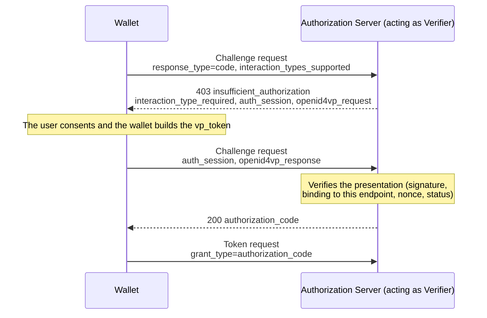

[← Wallet](../wallet.md)

# Issuing into the wallet

A credential offer is accepted with [`wallet accept`](presenting.md#wallet-accept-uri) (or from the wallet UI, a scanned QR, or the wallet's `/credential-offer` URL). Along the way the wallet handles sign-in at the issuer, renewing a credential later, deferred issuance, the wallet attestation it sends, the OpenID4VCI feature level, and interactive (presentation-during-issuance) authorization.

## Sign-in during issuance

An authorization code offer sends the user to the issuer to authenticate. Only a browser can do that, and the wallet never opens one itself (a hosted wallet opening a browser on its own server reaches nobody). Instead it hands out the authorization URL. An open UI tab takes it off the event stream and navigates. An API caller gets `HTTP 202` and the URL, and opens it itself only when it named no tab, so exactly one browser arrives:

```json
{
  "status": "authorization_required",
  "authorization_url": "https://issuer.example/authorize?client_id=...&request_uri=...",
  "offer_id": "23f9dd49-7e7b-4fca-9fbe-acba4680852f"
}
```

The flow keeps running. The user signs in, the issuer redirects to the wallet's `/callback`, and the flow resumes there and finishes the issuance. `GET /api/offers/{offer_id}` reports how it ended (`authorization_required`, `completed`, `deferred` or `failed`, the last two carrying the same payloads as a direct answer).

The callback is matched by `state` alone, so the sign-in can happen in any browser that can reach the wallet. `eudi wallet accept` uses this: it opens the URL here, prints it for a headless shell, and follows the offer until it resolves.

The one requirement is that the browser can reach the wallet's redirect URI. That holds for a local wallet and for a public one, but not for a wallet whose base URL is only routable on a network the browser cannot see.

## Renewing a credential

An issuer that hands over a refresh token at issuance can be asked for a fresh copy of the credential later. The wallet stores what the request needs (token and credential endpoints, configuration id, refresh token) with the credential.

```bash
eudi wallet refresh <credential-id>
curl -X POST http://localhost:8085/api/credentials/<id>/refresh
```

The credential keeps its id, so a verifier query or a UI selection that referred to it keeps working. A rotated refresh token replaces the stored one. Credentials that can be renewed report `can_renew` in listings, alongside `expires_at` (read from `exp` for SD-JWT and from the MSO validity for mdoc).

An issuer that gave no refresh token cannot be asked, so the request is refused.

A refresh is a token request (`grant_type=refresh_token`) at the same endpoint that issued the credential, so an issuer that required client authentication there requires it here. The wallet stores how it authenticated (wallet attestation or `private_key_jwt`, with the audience and the challenge endpoint) alongside the refresh token and rebuilds it per request. The attestation challenge is fetched fresh each time, since servers reject a replayed challenge.

The wallet also renews on its own, in two places. A background task checks every 30 seconds and renews anything within a minute of expiring (a failed renewal is held off for ten minutes rather than retried on every sweep). A credential is also renewed on the way to a verifier when it is that close to expiring, which covers a wallet with no server running. A failure there is not fatal. The credential in hand may still be accepted.

## Deferred issuance

An issuer that cannot produce the credential straight away answers the credential request with a `transaction_id` instead, and the wallet collects the credential from the `deferred_credential_endpoint` later. Both issuance flows handle this.

While the credential is not ready the issuer answers with the `issuance_pending` error and an `interval` to wait ([OID4VCI 1.0 §9.3](https://openid.net/specs/openid-4-verifiable-credential-issuance-1_0.html)). The wallet honors that interval. Some issuers signal the same thing by echoing the `transaction_id` back in a success response, which is accepted too.

The wallet does not wait. It records the transaction and returns straight away, and `wallet serve` collects the credential in the background on the interval the issuer asked for. The caller (a consent dialog, a CLI run) is not held for an interval that may be hours.

Accepting such an offer answers `HTTP 202` with the outcome:

```json
{
  "pending": true,
  "issuer": "https://playground.animo.id/oid4vci/a27a9f50-...",
  "transaction_id": "6a02ebb4-a256-4c71-a0dc-af1e5a7c1495",
  "retry_interval": "1m0s"
}
```

The wallet UI lists it under **Awaiting issuance** and the credential appears on its own once collected. From the CLI:

```bash
eudi wallet deferred                 # what is outstanding, and when the next attempt is
eudi wallet deferred check [id]      # ask the issuer now instead of at the next attempt
eudi wallet deferred abandon <id>    # stop collecting it
```

**Check now** asks the issuer straight away, for when the credential is known to be ready (or you want to watch the exchange). It reports what came back: the credential, a still-working issuer, or a refusal. The next scheduled attempt then moves on by one interval, as if the poller had made it. The UI has the same button on each entry.

**Abandon** drops the entry from the schedule. The transaction stays valid at the issuer. The wallet just stops asking. Use it instead of waiting out the 24 hours after which the wallet gives up on its own.

Pending issuances are persisted, so a wallet that restarts keeps collecting. A record is dropped when the credential arrives, when the issuer answers something that will not improve by asking again (a rejected token, an unknown transaction), when it is abandoned, or after 24 hours.

Collecting happens in `wallet serve`. A one-shot `wallet accept` against the local store cannot run a poller, so it only reports the deferral.

## Wallet attestation

On OID4VCI token requests the wallet authenticates itself with a wallet attestation ([OAuth 2.0 Attestation-Based Client Authentication](https://datatracker.ietf.org/doc/draft-ietf-oauth-attestation-based-client-auth/)), sent as the `OAuth-Client-Attestation` and `OAuth-Client-Attestation-PoP` headers. The attestation is signed by the wallet's own CA and carries only the leaf in `x5c`, so an issuer verifying it needs the CA from `wallet ca-cert` as its trust anchor. The same client authentication applies at every authorization server endpoint the wallet calls, including the PAR endpoint, the token endpoint, and the Authorization Challenge Endpoint of interactive authorization (OpenID4VCI 1.1 section 6).

Three drafts of that document are supported, following [ADR-0014](../adr/0014-pinned-draft-versions-stay-supported-alongside-the-latest.md). The outgoing JWTs carry the union of what those drafts define, which is the draft-07 shape OpenID4VCI 1.0 pins (its section 14.7 says to prefer the pinned version): `iss` and `nbf` in both the attestation and its PoP, whatever `--vci-version` is configured. Draft-08 stopped defining those claims without forbidding them (section 5.1 and section 5.2 rule 1 let a JWT carry claims the draft does not define), so the one shape verifies under every supported draft, including at issuers that check attestations against draft-07. The additions of the latest draft-10 are negotiated through server metadata regardless of the configured version. A server that offers only `attest_jwt_client_auth_dpop`, or whose `client_attestation_pop_methods_supported` names only `dpop_combined`, gets the attestation with the DPoP proof as its possession proof and no dedicated PoP header, with a warning that the mechanism postdates the configured draft. A challenge served in the `OAuth-Client-Attestation-Challenge` response header, or demanded with the `use_attestation_challenge` error, is carried in the next PoP, and the refused request is retried once. The `challenge_endpoint` route stays in use where the metadata names one.

Under `--haip` the wallet attests. HAIP 1.0 §4.4.1 requires it of both sides:

> Wallets MUST use, and Issuers MUST require, an OAuth2 Client authentication mechanism at OAuth2 Endpoints that support client authentication (such as the PAR and Token Endpoints).

A conformant issuer both requires and advertises client authentication, and the wallet attests. Two kinds of issuer deviate, and `--mode debug` (which the public demo runs) reads each so issuance can proceed:

- An issuer that requires an attestation but advertises no client authentication method at all. Advertising is only a SHOULD in §10.1, so a silent issuer may still require one. The wallet attests anyway and warns about the missing advertisement. An issuer like the Animo playground works this way.
- An issuer that explicitly advertises only unauthenticated access (`none`). The wallet takes it at its word, proceeds without client authentication, and warns (attesting would only be refused). This makes a non-HAIP issuer like Procivis One reachable.

`--mode strict` attests in both cases and lets the exchange fail at the token endpoint if the issuer refuses.

Without `--haip` it attests **only when the authorization server advertises it**, by listing `attest_jwt_client_auth` in `token_endpoint_auth_methods_supported`. That is what §8 of the draft asks a client to do:

> The client SHOULD fetch and parse the Authorization Server metadata and recognize Attestation-Based Client Authentication as a client authentication mechanism if either of the given `token_endpoint_auth_methods_supported` values are present.

Following the metadata is also a privacy measure. The wallet has one holder key and one attestation, and §10.1 of the same draft warns that reusing them across authorization servers lets those servers correlate the user. Attesting only where asked limits that to issuers who already require identification.

### `--client-attestation`

Advertising the method is a SHOULD, not a MUST, so an issuer may check an attestation without ever announcing it. Against such an issuer a non-HAIP wallet sends nothing and gets `invalid_client`. `--client-attestation` sends the attestation regardless of metadata:

```bash
eudi wallet serve --client-attestation --auto-accept
```

Use it when you know the issuer wants an attestation, accepting the correlation cost above. The wallet does not infer this from an `invalid_client` error, since one issuer's metadata bug should not change how it treats every other issuer. `GET /api/config` reports the setting as `force_client_attestation`.

The override never displaces client authentication the server did ask for: an authorization server that advertises `private_key_jwt` still gets the client assertion, not an attestation.

## OpenID4VCI feature level

The wallet speaks [OpenID4VCI 1.0](https://openid.net/specs/openid-4-verifiable-credential-issuance-1_0-final.html), the published final version, and that does not change. `--vci-version` decides whether it also uses what the [1.1 draft](https://openid.github.io/OpenID4VCI/openid-4-verifiable-credential-issuance-1_1-wg-draft.html) adds on top.

```bash
eudi wallet serve --vci-version 1.1
```

`1.0` is the default. `1.1` is what the public demo runs (`--demo` selects it, and `--vci-version 1.0` overrides that).

Every 1.1 feature is negotiated in the issuer's metadata. The level says what the wallet is willing to use, not what it demands. Against an issuer that publishes none of the features the two levels behave identically, so 1.1 is safe on a wallet that also talks to 1.0 issuers.

Like the other conformance settings, the level is changeable at runtime on a locally-hosted wallet (see [changing the conformance settings](serve.md#changing-the-conformance-settings)) and reported as `vci_version` by `GET /api/config`.

What 1.1 selects:

| Feature | 1.0 | 1.1 |
|---------|-----|-----|
| Interactive Authorization (1.1 §6), where the issuer publishes `authorization_challenge_endpoint` | Not used. The offer is recorded in the activity log naming the flag that would use it, and the redirect flow of §5 runs as before | Used. See [interactive authorization](#interactive-authorization) |

### Interactive authorization

An issuer can make presenting a credential a condition of issuing one. Instead of sending the user to a browser, the wallet talks to the issuer's Authorization Challenge Endpoint. The issuer answers that the authorization is not sufficient yet and sends an OpenID4VP request with it. The wallet asks the user and presents what was asked for, and the issuer verifies that presentation as a verifier would. Only then does it hand over an authorization code. Everything after that is the ordinary token and credential exchange.



Steps 2 and 3 repeat while the issuer asks for further interactions. A wallet that cannot satisfy one answers with an OpenID4VP error, so the issuer can report why it refuses.

The presentation asks for consent like any other, since consenting to receive a credential is not consenting to disclose one. A wallet in auto-accept mode answers for the user, as it does everywhere else.

Challenge requests carry the same wallet attestation headers as token requests, and the built-in demo issuer requires them there unless started with `--demo-issuer-client-auth optional`.

The presentation flow needs no `--vci-redirect-uri` (nothing is redirected anywhere), and interactive authorization is the only way to use an issuer that sets `require_interactive_authorization`. The presentation is bound to the challenge endpoint itself: an SD-JWT key binding JWT carries it as `ia:<endpoint>` in `aud`, and an mdoc signs over the `OpenID4VCIIAEHandover` session transcript. If the request carries `expected_origins`, it must name the challenge endpoint's own origin, which stops one authorization server from forwarding another's request.

The wallet offers two interactions and advertises only what it can complete (§6.2.1 makes it abort on an unsupported one):

- The presentation interaction (`urn:openid:dcp:ia:openid4vp_presentation`), always.
- The browser interaction (`urn:openid:dcp:ia:auth_via_web`, §6.2.1.2), when a redirect URI is configured and the server publishes an `authorization_endpoint`. The server answers the challenge with a `request_uri`, the wallet builds an authorization request from it (RFC 9126 §4) and hands the sign-in URL to the user's browser, exactly as in the redirect flow. The redirect back to the wallet carries the authorization code, or an `auth_session` when further steps remain at the challenge endpoint.

A server asking for an interaction the wallet did not advertise, or a custom one, is refused.

The built-in demo issuer uses both. An offer set to "Presentation during issuance" runs the presentation interaction. An offer set to "Browser sign-in" asks a wallet that advertises it for the auth_via_web interaction, and falls back to `redirect_to_web` (first-party-apps Section 5.2.2.1.1) for one that does not.

#### Trying it against the built-in demo issuer

The built-in demo issuer implements the other side, so the exchange runs against a single `wallet serve` with no external issuer. It asks for a PID, verifies the presentation itself, and issues a ticket naming that PID's holder.

```bash
eudi wallet serve --pid --auto-accept --vci-version 1.1 --vci-client-id demo-wallet

# an authorization code offer whose authorization is a presentation
curl -X POST 'http://localhost:8085/issuer/api/offers?grant=authorization_code&authorization=presentation' -d '{}'
curl -X POST http://localhost:8085/api/offers -d '{"uri": "<scheme_uri from above>"}'
```

`authorization=presentation` selects "Presentation during issuance" for this offer (the issuer UI choice described above). Without it the offer defaults to the browser sign-in. The same offer redeemed at `--vci-version 1.0` goes through the browser sign-in instead, because the demo issuer publishes `authorization_challenge_endpoint` only at 1.1.
