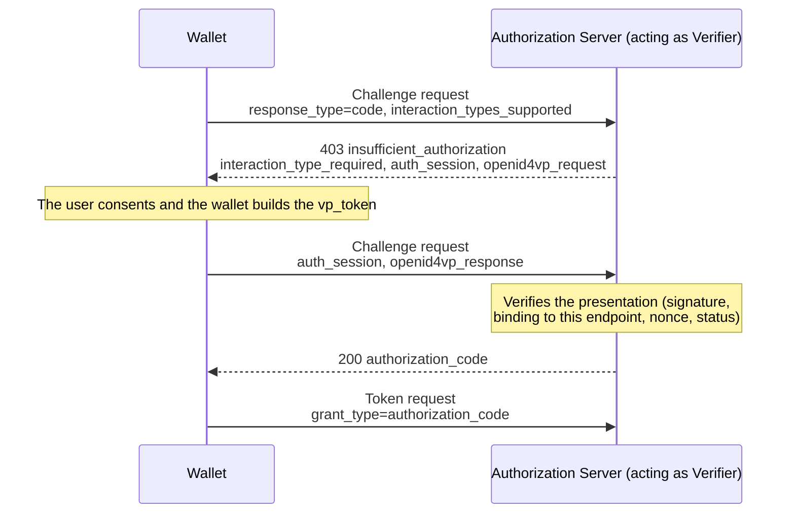

[← Wallet](../wallet.md)

# Issuing into the wallet

The wallet accepts a credential offer with [`wallet accept`](presenting.md#wallet-accept-uri), from the wallet UI, from a scanned QR, or at its `/credential-offer` URL.

## Sign-in during issuance

An authorization code offer requires sign-in at the issuer. The wallet returns the authorization URL because a hosted server cannot open a browser itself. An open wallet tab receives the URL through the event stream and navigates to it.

API callers receive `HTTP 202` with the URL. They should open it only when no wallet tab is handling the flow, so that the authorization request is used only once:

```json
{
  "status": "authorization_required",
  "authorization_url": "https://issuer.example/authorize?client_id=...&request_uri=...",
  "offer_id": "23f9dd49-7e7b-4fca-9fbe-acba4680852f"
}
```

After sign-in, the issuer redirects to `/callback` and the wallet resumes issuance. Poll `GET /api/offers/{offer_id}` for `authorization_required`, `completed`, `deferred` or `failed`. Deferred and failed responses carry the same payloads as a direct response.

The callback is matched by `state` alone, so the sign-in can happen in any browser that can reach the wallet's redirect URI. `eudi wallet accept` uses this. It opens the URL locally, prints it for a headless shell, and polls the offer until it completes.

## Renewing a credential

If an issuer returns a refresh token, the wallet can request a new copy of the credential later. It stores the endpoints, configuration ID and refresh token with the credential.

```bash
eudi wallet refresh <credential-id>
curl -X POST http://localhost:8085/api/credentials/<id>/refresh
```

The credential keeps its id, so a verifier query or a UI selection that referred to it keeps working. A rotated refresh token replaces the stored one. Credentials that can be renewed report `can_renew` in listings, alongside `expires_at` (read from `exp` for SD-JWT and from the MSO validity for mdoc).

Renewal uses `grant_type=refresh_token` at the original token endpoint, with the original client authentication method. The wallet stores the method, audience and challenge endpoint with the refresh token. It rebuilds authentication proofs and fetches a fresh attestation challenge for each request.

The server checks for renewal every 30 seconds and renews credentials within a minute of expiry. Failed renewals wait ten minutes before retrying. The wallet also attempts renewal before presenting a credential that expires within a minute, including without a running server. If renewal fails, it presents the stored credential.

## Deferred issuance

An issuer that cannot issue the credential immediately responds to the credential request with a `transaction_id`. The wallet collects the credential from the `deferred_credential_endpoint` later, in both issuance flows.

While the credential is not ready, the issuer responds with the `issuance_pending` error and an `interval` to wait ([OID4VCI 1.0 §9.3](https://openid.net/specs/openid-4-verifiable-credential-issuance-1_0.html)). The wallet waits that interval. Some issuers instead return the `transaction_id` in a success response. The wallet accepts this too.

The wallet records the transaction and returns immediately. `wallet serve` collects the credential in the background at the issuer's interval. The consent dialog and the CLI command do not wait for it.

Accepting such an offer returns `HTTP 202` with the outcome:

```json
{
  "pending": true,
  "issuer": "https://playground.animo.id/oid4vci/a27a9f50-...",
  "transaction_id": "6a02ebb4-a256-4c71-a0dc-af1e5a7c1495",
  "retry_interval": "1m0s"
}
```

The wallet UI lists it under **Awaiting issuance** and the credential appears once collected. From the CLI:

```bash
eudi wallet deferred                 # what is outstanding, and when the next attempt is
eudi wallet deferred check [id]      # ask the issuer now instead of at the next attempt
eudi wallet deferred abandon <id>    # stop collecting it
```

**Check now** polls immediately and reports the result: a credential, `issuance_pending` or a refusal. It schedules the next attempt one interval later. The UI offers the same action.

**Abandon** removes the entry from the schedule. The transaction stays valid at the issuer.

Deferred issuances are saved in the selected storage backend. With file or Postgres storage, collection resumes after a restart. A record is removed when collection succeeds, the issuer returns a final error, the user abandons it, or 24 hours pass. A local `wallet accept` command reports the deferral. Run `wallet serve` to collect the credential.

## ARF checks

*(new in 3.0.0)*

The offer flow applies `--mode`, `--haip` and `--arf` like a presentation, whether the offer comes from `wallet accept`, `wallet scan` or an offer URL.

With `--arf` the wallet also checks the issuer before it requests a credential, for an offer and for a renewal, as ARF v3.0.0 §6.6.2.2 and §6.6.2.3 describe. It asks for signed metadata first (`Accept: application/jwt, application/json;q=0.5`) and checks that:

- the Credential Issuer Metadata is signed with an access certificate (OpenID4VCI 1.0 §12.2.3, ISSU_22 and ISSU_32), and that certificate chains to a trusted access certificate authority (ISSU_24 for a PID Provider, ISSU_34 for an Attestation Provider)
- the metadata carries a registration certificate in `issuer_info` (ETSI TS 119 472-3 V1.1.1 §4.2.3), signed by a trusted registrar (ISSU_23c, ISSU_33a), not expired and not revoked (RPRC_22a)
- the registration certificate names the provider of the access certificate (RPRC_22b)
- it registers the issuer as a PID Provider for a PID (ISSU_24a), or as a QEAA, PuB-EAA or EAA Provider for other attestations (ISSU_34a)
- it lists every offered credential type in `provides_attestations` (RPRC_23, ISSU_24b, ISSU_34b)

Signed metadata must carry `iat`, and an `exp` must not be in the past (OpenID4VCI 1.0 §12.2.3). In `--mode debug` the wallet reads such metadata and logs a warning in the activity log. In `--mode strict` it refuses the metadata.

In `--mode debug` the findings are warnings and issuance goes on. The consent dialog for the offer lists them under a collapsed line, and the issuance result returns them in `findings`. In `--mode strict` the wallet refuses the offer before the consent dialog and doesn't request the credential. The trust anchors are the same as for verifiers: an access certificate chains to a CA on an `access-ca` list and a registration certificate to a CA on a `registrar` list (see [ARF checks](presenting.md#arf-checks)). The [registrar API walkthrough](registrar-api.md#an-issuer) registers an issuer and runs these checks.

When the credential arrives, the wallet looks up its type in the [attestation catalogue](registrar.md#attestation-catalogue). The entry's category names the rule: ARF ISSU_07 for a PID, ISSU_08 for a QEAA, ISSU_09 for a PuB-EAA and ISSU_10 for another EAA. The credential's certificate chain (`x5c` or `x5chain`) must end in an issuance service certificate on a trusted list, and the signature must verify. The wallet tries the list of the entry. An entry links the wallet's own list of its category unless it names another list. For a PID or a PuB-EAA, it also tries every list of that type on the [list of trusted lists](serve.md#trusted-lists). A PID from another issuer passes once its CA is on the wallet's `pid` list (`wallet trust add-ca --list pid`) or on an external PID provider list.

A PID, QEAA or PuB-EAA entry must link a readable trusted list. Otherwise that is a finding too. ISSU_10 applies only when the wallet has the issuer's trust anchors, so for an EAA an unreadable list only gives a warning in the activity log.

The wallet verifies the JAdES signature of each fetched trusted list. The signer must chain to a trusted list operator: the wallet CA or a CA from `--trust-list-ca` (ARF PPNot_05, TLPub_05, TLPub_07). The flag takes a PEM file and is repeatable on `wallet serve`, `wallet accept` and `wallet scan`. A list reached through an external list of trusted lists is signed by the certificate of its pointer instead (ETSI TS 119 602 V1.1.1 §6.3.13).

In `--mode debug` a failure is a warning. In `--mode strict` the wallet doesn't store the credential (ISSU_11b). Every copy of a batch, renewals and deferred credentials get the same check.

If an offered type has no catalogue entry, the consent dialog and the log show a warning. No specification requires this check, so the warning never stops issuance, not even in strict mode.

The ARF applies the registration certificate checks 24 months after the amended CIR 2024/2982 enters into force. Until then many issuers publish no `issuer_info`, so test them in debug mode. The [registrar](registrar.md#issuers) registers issuers and issues their certificates.

## Wallet attestation

The wallet supports [OAuth 2.0 Attestation-Based Client Authentication](https://datatracker.ietf.org/doc/draft-ietf-oauth-attestation-based-client-auth/). It sends `OAuth-Client-Attestation` and `OAuth-Client-Attestation-PoP` headers to the PAR, token and Authorization Challenge endpoints.

The attestation is signed by a separate wallet provider key. Its `x5c` contains the wallet provider leaf and any intermediate certificates, with the self-signed root omitted. An issuer can pin the root exported by `wallet ca-cert` or use the wallet provider certificates at `/api/trustlists/wallet-provider`. Key attestations use the same wallet provider signer.

The wallet supports three drafts of the attestation specification ([ADR-0014](../adr/0014-pinned-draft-versions-stay-supported-alongside-the-latest.md)). Outgoing JWTs use the draft-07 claims required by OpenID4VCI 1.0 section 14.7. Both the attestation and its PoP include `iss` and `nbf`, regardless of `--vci-version`. Draft-08 allows these additional claims under sections 5.1 and 5.2 rule 1, so the same JWTs work across the supported drafts.

Draft-10 features are selected through server metadata. If a server offers only `attest_jwt_client_auth_dpop`, or lists only `dpop_combined` in `client_attestation_pop_methods_supported`, the wallet uses DPoP as the possession proof and omits the dedicated PoP header. It warns when this mechanism is newer than the configured draft.

A server can request an attestation challenge through the `OAuth-Client-Attestation-Challenge` response header or the `use_attestation_challenge` error. The wallet includes the challenge in its next PoP and retries once. It also supports the `challenge_endpoint` advertised in metadata.

Under `--haip` the wallet always attests. HAIP 1.0 §4.4.1 requires it of both sides:

> Wallets MUST use, and Issuers MUST require, an OAuth2 Client authentication mechanism at OAuth2 Endpoints that support client authentication (such as the PAR and Token Endpoints).

Debug mode, used by the public demo, handles two issuer deviations:

- An issuer that requires an attestation but advertises no client authentication method. Advertising is a SHOULD in §10.1, so the wallet attests anyway and warns about the missing advertisement.
- An issuer that advertises only unauthenticated access (`none`). The wallet proceeds without client authentication and warns.

`--mode strict` attests in both cases and lets the exchange fail at the token endpoint if the issuer rejects it.

Without `--haip` the wallet attests **only when the authorization server advertises it** by listing `attest_jwt_client_auth` in `token_endpoint_auth_methods_supported`. §8 of the draft recommends this:

> The client SHOULD fetch and parse the Authorization Server metadata and recognize Attestation-Based Client Authentication as a client authentication mechanism if either of the given `token_endpoint_auth_methods_supported` values are present.

Following the metadata also limits correlation. The wallet has one holder key and one attestation, and §10.1 of the draft warns that reusing them across authorization servers lets those servers correlate the user.

### `--client-attestation`

Advertising the method is a SHOULD, so an issuer may require an attestation without advertising it. `--client-attestation` sends the attestation regardless of metadata:

```bash
eudi wallet serve --client-attestation --auto-accept
```

Reusing the attestation lets those issuers correlate the wallet. `GET /api/config` reports the setting as `force_client_attestation`. An authorization server that advertises `private_key_jwt` still receives the client assertion.

## OpenID4VCI feature level

The wallet implements [OpenID4VCI 1.0](https://openid.net/specs/openid-4-verifiable-credential-issuance-1_0-final.html), the published final version. `--vci-version` controls whether it also uses features from the [1.1 draft](https://openid.github.io/OpenID4VCI/openid-4-verifiable-credential-issuance-1_1-wg-draft.html).

```bash
eudi wallet serve --vci-version 1.1
```

`1.0` is the default. The public demo runs `1.1` (`--demo` sets it and `--vci-version 1.0` overrides it).

Every 1.1 feature is negotiated through issuer metadata. Against an issuer that advertises none of them, 1.1 behaves like 1.0.

Like the other conformance settings, the level can be changed at runtime on a local wallet (see [changing the conformance settings](serve.md#changing-the-conformance-settings)). `GET /api/config` reports it as `vci_version`.

Features enabled by 1.1:

| Feature | 1.0 | 1.1 |
|---------|-----|-----|
| Interactive Authorization (1.1 §6), where the issuer publishes `authorization_challenge_endpoint` | Not used. The §5 redirect flow runs and the activity log shows the flag that enables Interactive Authorization | Used. See [interactive authorization](#interactive-authorization) |

### Interactive authorization

An issuer can require a credential presentation before it issues a credential. The wallet calls the issuer's Authorization Challenge Endpoint. The issuer answers with an OpenID4VP request. The wallet asks the user for consent and presents the requested credentials. The issuer verifies the presentation like a verifier. It then returns an authorization code, and the regular token and credential exchange follows.


```mermaid
sequenceDiagram
    participant Wallet
    participant AS as Authorization Server (acting as Verifier)

    Wallet->>AS: Challenge request<br/>response_type=code, interaction_types_supported
    AS-->>Wallet: 403 insufficient_authorization<br/>interaction_type_required, auth_session, openid4vp_request
    Note over Wallet: The user consents and the wallet builds the vp_token
    Wallet->>AS: Challenge request<br/>auth_session, openid4vp_response
    Note over AS: Verifies the presentation (signature,<br/>binding to this endpoint, nonce, status)
    AS-->>Wallet: 200 authorization_code
    Wallet->>AS: Token request<br/>grant_type=authorization_code
```

Steps 2 and 3 repeat while the issuer asks for further interactions. If the wallet cannot complete an interaction, it responds with an OpenID4VP error so the issuer can report the reason.

The presentation requires consent like any other presentation (receiving a credential and disclosing one are separate decisions). In auto-accept mode, the wallet approves it automatically.

Challenge requests carry the same wallet attestation headers as token requests. The built-in demo issuer requires them on challenge requests unless it runs with `--demo-issuer-client-auth optional`.

The presentation interaction works without `--vci-redirect-uri`. An issuer that sets `require_interactive_authorization` requires this flow.

The presentation is bound to the challenge endpoint. An SD-JWT key binding JWT uses `ia:<endpoint>` as `aud`. An mdoc uses the `OpenID4VCIIAEHandover` session transcript. If the request contains `expected_origins`, it must contain the origin of the challenge endpoint. This stops one authorization server from forwarding another server's request.

The wallet supports two interaction types and advertises only those it can complete (§6.2.1):

- The presentation interaction (`urn:openid:dcp:ia:openid4vp_presentation`), always.
- The browser interaction (`urn:openid:dcp:ia:auth_via_web`, §6.2.1.2), when a redirect URI is configured and the server publishes an `authorization_endpoint`. The server answers the challenge with a `request_uri`. The wallet builds an authorization request from it (RFC 9126 §4) and opens the sign-in URL in the user's browser, as in the redirect flow. The redirect back to the wallet carries the authorization code, or an `auth_session` when further steps remain at the challenge endpoint.

The wallet rejects a request for an interaction it did not advertise.

The built-in demo issuer uses both. An offer set to "Presentation during issuance" runs the presentation interaction. An offer set to "Browser sign-in" requests the `auth_via_web` interaction from a wallet that advertises it, and falls back to `redirect_to_web` (first-party-apps Section 5.2.2.1.1) for other wallets.

#### Trying it against the built-in demo issuer

The built-in demo issuer implements the issuer side, so the exchange runs against a single `wallet serve`. It asks for a PID, verifies the presentation, and issues a ticket for that PID's holder.

```bash
eudi wallet serve --pid --auto-accept --vci-version 1.1 --vci-client-id demo-wallet

# an authorization code offer whose authorization is a presentation
curl -X POST 'http://localhost:8085/issuer/api/offers?grant=authorization_code&authorization=presentation' -d '{}'
curl -X POST http://localhost:8085/api/offers -d '{"uri": "<scheme_uri from above>"}'
```

`authorization=presentation` selects "Presentation during issuance" for this offer. Without it the offer defaults to the browser sign-in. The same offer redeemed with `--vci-version 1.0` goes through the browser sign-in, because the demo issuer publishes `authorization_challenge_endpoint` only at 1.1.
