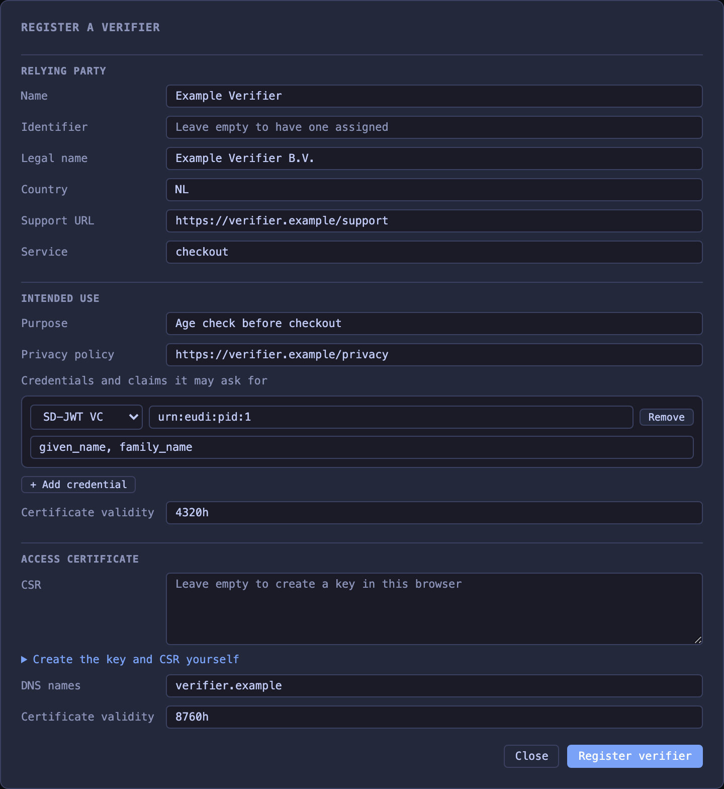
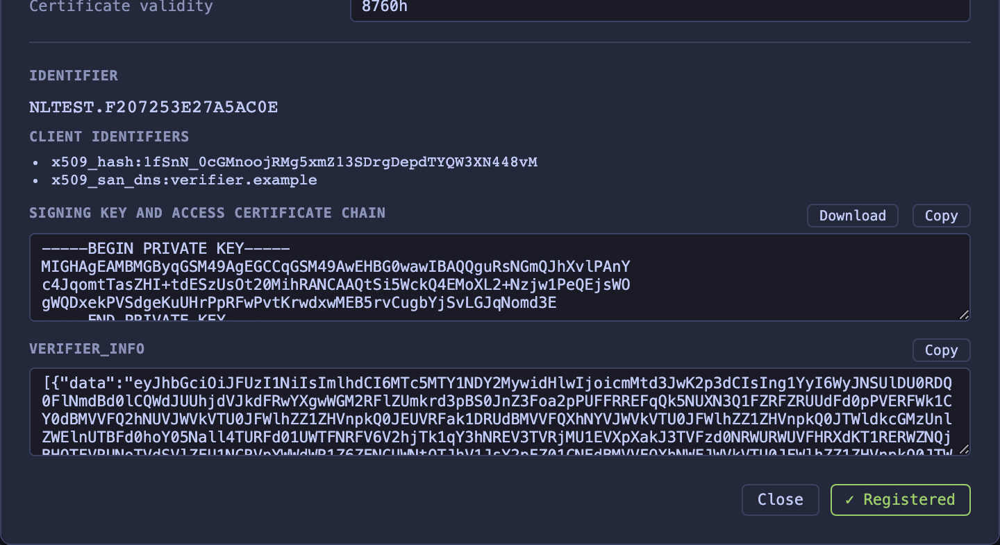
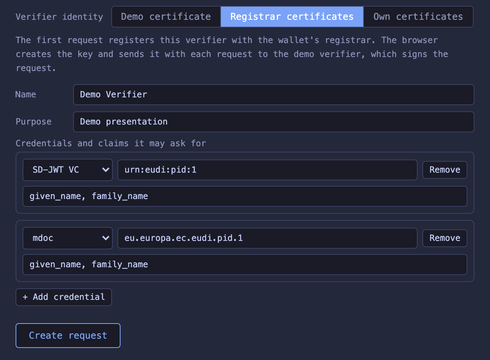

# Registrar

*(new in 3.0.0)*

The wallet includes a relying party registrar. Each member state runs a registrar like this one (ARF Topic 27). You register a verifier or an issuer with it and get two certificates:

- An **access certificate** (ETSI TS 119 411-8 V1.1.1). You send a certificate signing request and keep the private key. A verifier signs its request objects with that key and puts the certificate in `x5c`. An issuer signs its Credential Issuer Metadata with it (ARF ISSU_22 and ISSU_32).
- A **registration certificate** (ETSI TS 119 475 V1.2.1, typ `rc-wrp+jwt`). A verifier gets one for each intended use. It lists which credentials and claims the verifier may request, and the purpose shown in the consent dialog. The verifier sends it in `verifier_info` (OpenID4VP 1.0 §5.1). An issuer gets one for its service (ARF RPRC_13). It lists which attestation types the issuer may issue, and the issuer publishes it in `issuer_info` (ETSI TS 119 472-3 V1.1.1 §4.2.3).

Both certificates contain the same identifier (ARF Reg_32 and RPRC_07). The registrar API follows the TS05 v1.5 data model and registry API. The [registrar API walkthrough](registrar-api.md) registers a verifier and an issuer with curl and then uses their certificates with the wallet.

## Registrations

A relying party offers services. A verifier's service has intended uses (TS05 v1.5 §2.4). Each intended use needs a purpose (TS05 v1.5 §2.4.4) and lists which credentials and claims the verifier may request. A credential has the format `dc+sd-jwt` or `mso_mdoc` and its type in `meta`. Every credential lists at least one claim (TS05 v1.5 §2.4.5). A privacy policy without a `type` gets `http://data.europa.eu/eudi/policy/privacy-policy` (ETSI TS 119 475 V1.2.1 Annex B.2.8). A service has at most one `supportURI`.

A registration names its supervisory authority with `name`, `country` and at least one contact in `email`, `phone` or `formURI` (TS05 v1.5 §2.4.7). `email`, `phone` and `formURI` are lists. If you give no contact, the registrar adds the test address `dpa@eudi-test.dev` and the form `<issuer URL>/supervisory-authority`. The name defaults to `Test Supervisory Authority` and the country to the relying party's country.

If a registration has no identifier, the registrar assigns one. It is an `organizationIdentifier` such as `NTRNL-1A2B3C4D5E6F7A8B`: the identifier type (`LEI`, `NTR`, `VAT`, `EOR` or `EXC`), a country code, a dash and the value (ETSI TS 119 475 §5.1.3).

Anyone with access to the wallet can register, change and delete relying parties and revoke their certificates. On a shared instance every visitor sees every registration and can delete it.

An update can add identifiers. The first identifier never changes, because the issued certificates contain it.

Registrations are part of the wallet state. With file or Postgres storage they survive a restart. With memory storage they are lost, but if the keys are [seeded](../wallet.md#seeded-keys), certificates issued before the restart still verify. The wallet checks only their signatures. A demo reset deletes all registrations.

## Issuers

An issuer registers as an attestation provider. Its service has an entitlement from ETSI TS 119 475 V1.2.1 Annex A.2 (`PID_Provider`, `QEAA_Provider`, `PUB_EAA_Provider` or `Non_Q_EAA_Provider`) and lists its attestation types in `providesAttestations` (ARF RPRC_15). Each entry has a `format` and a `type`, which is the `vct` or the doctype (TS05 v1.5 §2.4.8). A provider needs at least one type. Without a provider entitlement, the service gets the entitlement of each type's category: the category of its catalogue entry, else `pid` for a PID type (ARF PID_04, PID_14), else `eaa`.

With `--arf` a PID needs `PID_Provider` (ISSU_24a). Any other attestation needs `QEAA_Provider`, `PUB_EAA_Provider` or `Non_Q_EAA_Provider` (ISSU_34a). The wallet treats these three alike. The choice only changes the content of the registration certificate. The wallet does not validate qualified signatures.

An issuer's registration certificate covers its service. It has `entitlements` and `provides_attestations`, where each type has its `vct` or doctype in `meta` (ETSI TS 119 475 V1.2.1 Table 8). It has no intended use (ARF RPRC_05). The registrar returns it inside an `issuer_info` array with two entries: the `registrar_dataset` with `identifier`, `srvDescription`, `registryURI` and `providesAttestations`, and the `registration_cert` (ETSI TS 119 472-3 V1.1.1 §4.2.3).

To use the certificates, an issuer:

1. puts the `issuer_info` array at the top level of its Credential Issuer Metadata
2. signs the metadata as OpenID4VCI 1.0 §12.2.3 describes, with the key of its access certificate and the access certificate chain in `x5c` (ETSI TS 119 472-3 §4.2.2)
3. serves the signed metadata when a wallet asks for `application/jwt`

A wallet with `--arf` then checks the issuer before it requests a credential (see [issuing](issuing.md#arf-checks)).

A provider that also requests attributes, for example to authenticate the user during issuance, registers intended uses too. The registrar then adds the `Service_Provider` entitlement (ARF RPRC_05 note).

## Revocation

Every registration certificate has a `status` claim that points to an entry in the registrar's status list (ETSI TS 119 475 V1.2.1 Table 7). The registrar publishes the list at `/api/registrar/status-list` as a Token Status List, signed with the registrar key.

`wallet registrar revoke` or the status endpoint revokes a certificate. `wallet registrar activate` or the same endpoint makes it valid again.

An intended use or an issuer service has one valid certificate at a time. The registrar also revokes certificates itself, and you can't activate these again:

- when you issue a new certificate for the same intended use or service
- when an update changes a field in the certificate (name, legal name, country, purpose, privacy policy, support URL, supervisory authority, credentials and claims, entitlements or attestation types)
- when an update removes the intended use or the service
- when the relying party is deleted

If you request a certificate while someone updates the same registration, the request fails with HTTP 409. Try again.

Each certificate gets a random entry. With memory storage the revocations are lost on restart, and a demo reset clears them. After a restart or a reset, a revoked certificate is valid again. Rarely, a new certificate gets the same entry as an old one, and revoking it revokes the old one too.

## In the web UI


The search looks at names, identifiers, purposes and credential types.

A verifier registration certificate belongs to one intended use. An issuer registration certificate belongs to the service. The registrar keeps the current certificate, so its `verifier_info` or `issuer_info` value stays available. Issuing a new certificate revokes the old one. A certificate the registrar revoked itself can't be activated again.

**+ Add verifier registration certificate** adds an intended use (ETSI TS 119 475) and issues a verifier registration certificate for it. The existing certificates stay valid. For an issuer, the dialog starts with a PID identity check. The party stays one relying party with both roles, because CIR (EU) 2025/848 Annex I keeps all entitlements and intended uses of a party in one registration. The registrar adds the `Service_Provider` entitlement. The issuer signs its request with its access certificate and sends the new certificate in `verifier_info`.

**+ Add issuer registration certificate** adds attestation types to an existing registration and issues the issuer registration certificate. **Delete** removes the relying party and revokes all its certificates.



**Register a verifier** and **Register an issuer** issue both certificates in one step. If you leave the CSR empty, the browser creates the key and the CSR, and the key never leaves the browser.

For SD-JWT claims, separate path segments with dots (`address.locality`). For mdoc, write the element name if it is in the doctype's namespace, or put another namespace in front with a colon (`eu.europa.ec.eudi.pid.de.1:birth_name`).



If the browser created the key, the result PEM contains the key and the access certificate chain. With your own CSR it contains only the chain. The registration certificate is in the `data` field of the `registration_cert` entry.

Every element has an ID for automated tests:

| Element | IDs |
|---------|-----|
| Registrar menu | `registrar-menu-toggle` opens the submenu with `registrar-parties-link` and `registrar-catalog-link` |
| Relying parties | Filters `registrar-filter-all`, `registrar-filter-verifiers`, `registrar-filter-issuers`. `registrar-search` searches, with suggestions in `registrar-search-suggestions`. `registrar-page-prev`, `registrar-page-next` and `registrar-page-info` page through the list. `registrar-parties-register` and `registrar-parties-register-issuer` open the register dialogs, and `registrar-parties-close` closes the dialog. A party is `registrar-party-<identifier>` with `-name`, `-identifier`, `-role-verifier`, `-role-issuer`, `-add-use` and `-delete`. `-requests-hint` explains verifier registration certificates on an issuer without one, and `-add-issuer` adds an issuer registration certificate. Each certificate has a line in the card, `<row>-summary` with `-summary-kind`, `-summary-title`, `-summary-status` and `-details`. **Details** opens `registrar-cert-overlay` with `registrar-cert-title`, `registrar-cert-party`, `registrar-cert-body` and `registrar-cert-close`. The certificate in it keeps the IDs below. An intended use is `registrar-party-<identifier>-use-<intended use>` with `-purpose`, `-status`, `-credentials`, `-issue` and `-revoke` (Revoke or Activate). An issued certificate shows in `-result` with `-verifier-info` and `-copy`. An issuer service is `registrar-party-<identifier>-service-<service>` (`default` without a service identifier) with `-entitlement`, `-status`, `-attestations`, `-issue`, `-revoke`, and `-result` with `-issuer-info` and `-copy`. In `<identifier>`, `<intended use>` and `<service>`, characters other than letters, digits, `_` and `-` become `_` |
| Register dialogs | `registrar-title`, `registrar-name`, `registrar-identifier`, `registrar-legal-name`, `registrar-country`, `registrar-support-uri`, `registrar-service-id`, `registrar-purpose`, `registrar-privacy-policy`, credential rows `registrar-credential-<n>-format`, `-type`, `-claims` and `-remove`, `registrar-add-credential`, `registrar-entitlement`, attestation rows `registrar-attestation-<n>-format`, `-type` and `-remove`, `registrar-add-attestation`, `registrar-registration-validity`, `registrar-csr`, `registrar-dns`, `registrar-access-validity`, `registrar-csr-help-toggle`, `registrar-copy-csr-command`, `registrar-error`, `registrar-submit`, `registrar-close`. Results in `registrar-result` with `registrar-result-identifier`, `registrar-client-id-<n>`, `registrar-pem` (labelled by `registrar-pem-label`), `registrar-download-pem`, `registrar-verifier-info` and `registrar-issuer-info`. `registrar-copy-pem`, `registrar-copy-verifier-info` and `registrar-copy-issuer-info` copy a result field. `registrar-client-id-<n>` counts from 0 |
| Attestation catalogue | `registrar-catalog-search`, the filter rows `registrar-catalog-filter-category`, `-los`, `-binding` and `-source` with buttons such as `registrar-catalog-filter-category-pid` (`aria-pressed` when selected), `registrar-catalog-filter-clear`, `registrar-catalog-list`, `registrar-catalog-close`, `registrar-catalog-add`. An entry is `registrar-catalog-entry-<id>` with `-name`, `-template`, `-category`, `-los`, `-binding`, `-id`, `-version`, `-formats`, `-schema-<n>`, `-rulebook`, `-trust` and `-delete`. **Add attestation** opens `registrar-catalog-add-overlay` with `registrar-catalog-name`, format rows `registrar-catalog-format-<n>-format`, `-type`, `-claims` and `-remove`, `registrar-catalog-add-format`, `registrar-catalog-category`, `registrar-catalog-rulebook`, `registrar-catalog-los`, `registrar-catalog-binding`, `registrar-catalog-trust`, `registrar-catalog-form-error`, `registrar-catalog-cancel` and `registrar-catalog-save` |
| Consent findings | In debug mode a collapsed `consent-findings` lists the findings about the verifier or the issuer. `consent-findings-summary` counts them, and `consent-findings-list` has one `consent-finding-<n>` each |

## Fields and where they go

| Field | Access certificate | Registration certificate |
|-------|--------------------|--------------------------|
| Name | Common name | `name` and `srv_description` |
| Identifier | `organizationIdentifier` | `sub` |
| Legal name | Organization | `sub_ln` |
| Country | Country | `country` |
| Support URL | URI in the subject alternative name | `support_uri` |
| Service | Organizational unit | Not included |
| Intended use (verifier) | Not included | `intended_use_id` (ETSI TS 119 475 V1.2.1 Table 9) |
| Purpose (verifier) | Not included | `purpose` |
| Privacy policy (verifier) | Not included | `privacy_policy` |
| Credentials and claims (verifier) | Not included | `credentials` |
| Entitlement (issuer) | Not included | `entitlements` |
| Attestation types (issuer) | Not included | `provides_attestations` |
| Supervisory authority | Not included | `supervisory_authority` with the name, the country and the first email, phone and form URI (ETSI TS 119 475 V1.2.1 Table 7) |
| Validity (registration certificate) | Not included | `iat` and `exp`, at most 12 months (GEN-5.2.4-08) |
| CSR | Public key | Not included |
| DNS names (verifier) | DNS names in the subject alternative name | Not included |
| Validity (access certificate) | Validity period, at most one year | Not included |
| (assigned) | Not included | `status`, the entry in the registrar's status list |

The registrar fills in the rest. `registry_uri` points to the registration in the registrar API, and a verifier's `entitlements` contains the service provider entitlement. `jti` is a random identifier of the certificate (ETSI TS 119 475 V1.2.1 GEN-6.2.6.1-03, RFC 7519 §4.1.7). `policy_id` is `0.4.0.19475.3.1` (OVR-6.1.3-01), and `certificate_policy` links to [test certificates](../test-certificates.md). An empty support URL becomes `<issuer URL>/support`, and an empty privacy policy becomes `<issuer URL>/privacy-policy`. The wallet serves a placeholder page at each of these URLs and at `<issuer URL>/supervisory-authority`.

The access certificate has the policy `0.4.0.194118.1.2` (ETSI TS 119 411-8 §5.3) and is signed by the relying party access CA. That CA is a separate root. Access certificates from the registrar never chain to the wallet CA. The registrar key signs the registration certificates. Its certificate chains to the registrar CA, another separate root. You can download the registrar certificate, the registrar CA and the relying party access CA under **Trust & certificates**.

## What the wallet checks

The consent dialog shows the registered purpose and a link to the privacy policy (ARF RPA_10). API clients find them in `purposes` and `privacy_policies` of a pending request. The wallet shows them even without `--arf`. The registration certificate must have a valid signature, and it must belong to the access certificate of the signed request. For an unsigned request the dialog shows neither.

With `--arf` the wallet checks the access and registration certificates of every verifier and issuer. It doesn't matter which registrar issued them (see [ARF checks for verifiers](presenting.md#arf-checks) and [for issuers](issuing.md#arf-checks)). It takes the anchors from two [trusted lists](serve.md#trusted-lists):

- **Access certificates** must chain to a CA on an `access-ca` list. The wallet's own list names the relying party access CA.
- **Registration certificates** must chain to a CA on a `registrar` list. The wallet's own list names the registrar CA. The relying party access CA is not on the registrar list, because that CA signs every visitor's CSR. Otherwise anyone with an access certificate could sign their own registration certificate.

Certificates from this registrar pass both checks. A registered credential without a claim list declares no attributes (ETSI TS 119 475 V1.2.1 Annex B.2.9), so requesting any claim counts as over-asking. TS05 registrars always list the claims.

The status list of the registration certificates must chain to a revocation service on a `registrar` list (ARF RPACANot_03b). If the wallet can't read the status, that is a finding. The wallet reads its own registrar's status list directly. It fetches other registrars' lists with its proxy and TLS settings.

The wallet does not check these:

- **The service identifier.** ARF RPRC_17a also compares the service identifier, but ETSI TS 119 475 V1.2.1 has no claim for it. The access certificate has it as organizational unit.
- **Access certificate revocation.** The registrar does not revoke access certificates. A deleted relying party keeps a valid access certificate until it expires.
- **The register.** The wallet does not look up `registry_uri`. A verifier sends exactly one registration certificate with its request (ARF RPRC_19), and an issuer publishes its certificate in its metadata (RPRC_22). A request with no registration certificate or with several gets an RPRC_19 finding.

## Use an external registrar

The wallet can check verifiers and issuers that another registrar registered. It needs that registrar's CAs, and it gets them the way a real wallet does. The TS05 registry API has no endpoint for them. A Member State notifies its access certificate authorities and its registrars to the Commission, which publishes them on lists of trusted entities (ETSI TS 119 602). The access certificate authorities are on a list of type `EUWRPACProvidersList` (Annex F), and the registrars on a list of type `EUWRPRCProvidersList` (Annex G). Each list also names the revocation service that signs the status lists (ARF RPACANot_03b, RPACANot_04, RPACANot_05 and RPACANot_05a). A certificate names its own status list, so status lists need no setup.

Give the wallet those lists when you start it:

```bash
eudi wallet serve --arf --trusted-list-ca lists-ca.pem --trusted-list https://lists.example/lotl
```

- `--trusted-list-ca` is the CA of the list operator, which signs the lists. The wallet uses a list only if its signer chains to this CA or to the wallet CA (ARF PPNot_05, TLPub_05 and TLPub_07).
- `--trusted-list` adds a list or a list of trusted lists. The wallet follows the pointers of a list of trusted lists and takes the anchors from each list according to its type.

A running wallet adds lists with `eudi wallet trust add-list <url>` or `POST /api/trust/lists`. `--trusted-list-ca` can only be set on `wallet serve`. `eudi wallet trust` and **Trust & certificates** in the UI show each list and whether the wallet could read it. The built-in registrar keeps working next to the external one.

Another eudi-dev wallet can be the external registrar, for example one at `https://other-wallet.example`. Its wallet CA signs its lists, and its list of trusted lists points to its `access-ca` and `registrar` lists:

```bash
curl -s https://other-wallet.example/api/certificates/ca > other-wallet-ca.pem
eudi wallet serve --arf --trusted-list-ca other-wallet-ca.pem --trusted-list https://other-wallet.example/api/trustlists/lists
```

A verifier registered there now passes the ARF checks of this wallet. Without the lists the same request gets ARF RPA_04, RPRC_02a and RPRC_17 findings, because neither certificate nor the status list chains to a trusted CA.

If you only have the CAs as files, put them on the lists directly. `--relying-party-ca` puts every CA in the file on both the `access-ca` and the `registrar` list. It is repeatable, and one file can hold several certificates:

```bash
eudi wallet serve --arf --relying-party-ca other-access-ca.pem --relying-party-ca other-registrar-ca.pem
eudi wallet trust add-ca --list access-ca --ca other-access-ca.pem        # on a running wallet
eudi wallet trust add-ca --list registrar --ca other-registrar-ca.pem
```

## The demo issuer and verifier



The demo issuer and the demo verifier are registered like any other relying party. Each has its own access certificate from the relying party access CA, and the identifier in it is the identifier of its registration.

- **EUDI Dev Demo Issuer** is an issuer. It is registered for the credential types of its templates and of the issued-attestation registry, except unlisted ones. The [category](serve.md#credential-categories) of a type comes from the template or the catalogue entry, else it is an EAA. Its entitlements are those of the categories, such as `PID_Provider` for the PIDs and `Non_Q_EAA_Provider` for the demo ticket. It also has the intended use `identity-check`, which asks for `given_name` and `family_name` of the EUDI PID in both formats. The demo issuer sends that registration certificate when it asks for your PID during [interactive authorization](issuing.md#interactive-authorization). Because of this intended use it also has the `Service_Provider` entitlement (ARF RPRC_05 note).
- **EUDI Dev Demo Verifier** is a verifier with one intended use, `demo-requests`. It registers the claims of every predefined template, so the demo requests ask only for registered claims.

The wallet registers both when it starts, after a demo reset, when you save or delete a template and once an hour, and stores the result. Both registrations are derived from the templates. The next update overwrites any change you make to them.

The demo issuer and the demo verifier each use their current registration certificate. If there is none, or the current one expires within a day, the registrar issues a new one. A revoked certificate stays the current one, so the demo keeps sending it until a new certificate replaces it. On the public demo this applies to every visitor until the next reset.

The demo issuer signs its metadata with its access certificate and publishes its registration certificate in `issuer_info`. On the demo verifier page you choose how the verifier identifies itself:

- **Registered** (default): the request is signed with the verifier's access certificate and carries its registration certificate in `verifier_info`. It passes the `--arf` checks. A custom request for a claim outside the templates gets an over-asking finding (RPRC_21).
- **Not registered**: the request is signed with the access certificate and has no `verifier_info`, so `--arf` reports RPRC_19.
- **Own certificates**: you paste a PEM bundle with your key and access certificate chain, and optionally a `verifier_info` value.

The identity buttons are `identity-registered`, `identity-unregistered` and `identity-own`. In **Own certificates** mode you paste into `signing-key` and `verifier-info`. The request API takes `"identity": "unregistered"` for the second option.

## Attestation catalogue

The registrar keeps a catalogue of attestation types, like the catalogue of attestations in EC TS11 v1.0 (§4.3 and §5). Each entry describes one attestation type: its formats with the schema of each, its rulebook, its level of security, how it is bound to its holder and the trusted list of its issuers.

Every predefined credential template is in the catalogue. Templates with the same display name share one entry, so the EUDI PID has its SD-JWT VC and its mdoc type in one entry. The rulebook is the last URL in the template's description. The entry takes the template's category. These entries can't be changed or deleted.

To add a user template, tick "Add the template to the attestation catalogue" when you save it (see [templates](../templates.md#attestation-catalogue)). You can delete that entry like any other added type.

You can add other attestation types and delete them again. An added type needs a unique name and at least one format with its `vct` or doctype. Without a rulebook URL it links a placeholder page at `<issuer URL>/rulebook`. The category defaults to `eaa` and the holder binding to `key`.

Each entry has a category: `pid`, `qeaa`, `pub-eaa` or `eaa`. The wallet signs credentials of the type under the provider CA of that category, so they chain to the category's [trusted list](serve.md#trusted-lists). Without trusted authorities of its own, the entry links that list. The level of security defaults to `iso_18045_high`, and to `iso_18045_basic` for `eaa`. Rulebooks and trusted lists are http or https URLs. A demo reset deletes the added types.

The holder binding is the TS11 `bindingType`. It says how the attestation is bound to its holder: `key` for a key in the holder's wallet, `claim` when it is linked to another credential of the holder (such as a PID), `biometric`, or `none`.

A trusted list is an `etsi_tl` entry with `isLOTE` set. TS11 §4.3.3 uses this for a list of trusted entities (ETSI TS 119 602).

The wallet serves the schema behind each schema URI:

- for `dc+sd-jwt`, SD-JWT VC Type Metadata (draft-ietf-oauth-sd-jwt-vc-19 §5.2) with the `vct`, the name and the claims
- for `mso_mdoc`, the doctype with its namespaces and element identifiers. TS11 asks for the DocType format of ISO 23220-2 here. eudi-dev has not checked the served document against that format.

What each field changes:

| Field | Effect |
|-------|--------|
| Name | Shown in the catalogue and in the type suggestions |
| Category | Selects the signer and the default trusted list for credentials of the type. With `--arf` it names the rule of the trusted list check: ISSU_07 for `pid`, ISSU_08 for `qeaa`, ISSU_09 for `pub-eaa` and ISSU_10 for `eaa` |
| Formats and types | Suggested when you register a verifier or an issuer. With `--arf` the wallet warns when an issuer offers a type without an entry. It also uses the type to find the trusted list for a received credential |
| Claims | Listed in the served schema (template entries only) |
| Trusted list (LoTE) | With `--arf` a received credential of this type must chain to a certificate on the list (see [issuing](issuing.md#arf-checks)). The wallet reads ETSI TS 119 602 lists of trusted entities only |
| Rulebook | Published in the `SchemaMeta` only |
| Level of security | Published in the `SchemaMeta` only |
| Holder binding | Published in the `SchemaMeta` only. The wallet binds every credential to a key, whatever the entry says |
| Version | Published in the `SchemaMeta` only |

In the catalogue filter, any selected value within a row matches, and the rows narrow each other down.

TS11 leaves adding entries to the Commission's registration process (§4.5), so `POST /api/catalog/attestations` is this catalogue's own method. The TS11 methods work on the `SchemaMeta` of an entry.

## Registrar API

The registry endpoints follow the TS05 v1.5 registry API. The `GET` endpoints under `/wrp` and `PUT /wrp` answer with a JWT signed by the registrar key (`application/jwt`). Its payload has `iss`, `iat`, `data` and, for searches, `pagination`. If the `Accept` header asks for `application/json` but not `application/jwt`, you get the same payload unsigned. The catalogue's read endpoints are signed the same way, and a catalogue search pages inside `data` as TS11 describes.

| Method | Path | Description |
|--------|------|-------------|
| `GET` | `/api/registrar/wrp` | Search registrations. Filters: `identifier`, `serviceidentifier`, `legalname`, `tradename`, `policy` (a privacy policy URL), `entitlement`, `providedattestation` (a `vct` or doctype), `credentialformat`, `credentialmeta`, `claimpath` (segments separated by dots), `isintermediary` and `intendeduseidentifier`. `usesintermediary` matches nothing, because the registrar records no intermediaries. With `serviceidentifier` and `isolateService=true` each record contains only that service. Pages with `limit` (default 20) and `cursor` |
| `GET` | `/api/registrar/wrp/{identifier}` | One registration |
| `GET` | `/api/registrar/wrp/{identifier}/services/{serviceidentifier}` | One service of a registration |
| `GET` | `/api/registrar/wrp/check-intended-use` | Answers `isRegistered` in `data`. It is `true` when one intended use matches every given parameter: `identifier`, `serviceidentifier`, `intendeduseidentifier`, `credentialformat`, `credentialmeta`, `claimpath` and `policyurl`. All are optional. Without `identifier` it searches every registration. An unknown `identifier` answers `404` |
| `POST` | `/api/registrar/wrp` | Register a relying party (TS05 JSON). Answers `201` with the stored registration |
| `PUT` | `/api/registrar/wrp` | Replace a registration. Answers `200` with the stored registration in `data`, signed like the searches. Send an intended use with its `intendedUseIdentifier` to keep that identifier. If an intended use or a service changes or is missing, its certificates are revoked |
| `DELETE` | `/api/registrar/wrp/{identifier}` | Delete a registration |
| `POST` | `/api/registrar/access-certificates` | Issue an access certificate. Fields `identifier`, `serviceIdentifier`, `csr`, `dnsNames`, `validity`. Answers `certificate`, `chain` and `clientIds` |
| `POST` | `/api/registrar/registration-certificates` | Issue a registration certificate. Fields `identifier`, `serviceIdentifier`, `intendedUseIdentifier`, `validity`. With an intended use it answers `registrationCertificate` and `verifierInfo`. Without one it certifies the issuer service and answers `registrationCertificate` and `issuerInfo`. `409` if the registration changed meanwhile |
| `GET` | `/api/registrar/registration-certificates` | The status list entries of the issued registration certificates, for one relying party with `identifier` or for all without it. An issuer's entry has `service` and an empty `intendedUse` |
| `POST` | `/api/registrar/registration-certificates/status` | Revoke (`revoked: true`) or activate (`revoked: false`) the registration certificates of the intended use `intendedUseIdentifier`, or of the service `serviceIdentifier`. Leave both out to change all certificates of `identifier`. Returns `changed`, the number of changed certificates |
| `GET` | `/api/registrar/status-list` | The status list of the registration certificates (`application/statuslist+jwt`) |
| `GET` | `/api/catalog/schemas` | The catalogue (TS11 v1.0 §5.3.1). Filters: `id`, `supportedFormats` (comma separated), `attestationLoS`, `bindingType`, `trustedAuthoritiesFrameworkType`, `trustedAuthoritiesValue`, `schemaUri`, `rulebookUri`. Pages with `limit` and `offset`. `data` has `total`, `limit`, `offset` and `data` |
| `GET` | `/api/catalog/schemas/{id}` | One `SchemaMeta` |
| `PUT` | `/api/catalog/schemas/{id}` | Replace the `SchemaMeta` of an added entry (TS11 §5.3.2). The formats and schema URIs follow from the entry's types and can't change. Built-in entries answer `403` |
| `DELETE` | `/api/catalog/schemas/{id}` | Delete an added entry (TS11 §5.3.3) |
| `GET` | `/api/catalog/schemas/{id}/{format}` | The schema behind a schema URI |
| `GET` | `/api/catalog/attestations` | The catalogue with names and types, as the UI shows it |
| `POST` | `/api/catalog/attestations` | Add an entry: `name`, `category`, `credentials` (each `format`, `type` and optional `claims` paths) and `schema` without `id`, `supportedFormats` and `schemaURIs`. Answers `201` with the entry |
| `GET` | `/privacy-policy`, `/support`, `/supervisory-authority`, `/rulebook` | Placeholder pages for the registrar's default URLs |

TS11 describes `GET /schemas/{schemaId}` in §5.3.1, but its OpenAPI file (Annex A.3) leaves it out. The wallet serves it as the text describes. For `PUT` the text asks for a signed response and the OpenAPI file for JSON. The wallet answers with JSON, like the OpenAPI file.

## `wallet registrar` and `wallet catalog`

The CLI uses the same registrar. If a wallet is running, it calls the API. Otherwise it changes the wallet state directly.

```bash
eudi wallet registrar verifiers add --name "Example Shop" --purpose "Age check" --dcql query.json
eudi wallet registrar issuers add --name "Example University" --attestation dc+sd-jwt:urn:example:diploma:1
eudi wallet registrar verifiers add --to NTRNL-1A2B3C4D5E6F7A8B --purpose "Identity check before issuance" --dcql pid.json
eudi wallet registrar issuers add --to NTRNL-0F1E2D3C4B5A6978 --attestation dc+sd-jwt:urn:example:ticket:1
eudi wallet registrar verifiers
eudi wallet registrar issuers
openssl ecparam -name prime256v1 -genkey -noout -out verifier.key
openssl req -new -key verifier.key -subj "/" -out verifier.csr
eudi wallet registrar access-cert --identifier NTRNL-1A2B3C4D5E6F7A8B --csr verifier.csr --dns shop.example > verifier.pem
eudi wallet registrar registration-cert --identifier NTRNL-1A2B3C4D5E6F7A8B
eudi wallet registrar registration-cert --identifier NTRNL-1A2B3C4D5E6F7A8B --new
eudi wallet registrar revoke --identifier NTRNL-1A2B3C4D5E6F7A8B
eudi wallet registrar activate --identifier NTRNL-1A2B3C4D5E6F7A8B
eudi wallet registrar verifiers rm NTRNL-1A2B3C4D5E6F7A8B
eudi wallet catalog
eudi wallet catalog add --name "University diploma" --type dc+sd-jwt:urn:example:diploma:1 --claim dc+sd-jwt:degree
eudi wallet catalog rm 3f1c3b0d-71ad-496b-9f94-68198503e761
```

`verifiers` and `issuers` list the registered verifiers and issuers, and so do `verifiers list` and `issuers list`. `add` registers one and prints the assigned identifier, and `rm` deletes a registration and revokes its certificates. `verifiers add` takes the credentials and claims of a DCQL query, so requests with that query pass the over-asking check (ARF RPRC_21). `issuers add` takes the attestation types and optionally the categories of its entitlements.

With `--to`, both add the other role to a registered relying party instead. `verifiers add --to` adds an intended use, and `issuers add --to` adds attestation types. It stays one registration with both roles. The command issues the new registration certificate and prints its `verifier_info` or `issuer_info` value.

`access-cert` prints the PEM certificate and writes the client identifiers to stderr: `x509_hash` for the certificate and `x509_san_dns` for each `--dns` name (OpenID4VP 1.0 §5.9.3). The name becomes the common name (ETSI TS 119 411-8 GEN-6.1.1-04, ARF RPRC_06). The key must be P-256, because HAIP 1.0 requires ES256 for request objects.

`registration-cert` prints the current certificate in a `verifier_info` value for an intended use, or in an `issuer_info` value for an issuer service. If there is none, or it has expired, the registrar issues one. `--new` issues a new certificate and revokes the current one. Without `--intended-use` it uses the only intended use, or the only issuer service. A relying party with both needs `--intended-use`, or `--service-id` with `--provider`. `--jwt` prints the bare certificate instead. `--json` prints the value and the bare certificate.

`catalog` and `catalog list` list the catalogue, `catalog add` adds an attestation type and prints its schema URIs, and `catalog rm` deletes one you added.

| Command | Flag | Default | Description |
|---------|------|---------|-------------|
| `verifiers add`, `issuers add` | `--name` | None | Trade name (required without `--to`) |
| `verifiers add`, `issuers add` | `--to` | None | Identifier of a registered relying party to add the role to |
| `verifiers add`, `issuers add` | `--identifier` | Assigned | `organizationIdentifier` |
| `verifiers add`, `issuers add` | `--legal-name` | `--name` | Legal name |
| `verifiers add`, `issuers add` | `--country` | The identifier's country (`NL` for an assigned identifier) | Country code |
| `verifiers add`, `issuers add` | `--support-uri` | `<issuer URL>/support` | Support contact URL |
| `verifiers add`, `issuers add` | `--service-id` | None | Service identifier |
| `verifiers add` | `--dcql` | None | DCQL query to register (file, JSON or `-` for stdin, required) |
| `verifiers add` | `--purpose` | None | Purpose of the intended use (required) |
| `verifiers add` | `--privacy-policy` | `<issuer URL>/privacy-policy` | Privacy policy URL of the intended use |
| `issuers add` | `--attestation` | None | Attestation type as `format:type`, such as `dc+sd-jwt:urn:eudi:pid:1` (repeatable, required) |
| `issuers add` | `--category` | The categories of the attestation types | Category for the issuer's provider entitlement: `pid`, `qeaa`, `pub-eaa` or `eaa` (repeatable) |
| `access-cert` | `--identifier` | None | Registered identifier (required) |
| `access-cert` | `--service-id` | The first service | Service the certificate is for |
| `access-cert` | `--csr` | None | PEM certificate signing request (file or `-` for stdin, required) |
| `access-cert` | `--dns` | None | DNS name for the `x509_san_dns` client identifier (repeatable) |
| `access-cert` | `--validity` | `8760h` | Validity as a Go duration, at most `8760h` |
| `registration-cert` | `--identifier` | None | Registered identifier (required) |
| `registration-cert` | `--service-id` | Any service | Service of the intended use, or the issuer service |
| `registration-cert` | `--intended-use` | The only one | Intended use of the certificate |
| `registration-cert` | `--provider` | `false` | Use the issuer service instead of an intended use |
| `registration-cert` | `--new` | `false` | Issue a new certificate and revoke the current one |
| `registration-cert` | `--jwt` | `false` | Print the bare certificate instead of `verifier_info` or `issuer_info` |
| `registration-cert` | `--validity` | `4320h` | Validity of a new certificate as a Go duration, at most `8760h` (ETSI TS 119 475 GEN-5.2.4-08) |
| `revoke`, `activate` | `--identifier` | None | Registered identifier (required) |
| `revoke`, `activate` | `--intended-use` | All | Only change the certificates of this intended use |
| `revoke`, `activate` | `--service-id` | All | Only change the certificates of this service |
| `catalog add` | `--name` | None | Name of the attestation type (required, unique) |
| `catalog add` | `--type` | None | Format and type, such as `mso_mdoc:org.example.diploma.1` (repeatable, once per format, required) |
| `catalog add` | `--claim` | None | Format and claim, such as `dc+sd-jwt:address.locality` or `mso_mdoc:degree` (repeatable) |
| `catalog add` | `--category` | `eaa` | Credential category: `pid`, `qeaa`, `pub-eaa` or `eaa` |
| `catalog add` | `--los` | `high`, `basic` for `eaa` | Level of security: `basic`, `enhanced-basic`, `moderate` or `high` |
| `catalog add` | `--binding` | `key` | How the attestation is bound to its holder: `key` (a key in the wallet), `claim` (linked to another credential, such as a PID), `biometric` or `none` |
| `catalog add` | `--rulebook` | `<issuer URL>/rulebook` | Rulebook URL |
| `catalog add` | `--trusted-list` | The category's list on the wallet | URL of the trusted list of issuers for this type |
| `catalog add` | `--issuer-ca` | None | PEM file with the CA of your issuer. The wallet adds it to the trusted list of the category |
