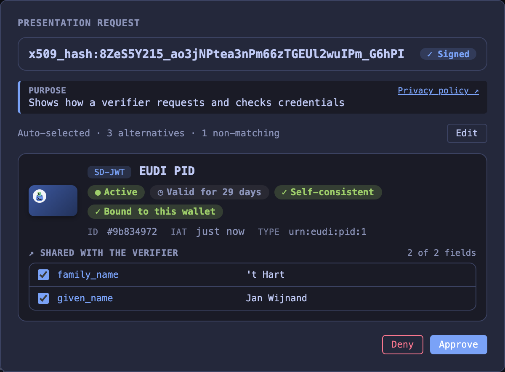
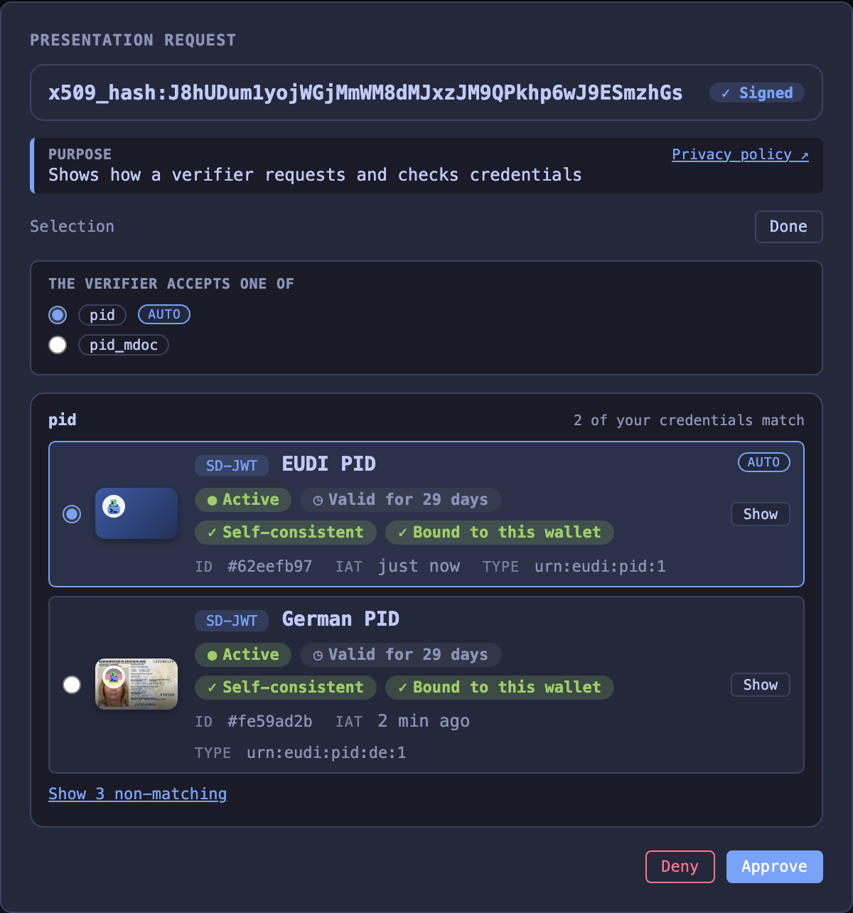
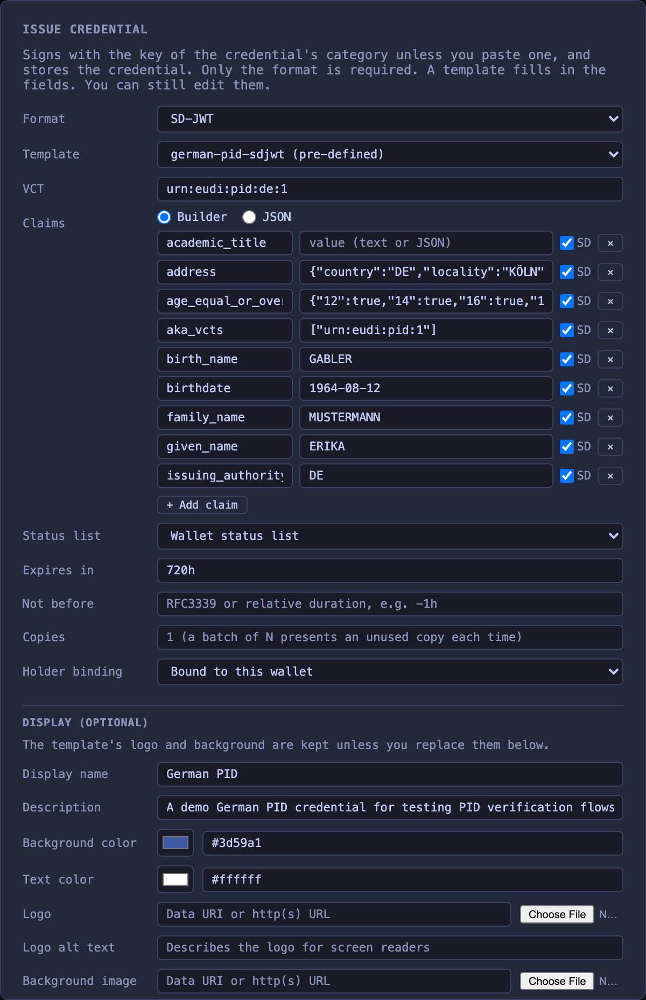

[← Wallet](../wallet.md)

# Serving the wallet

`wallet serve` runs the persistent wallet HTTP server (web UI, OID4VP and OID4VCI endpoints, trusted lists, optional URL scheme handling).

## `wallet serve`

It loads credentials from the selected storage backend, saves changes and logs requests. Interactive requests show a consent dialog.

The server exposes:

- Web UI for credential management and consent
- OID4VP authorization endpoint (`/authorize`)
- OID4VCI credential offer endpoint (`/credential-offer`). Accepts `credential_offer` / `credential_offer_uri` query parameters. Offer links can use the wallet URL in place of a custom scheme (see [Invoking the wallet by URL](presenting.md#invoking-the-wallet-by-url))
- Trusted list endpoint (`/api/trustlist`), which serves the PID list or the list for a `vct` or `doctype`. Use this URL as `--trusted-list` when validating PID credentials issued by the wallet
- Trusted list index endpoint (`/api/trustlists`) with one JWT endpoint per list
- HTTPS wallet endpoints on the wallet's effective issuer URL, including `/.well-known/jwt-vc-issuer`, `/.well-known/openid-credential-issuer`, `/api/trustlist`, `/api/trustlists`, `/api/statuslist`, and `/api/registrar/wrp`
- A management API mirroring the wallet CLI (list, show, import, and remove credentials, issue credentials, generate PIDs, export certificates). It has no authentication (see [HTTP API](http-api.md))

For `credential_offer_uri`, the wallet fetches the offer for the dialog and again on approval (OpenID4VCI 1.0 §4.1.3). If the issuer serves the offer only once, issuance uses the copy shown in the dialog and logs the failed second fetch. If the first fetch fails, the dialog shows the issuer from the URI and approval retries the fetch.

If the offer requires a transaction code and none is given, issuance fails before the wallet uses the pre-authorized code. This applies to API callers and to `--auto-accept` too. The error gives the required code length and input mode.

After storing a credential, the wallet calls the issuer's Notification Endpoint if the issuer publishes one. The endpoint is optional (OpenID4VCI 1.0 §11). A rejected call logs a warning and the credential stays in the wallet. The warning quotes the response and compares it with §11.3 (an Authorization Error Response for a rejected token, a 400 for a bad `notification_id`).

The purpose and privacy policy in the presentation consent dialog come from the verifier's registration certificate. The certificate must belong to the access certificate of the signed request (see [what the wallet checks](registrar.md#what-the-wallet-checks)). `--arf` checks the registration certificate (see [ARF checks](presenting.md#arf-checks)).

The presentation dialog starts with the wallet's automatic credential selection. The user can choose a credential-set option and a credential for each query. Auto-accept submits the automatic selection without a dialog.

If the verifier sets `multiple: true` on a query, all matching credentials are selected. At least one stays selected.

In debug mode the dialog also offers non-matching credentials with the reasons (format, type, missing claims). They are never picked automatically. If you pick one, the wallet discloses every requested claim present in the credential. When nothing matches a request from a link, the UI or a DC API call, debug mode opens the dialog, and **Approve** stays disabled until you pick a credential for every query. Auto-accept, API submissions and presentations requested during issuance get no dialog. The wallet answers them with `access_denied`.

When a query lists `claim_sets`, the wallet uses the first matching claim set (OpenID4VP 1.0 §6.4.1). In debug mode the user can pick any matching claim set. The wallet then discloses its claims, and the claim checkboxes still apply.

API clients receive the alternatives in `credential_options`. In debug mode each query also lists `non_matching` credentials with their `mismatches`. `unmatched` on a credential set lists the options without a matching credential. Send `picks` (query ID to credential ID, or to a list of credential IDs when the query has `"multiple": true`), `set_choices` (option index per set, or `-1` to skip an optional set), `claim_sets` (query ID to the index of a matching claim set, debug mode only) and `selected_claims` to `POST /api/requests/{id}/approve`. An invalid selection returns `400` and leaves the request pending.





A credential issued in the web UI can reference the wallet's own status list when configured, a custom URI and index, or no status list. The UI can revoke and activate credentials on the wallet's own status list. For an external status list it fetches the list on request.

UI controls have stable IDs and data attributes for browser automation. Credential cards expose `data-credential-id`, `data-format`, `data-vct`, `data-doctype` and `data-status`. For example, select a PID with `.credential-card[data-vct="urn:eudi:pid:1"]`.

| Control | ID or selector |
|---|---|
| Credential actions | `show-<id>`, `delete-<id>`, `revoke-<id>`, `status-check-<id>` |
| Template rows and actions | `template-row-<name>`, `template-edit-<name>`, `template-delete-<name>` |
| Consent actions | `consent-approve`, `consent-deny` |
| Registered purpose and privacy policy | `consent-purpose-<n>`, `consent-privacy-policy-<n>` |
| Consent credential | `consent-credential-<id>` |
| Claim checkboxes | `data-cred` and `data-claim` |
| Selection controls | `consent-edit-selection`, `consent-selection-done`, `consent-selection-reset` |
| Set options | `consent-set-<n>-option-<m>`, `consent-set-<n>-none` for optional sets |
| Query sections | `consent-query-<id>` |
| Claim set dropdown | `consent-claim-set-<query>` |
| Non-matching credentials | `consent-show-nonmatching-<query>` toggles the list. While a non-matching credential is picked or none matches, the list stays open under `consent-nonmatching-label-<query>`. Rows carry `data-non-matching="true"`. Reasons are in `consent-mismatch-<query>-<credential>` |
| Query without a matching credential | `consent-unanswered-<query>` |
| Candidate rows | `consent-candidate-<query>-<credential>`, with `data-query` and `data-cred` |
| Activity entries | `data-testid="log-entry"`, with `data-event` and `data-action` |
| Open or close an activity entry | `data-testid="log-entry-toggle"` |
| Switch encrypted or decrypted view | `data-testid="log-payload-toggle"` |
| Open a token in the decoder | `data-testid="log-decoder-link"` |
| Show an alternate wire value | `data-testid="log-wire-toggle"` |

Scope activity controls to their entry. Entries for a stored credential also have `data-credential-id`. Presentation decoder links have `data-query-id` and `data-token-index`. Credential response and batch import links have `data-credential-index`. Batch import links also have `data-credential-id` for each stored copy. Token indexes start at zero within each query. Credential indexes start at zero within the entry. The encryption toggle keeps the same selector in both views.



Only local wallets can change **Auto-accept** in the UI.

A fetched request object and its receipt share one activity entry. Deferred collection adds separate request and response entries, including pending replies and errors.

A batch import is one entry with the ID of every stored copy. Encrypted exchanges show the wire value first. Switching to the decrypted view changes only the log display.

Verifiers check wallet-issued credentials against the wallet CA. Issuers use it to check wallet and key attestations.

The default local issuer URL is `https://localhost:8086`, on `<port+1>` relative to the wallet's HTTP port. An HTTPS `--base-url`, such as `https://eudi-test.dev`, becomes the issuer URL. Issuer metadata, trusted lists and status lists are then served from the public origin behind an external TLS terminator (see [public demo hosting](../public-demo.md)).

To serve the wallet under a path prefix on a shared host, include the prefix in the base URL, such as `https://example.com/some/context`. See [behind a reverse proxy](../reverse-proxy.md) for the proxy setup.

For a local https origin without an external TLS terminator, add `--serve-tls`. The wallet then also listens on the base URL's port with its own TLS certificate. The plain HTTP port stays open. `--serve-tls` requires an https `--base-url` with an explicit port. The [demo issuer and verifier conformance run](../conformance-run-demorp.md) needs it because the OIDF suite requires https endpoints.

The demo verifier accepts a credential when its certificate chains to an issuance service on a credential provider list of the wallet's [list of trusted lists](#trusted-lists). That includes the wallet's own issuers, added providers and the providers on external lists. A status list may also chain to a revocation service. `--demo-verifier-issuer-ca <pem>` (repeatable) adds more CAs directly (for example, the OIDF conformance suite signs its credentials under its own CAs).

### Trusted lists

*(new in 3.0.0)*

The wallet publishes lists of trusted entities (ETSI TS 119 602). It takes every trust anchor from such lists ([ADR 0023](../adr/0023-trust-anchors-come-from-trusted-lists.md)). With `--arf`, the wallet checks received credentials against them. It also checks the access and registration certificates of verifiers and issuers. The demo issuer and the demo verifier use them too.

| List ID | Lists | LoTE type |
|---|---|---|
| `pid` | PID providers | `http://uri.etsi.org/19602/LoTEType/EUPIDProvidersList` (Annex D) |
| `qeaa` | QEAA providers | `https://eudi-test.dev/LoTEType/QEAAProvidersList` |
| `pub-eaa` | PuB-EAA providers | `http://uri.etsi.org/19602/LoTEType/EUPubEAAProvidersList` (Annex H) |
| `eaa` | Other EAA providers | `https://eudi-test.dev/LoTEType/EAAProvidersList` |
| `wallet-provider` | Wallet providers | `http://uri.etsi.org/19602/LoTEType/EUWalletProvidersList` (Annex E) |
| `access-ca` | Providers of access certificates | `http://uri.etsi.org/19602/LoTEType/EUWRPACProvidersList` (Annex F) |
| `registrar` | Providers of registration certificates | `http://uri.etsi.org/19602/LoTEType/EUWRPRCProvidersList` (Annex G) |

TS 119 602 registers no list type for QEAA or other EAA providers (QEAA providers are on TS 119 612 trusted lists). Annex C.1 lets a scheme operator create its own URIs, and §6.3.3 asks for one type per profile. So the `qeaa` and `eaa` lists have types of their own, with the service types `https://eudi-test.dev/SvcType/QEAA/Issuance`, `.../QEAA/Revocation`, `.../EAA/Issuance` and `.../EAA/Revocation`. These URIs name the list profile. They are the same on every deployment, regardless of the base URL. A wallet state from eudi-dev 2 stores `http://uri.etsi.org/19602/LoTEType/local` for its EAA list, and the wallet reads that as the `eaa` list.

The `access-ca` list names the relying party access CA of the [registrar](registrar.md) and the `registrar` list names the registrar CA. CAs from `--relying-party-ca` are on both lists.

#### Credential categories

Each credential category (`pid`, `qeaa`, `pub-eaa` and `eaa`) is a provider role with its own signing key and its own provider CA under the wallet CA. The category of a credential selects the signing key. The signing certificate is then on the list of that category.

The PID role signs with the wallet's issuer key (`issuer.pem`). The other roles have keys named `issuer-<role>` in the signing store, and the wallet provider has `wallet-provider`. `/.well-known/jwt-vc-issuer` lists one JWK per category list, per custom list and for unlisted credentials. The wallet serves each provider CA certificate at `/api/certificates/providers/{role}/{country}.der`.

A credential gets its category in this order:

- `--category` of `issue ... --wallet`, or `category` in the issue API
- the `category` of its [template](../templates.md)
- the category of its entry in the [attestation catalogue](registrar.md#attestation-catalogue)
- otherwise it is an EAA

The category `unlisted` keeps a credential off every list. Its signer has its own provider role (`unlisted`) and provider CA. Use it to test how a verifier handles an issuer without a trust anchor.

The wallet also keeps an issued-attestation registry. It lists the type of each credential issued by the wallet, with its category and trusted list data. The trusted lists name these types:

- `wallet generate-pid` and `wallet serve --pid` register the PID types
- `issue ... --wallet` registers the type of the issued credential

An imported credential and a credential signed with your own `--key` and `--cert` are on none of the wallet's lists, because the wallet did not sign them.

Each trusted list publishes its service's signing certificates, provider CAs and status signing certificates. With a configured root of path length zero, the list names only the signing certificates. A separate list operator key under the wallet CA signs the list. An unchanged list keeps its signed instance until it expires. Changed content or expiry increments the sequence number. Previous instances are available at the list's `/history` endpoint. Every list except `pub-eaa` points to itself. Tables D.1 to G.1 require that for the lists of Annexes D to G, and Table H.1 forbids pointers.

Wallet and key attestations use a separate wallet provider key. Their `x5c` contains the leaf and any intermediate certificates, with the self-signed root omitted. Issuers can pin the root from `/api/certificates/ca` or use `/api/trustlists/wallet-provider`.

#### Your providers and lists

To check the relying parties of another registrar, see [Use an external registrar](registrar.md#use-an-external-registrar).

`eudi wallet trust` adds your own providers to the wallet's lists and external lists to the wallet's list of trusted lists:

```bash
eudi wallet trust add-ca --list pid --name "Example PID Provider" --ca pid-ca.pem
eudi wallet trust add-ca --list registrar --ca registrar-ca.pem
eudi wallet trust add-ca --list trusted-list-ca --ca lists-ca.pem
eudi wallet trust add-list https://lists.example/pid
eudi wallet trust                       # or: eudi wallet trust list
eudi wallet trust rm-ca fc390242d2ad08ab
eudi wallet trust rm-list https://lists.example/pid
```

`add-ca` takes a PEM file with CA certificates and one of the list IDs above. The wallet adds the CA to that list as a provider with an issuance and a revocation service, and signs the list. The CA is then a trust anchor for certificates issued under it and for their status lists. Adding the same certificates to the same list again replaces the earlier entry. The name defaults to the CA's common name. `trusted-list-ca` is no published list. Its CAs may sign trusted lists, like those from `--trusted-list-ca`, so the wallet accepts external lists signed under them.

`add-list` puts an external list of trusted entities on the list of trusted lists. With `--arf` the providers on the external list are trust anchors for the checks of its list type. For example, a PID provider list anchors the checks of received PIDs. The list signer must chain to the wallet CA or to a CA from `--trusted-list-ca`. In `--mode strict` the wallet refuses an unreadable list. In `--mode debug` it adds the list and reports the reason. `wallet serve --trusted-list <url>` (repeatable) adds lists at startup. They can't be removed through the API.

`eudi wallet trust` shows the added providers and lists:

```
ID                LIST  NAME                CERTIFICATES
fc390242d2ad08ab  eaa   Example University  1

List of trusted lists: https://localhost:8086/api/trustlists/lists
```

The HTTP API:

| Method | Path | Description |
|---|---|---|
| `GET` | `/api/trust` | `entities` (the added providers), `entity_lists` (the list IDs), `lists` (the external lists) and `lists_url` |
| `POST` | `/api/trust/entities` | Add a provider: `list`, `name` and `certificates` (PEM). Answers `201` with the entity and its `id` |
| `DELETE` | `/api/trust/entities/{id}` | Remove a provider |
| `POST` | `/api/trust/lists` | Add an external list: `url`. Answers `201` with the list |
| `DELETE` | `/api/trust/lists?url=<url>` | Remove an external list |

Each entry of `lists` has `url` and, where they apply, `configured` (from `--trusted-list`), `via` (the list of trusted lists that points to it) and `error` (why the wallet can't use it):

```json
{
  "entities": [
    { "id": "fc390242d2ad08ab", "list": "eaa", "name": "Example University", "certificates": ["MIICCTCCAa+gAwIBAgIU..."] }
  ],
  "entity_lists": ["pid", "qeaa", "pub-eaa", "eaa", "wallet-provider", "access-ca", "registrar"],
  "lists": [
    {
      "url": "https://lists.example/pid",
      "error": "fetching the trusted list: fetching https://lists.example/pid: Get \"https://lists.example/pid\": dial tcp: lookup lists.example: no such host"
    }
  ],
  "lists_url": "https://localhost:8086/api/trustlists/lists"
}
```

The wallet keeps a fetched external list for 5 minutes. A list past its `NextUpdate` is expired and anchors nothing (ETSI TS 119 602 V1.1.1 §6.3.15). A withdrawn service anchors nothing either. The public demo holds at most 20 added providers and 5 added lists.

#### List of trusted lists

`/api/trustlists/lists` is a list of trusted lists (ETSI TS 119 602 V1.1.1 §6.3.13). Its type is `https://eudi-test.dev/LoTEType/ListOfTrustedLists`. It points to every list of the wallet and to every readable external list. Each pointer has the list's location, the certificate of its signer, and the list type, scheme operator name, scheme territory and MIME type as qualifiers:

```json
{
  "LoTELocation": "https://localhost:8086/api/trustlists/pid",
  "ServiceDigitalIdentities": [{ "X509Certificates": [{ "val": "MIIC..." }] }],
  "LoTEQualifiers": [{
    "LoTEType": "http://uri.etsi.org/19602/LoTEType/EUPIDProvidersList",
    "SchemeOperatorName": [{ "lang": "en", "value": "EUDI Dev Wallet" }],
    "SchemeTerritory": "EU",
    "MimeType": "application/jwt"
  }]
}
```

The wallet follows the pointers of an external list of this type, one level deep. A pointed-to list must be signed by a certificate of its pointer (§6.3.13). `GET /api/trust` shows such a list with `via`. To trust all lists of another eudi-dev wallet at once, add its `/api/trustlists/lists`. That list is signed under the other wallet's CA. Start this wallet with `--trusted-list-ca` set to that CA.

`wallet serve` reuses persisted issuer and status list URLs unless `--base-url` or `--docker` overrides them. Credentials generated earlier then keep resolving against the same endpoints. Issuance commands (`issue ... --wallet`, `wallet generate-pid`) follow the same rule. They print a note when no server serves the embedded URLs.

The startup banner warns about a persisted Docker hostname outside Docker. It also warns about stored credentials with issuer or status list URLs that this server does not serve. Those credentials fail validation and status checks until they are issued again.

Each list is served at `/api/trustlists/{id}`:

- `pid`, `qeaa`, `pub-eaa` and `eaa` for the categories
- `wallet-provider` for the Wallet Provider list, which issuers use to verify the wallet attestation
- `access-ca` and `registrar` for the providers of relying party certificates
- `lists` for the list of trusted lists
- `tl-<8 hex digits>` for a credential type with its own trusted list fields, such as `--trusted-list-type`

`eudi wallet trusted-list --list` shows these lists for the selected local or remote wallet:

```
ID               DEFAULT  CATEGORY                    PATH
pid              yes      Credential providers        /api/trustlists/pid
qeaa                      Credential providers        /api/trustlists/qeaa
pub-eaa                   Credential providers        /api/trustlists/pub-eaa
eaa                       Credential providers        /api/trustlists/eaa
wallet-provider           Wallet providers            /api/trustlists/wallet-provider
access-ca                 Relying party certificates  /api/trustlists/access-ca
registrar                 Relying party certificates  /api/trustlists/registrar
```

With `--json` it prints the `/api/trustlists` body unchanged.

`/api/trustlists` lists them for API clients. Each entry includes:

- `id`, for example `pid` or `eaa`
- `path`, for example `/api/trustlists/pid`
- `advertised_url` when the wallet has an issuer URL configured, for example `https://localhost:8086/api/trustlists/pid`
- `url`, an alias for `advertised_url`

Clients that call the wallet through Docker port mappings, reverse proxies, or Testcontainers should resolve `path` against the URL of their `/api/trustlists` request. `advertised_url` is the configured publication URL of the wallet. It can differ from the request URL.

`/api/trustlist` selects a list by credential type:

- without parameters it returns the PID list
- `vct` and `doctype` select the list that names a credential type

Examples:

- `/api/trustlists/pid`
- `/api/trustlists/eaa`
- `/api/trustlist?vct=urn:eudi:pid:1`
- `/api/trustlist?doctype=org.iso.23220.photoid.1`

Example discovery response:

```json
{
  "trust_lists": [
    {
      "id": "pid",
      "default": true,
      "path": "/api/trustlists/pid",
      "advertised_url": "https://localhost:8086/api/trustlists/pid",
      "url": "https://localhost:8086/api/trustlists/pid",
      "loTEType": "http://uri.etsi.org/19602/LoTEType/EUPIDProvidersList"
    },
    {
      "id": "eaa",
      "default": false,
      "path": "/api/trustlists/eaa",
      "advertised_url": "https://localhost:8086/api/trustlists/eaa",
      "url": "https://localhost:8086/api/trustlists/eaa",
      "loTEType": "https://eudi-test.dev/LoTEType/EAAProvidersList"
    },
    {
      "id": "wallet-provider",
      "default": false,
      "path": "/api/trustlists/wallet-provider",
      "advertised_url": "https://localhost:8086/api/trustlists/wallet-provider",
      "url": "https://localhost:8086/api/trustlists/wallet-provider",
      "loTEType": "http://uri.etsi.org/19602/LoTEType/EUWalletProvidersList"
    }
  ]
}
```

The example leaves out the `qeaa`, `pub-eaa`, `access-ca` and `registrar` entries.

`--register` also registers OS URL scheme handlers. `openid4vp://`, `eudi-openid4vp://`, `haip-vp://`, `openid-credential-offer://`, `haip-vci://` and `eu-eaa-offer://` links then open the wallet on macOS. On Linux and Windows, `--register` is a no-op.

```bash
eudi wallet serve
eudi wallet serve --port 9000 --auto-accept
eudi wallet serve --pid --credential extra.txt
eudi wallet serve --register           # also register URL scheme handlers using the current interactive/auto-accept mode
eudi wallet serve --register --port 9000
eudi wallet serve -d                   # run in the background (stop with `eudi wallet kill`)
```

| Flag                    | Default  | Description                                      |
|-------------------------|----------|--------------------------------------------------|
| `--port`                | `8085`   | Server port                                      |
| `--auto-accept`         | `false`  | Auto-approve everything. Without it, only interactive channels (web invocation URLs, scheme dispatches, browser DC-API) show the consent dialog. API submissions (`POST /api/offers`, `/api/presentations`) always auto-accept because the API call counts as consent (opt in per request with `"interactive": true`) |
| `--credential`          | None     | Import credential from file (repeatable)         |
| `--credentials`         | None     | Credentials to add on every start, from a YAML or JSON file, a directory of such files, or stdin (`-`). See [startup credentials](#startup-credentials) |
| `--pid`                 | `false`  | Generate default EUDI PID credentials on start   |
| `--key`                 | None     | Override holder key (PEM/JWK)                    |
| `--issuer-key`          | None     | Issuer key for generated PIDs (PEM/JWK)          |
| `--mode`                | `debug`  | Validation mode: `debug` or `strict`             |
| `--storage`             | `file`   | Storage backend: `file`, `memory`, `auto` or a `postgres://` URL. `$EUDI_DEV_STORAGE` when set (see [storage backends](../wallet.md#storage-backends)) |
| `--seed`                | None     | Derive the generated keys from this string. `auto` seeds the memory backend only. `$EUDI_DEV_SEED` when set (see [seeded keys](../wallet.md#seeded-keys)) |
| `--session-transcript`  | `oid4vp` | mdoc session transcript mode: `oid4vp` or `iso`  |
| `--register`            | `false`  | Register OS URL scheme handlers                  |
| `--no-register`         | `false`  | Skip URL scheme registration (overrides --register) |
| `--tls-verify` | mode default | Verify HTTPS certificates (`true` in strict mode, `false` in debug mode) |
| `--tls-ca` | None | PEM CA bundle added to system trust for outbound HTTPS |
| `--http-proxy` | `$HTTP_PROXY` | Forward proxy for outbound `http://` requests |
| `--https-proxy` | `$HTTPS_PROXY` | Forward proxy for outbound `https://` requests |
| `--no-proxy` | `$NO_PROXY` | Hosts, domains and CIDRs that bypass the proxy |
| `--key-attestation-level` | Issuer requirements | Test claims for key storage and user authentication: issuer requirements (default), `none`, or a level such as `iso_18045_high`. Change it in the Conformance panel. See [key attestation claims](#key-attestation-claims) |
| `--preferred-format`    | None     | Preferred credential format when multiple match: `dc+sd-jwt`, `mso_mdoc`, or `jwt_vc_json` |
| `--status-list`         | `false`  | Embed status list references in generated credentials |
| `--base-url`            | None     | Public URL of the wallet, optionally with a path prefix (see [behind a reverse proxy](../reverse-proxy.md)). An https base URL is used as the issuer URL (external TLS terminator). An http base URL derives a self-signed HTTPS issuer URL on port+1. Existing persisted issuer URLs are reused unless this flag is set |
| `--docker`              | `false`  | Use `host.docker.internal` instead of `localhost` when deriving new HTTP and HTTPS wallet endpoint URLs |
| `--vci-client-id`       | Wallet origin | Client ID for OID4VCI authorization code flows |
| `--vci-redirect-uri`    | Wallet origin + `/callback` | Redirect URI for OID4VCI authorization code flows |
| `--vci-version`         | `1.0`    | OpenID4VCI feature level of the wallet as a client: `1.0` (the published version) or `1.1` (also uses 1.1 draft features when the issuer supports them). See [OpenID4VCI feature level](issuing.md#openid4vci-feature-level) |
| `--haip`                | `false`  | Check incoming presentations and credential offers against HAIP 1.0. `--mode` sets how violations are handled. Strict aborts the flow. Debug reports the violation and continues |
| `--arf`                 | `false`  | Check the access and registration certificates of verifiers and issuers against the ARF (see [verifiers](presenting.md#arf-checks) and [issuers](issuing.md#arf-checks)). With `--mode strict` the wallet refuses the request or the offer on any finding |
| `--relying-party-ca`    | None     | PEM file with CA certificates that issue relying party access and registration certificates. The wallet puts them on its `access-ca` and `registrar` lists (repeatable) |
| `--trusted-list-ca`       | None     | PEM file with CA certificates of trusted list operators. With `--arf` the wallet also accepts trusted lists signed under these CAs (repeatable) |
| `--trusted-list`        | None     | URL of an external list of trusted entities for the [list of trusted lists](#list-of-trusted-lists) (repeatable) |
| `--client-attestation`  | `false`  | Send the wallet attestation on OID4VCI token requests even when the issuer does not advertise `attest_jwt_client_auth` (see [wallet attestation](issuing.md#wallet-attestation)) |
| `--adhoc-display-images` | `false` | Fetch HTTPS display images on demand instead of storing them. The issuer sees each render. See [display images](#display-images) |
| `--require-encrypted-request` | `false` | Refuse an unencrypted Request Object. The wallet always sends an encryption key in `wallet_metadata`, so this requires the Verifier to use it |
| `--demo`                | `false`  | Public demo profile: implies `--pid`, `--mode debug`, `--haip`, `--arf` and `--vci-version 1.1` (all overridable), disables process and filesystem endpoints, blocks fetches to internal networks. Browser flows keep the consent dialog, API flows auto-accept (see [public demo hosting](../public-demo.md)) |
| `--demo-issuer-client-auth` | `required` | Client authentication required by the authorization server of the built-in demo issuer at its PAR and token endpoints: `required` (HAIP 1.0 §4.4.1) or `optional`, which also accepts wallets that send no wallet attestation (see [public demo hosting](../public-demo.md)) |
| `--demo-verifier-issuer-ca` | None | PEM file with extra issuer CA certificates for the demo verifier. The demo verifier always accepts the wallet's own CA. The flag is repeatable. Use it for credentials issued outside this wallet, such as in an OIDF conformance suite run |
| `--serve-tls`           | `false`  | Serve an https `--base-url` locally with the wallet's own TLS certificate instead of expecting an external TLS terminator. Requires an https base URL with an explicit port. The wallet also keeps listening on the HTTP port |
| `--demo-reset`          | `1h`     | Schedule for restoring the demo baseline: an interval (`24h`), a daily wall-clock time (`00:00`), or one with a timezone (`"00:00 Europe/Berlin"`). `0` disables. Requires `--demo` |
| `--imprint-file`        | None     | HTML snippet with the operator's legal notice, served at `/imprint` |
| `--news-file`           | None     | HTML snippet with news for visitors, shown once in a popup and linked from the footer. Requires `--demo` |
| `-d, --detached`        | `false`  | Run the server as a background process and return once it responds. Output goes to `<wallet-dir>/serve.log`. Stop it with `wallet kill` |

## Startup credentials

*(new in 3.0.0)*

`--credentials` adds credentials on every start. It reads a YAML or JSON file, every `.yaml`, `.yml` and `.json` file of a directory (in name order), or stdin with `-`. An entry either issues a credential from a [template](../templates.md) or imports a finished one. A file can mix both.

```yaml
credentials:
  - id: employee-alice
    template: employee-card
    claims:
      employee_id: E-2
      department: Sales
  - id: erika
    template: german-pid-sdjwt
    claims:
      birthdate: 1970-01-31
    exp: 2160h
  - id: partner-ticket
    credential: eyJhbGciOiJFUzI1NiIs...~WyJ...~
```

`employee-card` is a user template saved beforehand (see [templates](../templates.md#cli)). `german-pid-sdjwt` is a built-in one.

| Field | Description |
|-------|-------------|
| `id` | Credential ID in the wallet, the API and the UI selectors. It starts with a letter or digit and holds letters, digits, `.`, `_` and `-`. Unique across all files |
| `template` | Template name or file path. The fields below override its defaults |
| `format` | `sdjwt`, `jwt` or `mdoc` (default the template's format) |
| `claims` | Claims merged over the template's claims |
| `always_disclosed` | Claims issued without selective disclosure, in addition to the template's list |
| `omit` | Top-level template claims to leave out |
| `exp` | Expiry as a Go duration (default the template's `exp`) |
| `display` | Card appearance, with the fields of the template's `display` |
| `protected` | `true` keeps visitors from deleting or revoking the credential. Default `true` with `--demo`, `false` otherwise |
| `credential` | A finished SD-JWT VC, JWT VC or mdoc to import instead of a template |

Every start adds the entries again. Template entries get fresh dates. A credential from an earlier start with the same `id` is replaced, so the wallet holds one copy of each entry. Its revocation status resets with each start.

With `--demo` the startup credentials are part of the baseline, so a demo reset restores them with the default PIDs. For a demo where visitors can delete every credential, set `protected: false` on the entries and turn off the default PIDs:

```bash
eudi wallet serve --demo --pid=false --credentials demo-credentials.yaml
```

## Key attestation claims

`--key-attestation-level` sets the test claims `key_storage` and `user_authentication` (OpenID4VCI Appendix D.2). By default they match the issuer's requirements. `none` omits both claims. A level such as `iso_18045_high` sets both explicitly. The Conformance panel can change this at runtime.

These claims describe simulated protection levels. Keys are stored unencrypted. See [SECURITY.md](../../SECURITY.md).

## Display images

By default, the wallet fetches display images once and stores them. `--adhoc-display-images` keeps HTTPS logo and background URLs from issuer metadata and fetches them on each card render. The wallet stores no HTTPS image.

Data URIs, template images and HTTP URLs are stored in both modes. Storing HTTP images avoids mixed content on an HTTPS page. `GET /api/config` reports the setting as `adhoc_display_images`.

## `wallet trusted-list`

Prints a trusted list of the wallet (ETSI TS 119 602) as a signed JWT. It contains the signing certificates, provider CAs and status signing certificates of the selected list. Verifiers use its provider CAs to validate the `x5c` or `x5chain` embedded in credentials. Issuer authorization data such as provider entitlements and `providesAttestations` comes from signed `/.well-known/openid-credential-issuer` metadata and `/api/registrar/wrp`. See [test certificates](../test-certificates.md).

Without selection flags it prints the PID list, like `/api/trustlist`. `--id`, `--vct` or `--doctype` selects another list. The IDs are `pid`, `qeaa`, `pub-eaa`, `eaa`, `wallet-provider`, `access-ca`, `registrar` and the `tl-` IDs of custom lists. `--list` shows all lists of the wallet. `--id lists` prints the list of trusted lists, which is also at `/api/trustlists/lists`.

Pipe the output to a file or pass it to `validate --trusted-list`. `--url` prints only the URL for a running wallet server.

```bash
eudi wallet trusted-list                          # Print the trusted list JWT
eudi wallet trusted-list > trustlist.jwt          # Save to file
eudi wallet trusted-list --url                    # http://localhost:8085/api/trustlist
eudi wallet trusted-list --id pid --url           # http://localhost:8085/api/trustlists/pid
eudi wallet trusted-list --id eaa --url           # http://localhost:8085/api/trustlists/eaa
eudi wallet trusted-list --doctype org.iso.23220.photoid.1 --url
eudi wallet trusted-list --url --port 9000        # http://localhost:9000/api/trustlist
eudi wallet trusted-list --url --docker           # http://host.docker.internal:8085/api/trustlist
```

| Flag       | Default | Description                                        |
|------------|---------|----------------------------------------------------|
| `--url`    | `false` | Print only the trusted list URL (for a running server) |
| `--list`   | `false` | List all trusted lists of the wallet instead of printing one |
| `--id`     | None    | ID of the list to print, such as `pid`, `eaa` or `wallet-provider` |
| `--vct`    | None    | Select the trusted list covering this SD-JWT `vct`    |
| `--doctype`| None    | Select the trusted list covering this mdoc `docType`  |
| `--port`   | `8085`  | Wallet server port (used with --url)                |
| `--docker` | `false` | Use `host.docker.internal` instead of `localhost` (used with --url) |

## `wallet ca-cert`

Loads or creates the shared root CA certificate and prints exactly one PEM certificate. Wallets under the same parent directory use this root for their signing and HTTPS certificate chains. Provider chains include an intermediate CA. Trusted lists publish the relevant service certificates and provider CAs.

`--jwks` exports the certificate as a JWKS document. It contains the certificate's public key as a JWK with `kid`, `alg`, `use`, the certificate chain in `x5c`, and the leaf hash in `x5t#S256`.

```bash
eudi wallet ca-cert
eudi wallet ca-cert --out wallet-ca-cert.pem
eudi wallet ca-cert --jwks
```

On a running wallet server the same export is available as `GET /api/certificates/ca` (`?format=jwks` for JWKS). See [Certificate export](http-api.md#certificate-export).

| Flag     | Default | Description |
|----------|---------|-------------|
| `--out`  | None    | Write the shared wallet CA certificate to a file instead of stdout |
| `--pem`  | `false` | Output as PEM (the default when no format flag is set) |
| `--jwks` | `false` | Output as JWKS (public key with `x5c` chain) |

## Registrar

*(new in 3.0.0)*

The wallet runs a relying party registrar. It registers relying parties and issues their access and registration certificates. See [registrar](registrar.md).

## `wallet tls-cert`

Loads or creates the HTTPS leaf certificate of the wallet's HTTPS endpoints and prints exactly one PEM certificate. To export the shared trust root, use `wallet ca-cert`.

```bash
eudi wallet tls-cert
eudi wallet tls-cert --out wallet-tls-cert.pem
eudi wallet tls-cert --docker --out wallet-tls-cert.pem
eudi wallet tls-cert --base-url http://wallet:8085 --out wallet-tls-cert.pem
eudi wallet tls-cert --jwks
```

Pass the same `--port`, `--docker`, and `--base-url` flags as to `wallet serve`. The exported certificate then matches the certificate of the running wallet.

On a running wallet server the same export is available as `GET /api/certificates/tls` (`?format=jwks` for JWKS). It always matches the running server's HTTPS wallet host. See [Certificate export](http-api.md#certificate-export).

| Flag         | Default | Description |
|--------------|---------|-------------|
| `--out`      | None    | Write the certificate to a file instead of stdout |
| `--port`     | `8085`  | Wallet server port (certificate will match HTTPS wallet endpoints on `port+1`) |
| `--docker`   | `false` | Use `host.docker.internal` instead of `localhost` when deriving the HTTPS wallet host |
| `--base-url` | None    | Base URL used to derive the HTTPS wallet host |
| `--pem`      | `false` | Output as PEM (the default when no format flag is set) |
| `--jwks`     | `false` | Output as JWKS (public key with `x5c` chain) |

## `wallet register` / `wallet unregister`

Registers (or removes) OS-level URL scheme handlers for `openid4vp://`, `eudi-openid4vp://`, `haip-vp://`, `openid-credential-offer://`, `haip-vci://` and `eu-eaa-offer://` links.

The handler script starts a local `wallet serve` instance when none is running and forwards the incoming URI to it. If a UI tab is open, the wallet notifies it over the event stream. Otherwise it opens the UI with the request ID in the URL, and that tab handles the request.

With `--auto-accept`, the handler processes URLs without opening the UI. It POSTs to a running `wallet serve` instance or runs `wallet accept` if that fails.

- **macOS**: Creates an AppleScript `.app` bundle in `~/Applications/` and registers via Launch Services
- **Other platforms**: `register` / `unregister` are accepted as no-ops. Use `wallet accept <uri>` instead

```bash
eudi wallet register               # Register URL handlers and open the wallet UI by default
eudi wallet register --auto-accept # Keep URL handling silent / background-only
eudi wallet register --port 9000   # Use custom listener port
eudi wallet unregister             # Remove URL handlers
```

| Flag            | Default | Description                                                    |
|-----------------|---------|----------------------------------------------------------------|
| `--port`        | `8085`  | Listener port for handler script to try before falling back to CLI |
| `--auto-accept` | `false` | Handle incoming URLs silently without opening the wallet UI    |

## HTTPS certificate verification

Strict mode verifies server certificates for every outbound HTTPS request. Debug mode skips verification by default. `--tls-verify=true` or `--tls-verify=false` overrides either default, including for local endpoints and redirects.

`--tls-ca dev-ca.pem` adds CA certificates to system trust. Server certificates must also match the hostname and be within their validity dates. Credential and request object signatures are checked separately.

```bash
eudi wallet serve --mode strict --tls-ca dev-ca.pem
eudi wallet serve --mode strict --tls-verify=false
eudi wallet serve --mode debug --tls-verify=true
```

A running wallet uses its own TLS settings. Set them with its startup flags, in the Conformance panel, or through `PUT /api/config/conformance`.

## Outbound proxy

If issuers and verifiers are only accessible through a forward proxy, set the standard proxy environment variables or the matching flags:

```bash
HTTPS_PROXY=http://proxy.corp:3128 NO_PROXY=.corp.example eudi wallet serve
eudi wallet serve --https-proxy http://proxy.corp:3128 --no-proxy .corp.example
```

| Variable | Flag | Used for |
|----------|------|----------|
| `HTTPS_PROXY` | `--https-proxy` | Requests to `https://` URLs (almost all issuers and verifiers) |
| `HTTP_PROXY` | `--http-proxy` | Requests to `http://` URLs |
| `NO_PROXY` | `--no-proxy` | Hosts to connect to directly: a comma separated list of host names, domain suffixes such as `.corp.example`, IP addresses and CIDR ranges. `*` disables the proxy for all hosts |

A flag overrides the matching variable. Lowercase variable names work too. Proxy URLs can use `http`, `https`, `socks5` or `socks5h`. A URL without a scheme, such as `proxy.corp:3128`, uses `http`.

Requests to `localhost`, `127.0.0.1`, `::1` and `host.docker.internal` always bypass the proxy.

The wallet verifies the issuer or verifier certificate through the proxy too. If your proxy intercepts TLS traffic, add its CA with `--tls-ca` or disable verification with `--tls-verify=false`.

A running wallet uses its startup proxy settings. `wallet accept` and `wallet scan` therefore reject proxy flags when they forward a request to a running wallet. Set them on `wallet serve` instead.

## JSON logs

`--log-format json` (or `EUDI_DEV_LOG_FORMAT=json`) prints every line of console output as one JSON record on stdout. This includes the startup summary, the request log and warnings:

```json
{"time":"2026-10-03T18:56:44.53+02:00","level":"WARN","msg":"OID4VP 1.0 §5.2: nonce is required"}
{"time":"2026-10-03T18:56:44.61+02:00","level":"INFO","msg":"Encrypting response: response_mode=direct_post.jwt","component":"VP"}
```

`level` is `WARN` or `ERROR` for warning and error lines and `INFO` otherwise. `component` identifies the part of the wallet that logged the line, such as `VCI`, `VP`, `DCQL` or `Demo issuer`. A multi-line entry, such as a token response, stays one record. The default `text` prints the colored console output.

## Changing the conformance settings

**Local wallets** can change the validation mode, HTTPS certificate verification, the HAIP and ARF checks, whether request objects must be encrypted, the [OpenID4VCI version](issuing.md#openid4vci-feature-level) and the key attestation level (see [SECURITY.md](../../SECURITY.md)) at runtime. They do this in the **Conformance** panel or through `PUT /api/config/conformance`. The mdoc session transcript and the preferred format are set at startup. Changes apply to every flow until the process restarts. `DELETE /api/config/conformance` restores startup settings.

**The public demo** runs the HAIP and ARF checks in debug mode. Violations are warnings and the flow continues. `PUT` and `DELETE /api/config/conformance` return `403`.

`eudi wallet config` (alias of `wallet info`) reports the active fields for a local or remote wallet.
