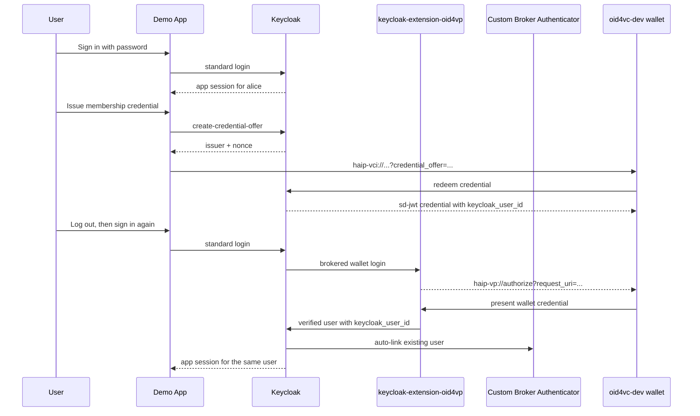
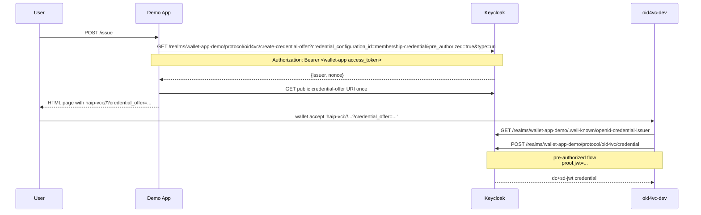
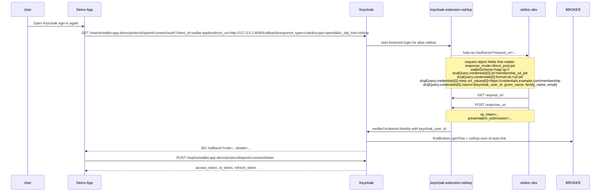

# Keycloak Issuer + Verifier Demo App

This example combines OpenID4VCI issuance and OpenID4VP verification around one Keycloak realm and one small sample application.

Compared with the smaller examples in this directory, this scenario still needs a small dynamic bootstrap for runtime-generated trust material and the persistent signing key. The static realm import already contains the fixed app client, credential scope, custom first-broker flow, OID4VP identity provider, and the wallet-login session-note mapper. The UI itself is kept separate from the Go handlers in `app/templates/` and `app/static/`.

The example always starts:

- Keycloak
- the demo app
- a local `oid4vc-dev wallet serve --docker` wallet
- a local `oid4vc-dev proxy` in front of a single-host route proxy that exposes both Keycloak and the app through one hostname

The only exposure switch is ngrok:

- default: use ngrok automatically when sandbox verifier files are available
- `--ngrok`: publish Keycloak and the app through one ngrok HTTPS hostname
- `--no-ngrok`: keep Keycloak and the app local
- `--http` / `--https`: choose the local Keycloak transport when ngrok is disabled

The start script derives the runtime URLs itself. When ngrok is enabled, issuance, login, and wallet presentation offers use the public ngrok URL and traffic passes through the `oid4vc-dev proxy` dashboard.

## How It Works

The static realm import provides the stable parts of the example. `bootstrap.sh` fills in the runtime parts: the persistent RS256 signing key, the verifier request settings, and the HTTP-only admin setting for the local demo.

### Trust And Verifier Modes

- The presented credential is the custom membership credential issued by this Keycloak realm.
- The verifier always enforces HAIP and uses `x509_hash` plus `direct_post.jwt`.
- Local/no-ngrok mode verifies that credential through issuer metadata / JWKS.
- Ngrok mode is the external-wallet path. It exposes a public Keycloak signing-certificate trust list at `<public-url>/keycloak-trustlist.jwt`.
- The local wallet is still started in ngrok mode, so the same public issuer/verifier setup can be exercised with either the local wallet or an external wallet.
- Sandbox verifier files are discovered from `sandbox/sandbox-ngrok-combined.pem` and `sandbox/sandbox-verifier-info.json` by default, from another git worktree's root `sandbox/` directory, or from `SANDBOX_DIR`, `EXAMPLES_SANDBOX_PEM`, and `EXAMPLES_SANDBOX_VERIFIER_INFO`.

## High-Level Flow



## Detailed Flows

### Issuance



### Verification



## Files

- `start.sh`: runs the full setup; starts the wallet and proxy every time, and uses `--ngrok` / `--no-ngrok` for public exposure
- `docker-compose.yml`: starts the HTTP Keycloak setup and imports the base realm from `realm/`
- `docker-compose.https.yml`: overrides the base compose file for HTTPS mode
- `realm/wallet-app-demo-realm.json`: source-of-truth base realm with the static user, app client, and credential scope
- `scripts/download-extension.sh`: downloads `keycloak-extension-oid4vp` `0.6.1`
- `scripts/build-link-provider.sh`: builds the custom Keycloak first-broker authenticator
- `scripts/generate-keycloak-cert.sh`: generates the local HTTPS certificate for Keycloak in `--https` mode
- `scripts/generate-keycloak-signing-cert.sh`: creates and reuses the persistent Keycloak RS256 signing keypair used in both HTTP and HTTPS mode
- `scripts/generate-keycloak-trustlist.go`: optional helper for explicit trust-list experiments
- `scripts/bootstrap.sh`: configures issuance, verification, user profile, and first-broker flow
- `scripts/start-app.sh`: starts the Go sample app
- `scripts/smoke.py`: runs the complete password-login, issuance, redemption, and wallet-login flow
- `app/main.go`: sample application routes and OIDC flow handling
- `app/templates/`: external HTML templates for the demo UI
- `app/static/`: CSS for the demo UI

## Why Inline `credential_offer`

This example uses the OpenID4VCI by-value `credential_offer` form instead of handing wallets a `credential_offer_uri`.

- OpenID4VCI allows both by-value and by-reference offers.
- The Keycloak `create-credential-offer` endpoint in 26.6 creates an internal offer URI and does not directly return by-value JSON.
- Some external wallets dereference `credential_offer_uri` more than once across parse and issuance steps.
- Current Keycloak behavior for that generated offer URI is effectively one-shot in this flow, so the second fetch fails with `invalid_credential_offer_request`.
- The example therefore resolves the offer once server-side and gives the wallet an inline `credential_offer=...` URI instead.
- The demo realm sets `vc.credential_identifier=membership-credential`, so Keycloak emits final-form `credential_identifiers` in the token response and wallets can send a final `credential_identifier` credential request.

## Quick Start

```bash
cd examples/keycloak-issuer-verifier-app
./start.sh
```

If `oid4vc-dev` is not already installed, `start.sh` installs the latest release with `go install github.com/dominikschlosser/oid4vc-dev@latest`.

Local setup:

```bash
./start.sh --no-ngrok
./start.sh --no-ngrok --https
```

Ngrok setup:

```bash
mkdir -p sandbox
# Put the sandbox verifier files here, or set SANDBOX_DIR to another directory:
#   sandbox/sandbox-ngrok-combined.pem
#   sandbox/sandbox-verifier-info.json
./start.sh --ngrok
```

When both sandbox verifier files are present, `./start.sh` defaults to ngrok mode. Use `--no-ngrok` to force local-only startup. Passing `--ngrok` explicitly requires those sandbox verifier files.

```bash
./start.sh --wallet-port 8087
```

`--ngrok` also accepts a fixed ngrok hostname through `--keycloak-domain` / `--domain`; otherwise it detects the hostname from the sandbox certificate SAN, including when the sandbox files were found in a sibling worktree.

Each `./start.sh` run recreates the Keycloak container state and imports `realm/wallet-app-demo-realm.json` from scratch. Then open the printed public URL in ngrok mode, or `http://127.0.0.1:8090/` in local mode, and:

1. log in as `alice` / `alice`
2. issue the membership credential
3. open the offer in `oid4vc-dev`
4. log out, sign in again, and choose the wallet option in Keycloak
5. present the credential back to Keycloak

`./start.sh` starts the local wallet server with `--register`, so custom scheme handlers are installed while the wallet UI remains available at `http://localhost:8087/` by default. On macOS registration installs the custom scheme handlers so `haip-vci://` and `haip-vp://` links hand the URI to `oid4vc-dev` and open the wallet UI in interactive mode. On Linux and Windows the command is a no-op.

If your system does not handle the custom scheme directly:

- issuance: use the offer page in the demo app and run the printed `oid4vc-dev wallet accept '<haip-vci://...>'` command
- verification: when Keycloak shows the wallet login page, copy the `haip-vp://...` link target and run `oid4vc-dev wallet accept '<haip-vp://...>'`

Manual registration is still available if you want to run it yourself:

```bash
oid4vc-dev wallet register
```

Headless verification:

```bash
./start.sh --no-ngrok --smoke
./start.sh --no-ngrok --https --smoke
```

Setup only:

```bash
./start.sh --no-ngrok --setup-only
./start.sh --ngrok --setup-only
```

## Useful Overrides

These are optional. The normal demo path does not require setting URL or trust-mode variables manually.

```bash
KEYCLOAK_CA_CERT=$(pwd)/keycloak-ca-cert.pem
KEYCLOAK_REALM=wallet-app-demo
APP_CLIENT_ID=wallet-app
OID4VCI_CREDENTIAL_SCOPE=membership-credential
KEYCLOAK_TRUST_LIST_PATH=$(pwd)/keycloak-trustlist.jwt
OID4VC_WALLET_PORT=8087
PUBLIC_PROXY_PORT=9090
OID4VC_PROXY_DASHBOARD_PORT=9091
OID4VP_NGROK=auto
SANDBOX_DIR=$(pwd)/sandbox
OID4VP_SANDBOX_PEM_PATH=$(pwd)/sandbox/sandbox-ngrok-combined.pem
OID4VP_SANDBOX_VERIFIER_INFO_PATH=$(pwd)/sandbox/sandbox-verifier-info.json
```

## Cleanup

```bash
docker compose down -v
oid4vc-dev wallet remove --all
rm -f keycloak-trustlist.jwt
rm -f keycloak-ca-cert.pem keycloak-ca-key.pem keycloak-cert.pem keycloak-key.pem
```
